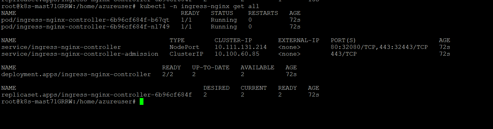
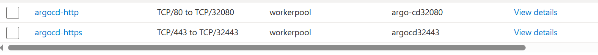
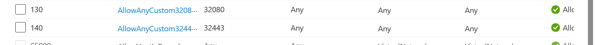
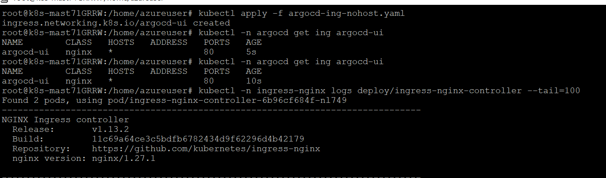

## 更新helm仓库
```bash
helm repo add ingress-nginx https://kubernetes.github.io/ingress-nginx
helm repo update
```

## 使用ingress-nginx和node-port
```bash
helm upgrade --install ingress-nginx ingress-nginx/ingress-nginx \ 
  --namespace ingress-nginx --create-namespace \
  ## 将Nginx ingress controller的pod数量设置成2
  --set controller.replicaCount=2 \
  ## 将 Ingress Controller的服务通过NodePort暴露到集群外部
  --set controller.service.type=NodePort \
  ## 显式地将处理 HTTP（端口 80）流量的 NodePort 设置为 ​​32080​​。
  --set controller.service.nodePorts.http=32080 \
  ## 显式地将处理 HTTPS（端口 443）流量的 NodePort 设置为 ​​32443​​。
  --set controller.service.nodePorts.https=32443 \
  ## 如果不手动设置，Kubernetes 会在 30000-32767 范围内随机分配一个端口。
  --set controller.service.externalTrafficPolicy=Local
```
#### 验证：

```bash 
kubectl -n ingress-nginx get pods -o wide
kubectl -n ingress-nginx get svc ingress-nginx-controller -o wide
```
#### 创建结果：



## 生成azure lb规则
> Azure LB 的 HTTP 探测需要 200 返回码，而 ingress-nginx 默认 / 是 404，所以推荐 TCP 探测：
1. 创建两个监听后端32080后端32443端口的lb rule
2. 创建结果：



## NSG放行



## 创建ingress无域名版
```bash
vim argocd-ing-nohost.yaml 
apiVersion: networking.k8s.io/v1    # 使用的Kubernetes API版本
kind: Ingress                       # 要创建的资源类型是 Ingress
metadata:
  name: argocd-ui                   # 这个Ingress资源的名称
  namespace: argocd                 # 这个资源将被创建在 `argocd` 命名空间
  annotations:  
    # 这是一个重要的注解，告诉Nginx控制器，后端的ArgoCD服务使用的是HTTP协议
    # 因为ArgoCD的Service（80端口）最终将流量代理到Pod的8080端口，这是一个HTTP服务
    # 后端是 HTTP（svc 80 -> pod 8080）
    nginx.ingress.kubernetes.io/backend-protocol: "HTTP"
    nginx.ingress.kubernetes.io/ssl-redirect: "false"  # 如暂不做 TLS，可关 80->443 跳转
spec:
  ingressClassName: nginx           # 指定由名为 `nginx` 的Ingress控制器来处理此规则
                                    # 这必须与你集群中部署的ingress-nginx控制器的IngressClass名称一致
  rules:
  - http:                           # 定义HTTP协议的规则
      paths:                        
      - path: /                     # 匹配所有以 `/` 开头的请求路径（即所有请求）
        pathType: Prefix            # 路径匹配类型为“前缀匹配”
        backend:
          service:
            name: argocd-server     # 将匹配到的流量转发到名为 `argocd-server` 的Service
            port:
              number: 80            # 转发到该Service的80端口

```
#### 检查
```bash
kubectl apply -f argocd-ing-nohost.yaml
kubectl -n argocd get ing argocd-ui
kubectl -n argocd describe ing argocd-ui
kubectl -n ingress-nginx logs deploy/ingress-nginx-controller --tail=100
```


## 更改密码并进行登录：
```bash
# 取初始管理员密码
kubectl -n argocd get secret argocd-initial-admin-secret \
  -o jsonpath='{.data.password}' | base64 -d; echo
```
## 问题
1. 连接不上网站，自动redirect到https：


#### 解决办法：
1. 因为Argo CD 默认会把任何 HTTP 请求重定向到 HTTPS， 所以浏览器 → https → ingress（TLS 终止，转成 http 回源）→ ArgoCD 看到 http 又 301 到 https → 浏览器再走 https → … 进入重定向环（ERR_TOO_MANY_REDIRECTS）。
2. 通过以下方法使ArgoCD 不再强制 http→https 重定向:
```bash
# 开启 insecure
kubectl -n argocd patch configmap argocd-cmd-params-cm --type merge \
  -p '{"data":{"server.insecure":"true"}}'

# 重启 server 让配置生效
kubectl -n argocd rollout restart deploy/argocd-server
kubectl -n argocd rollout status deploy/argocd-server
```