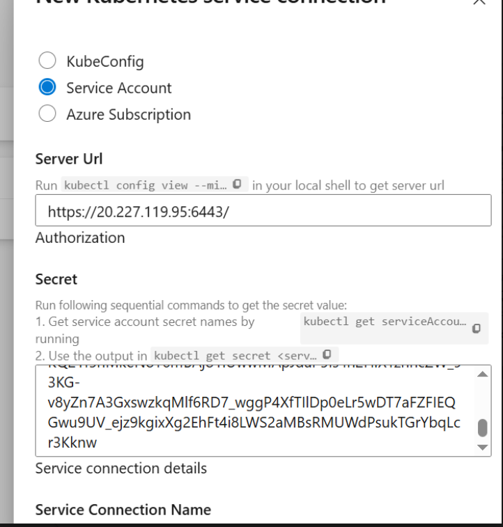
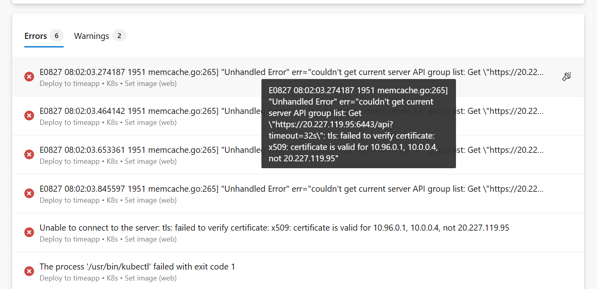
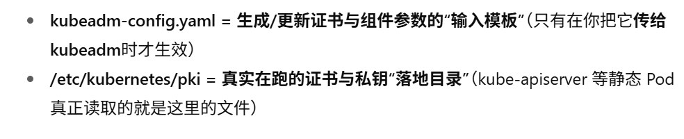
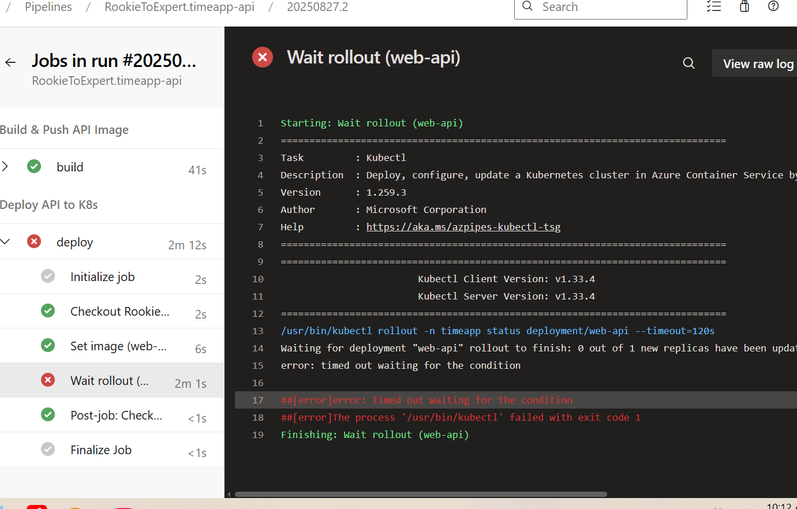

## 给master vmss搭建入站load balancer规则
#### 确保azure devops可以访问到master node的api server
- 添加一条load balancer rule，**前端port:6443**,**后端port:6443(api server监听的端口)**，设定后端pool为master node
- master node nsg放行**inbound规则，端口为6443**.

## 在Azure DeVops中创建创建k8s service connection
#### 准备 RBAC 凭据（最小权限）
1. **ServiceAccount**（服务账户）是Kubernetes集群中​​用于标识**工作负载（如Pod）身份​​的对象**。它不是给人用的账户（那是UserAccount），而是给运行在集群中的​**​程序、进程、Pod​​使用的身份标识**。

2. **RoleBinding**（角色绑定）将一个**角色（Role）**中定义的​​权限（Permissions）​​ **授予（Bind）**给一个或**多个主体（Subject，如ServiceAccount、User或Group**）。它建立了 ​​“谁”​​ 在 ​​“什么范围”​​ 内拥有 ​​“哪些权限”​​ 的关联关系。

3. 操作步骤：
```bash
# 1) 在 timeapp 里创建用于部署的 ServiceAccount
kubectl -n timeapp create serviceaccount ado-deployer

# 2) 绑定 namespace 级的 edit（够用：apply/set image/rollout）
kubectl -n timeapp create rolebinding ado-deployer-edit \
  --clusterrole=edit \
  --serviceaccount=timeapp:ado-deployer

# 最终效果：任何使用 ado-deployer这个ServiceAccount的Pod（比如您Azure DevOps Pipeline中运行的部署工具Pod），在 timeapp命名空间内，就拥有了进行部署操作所需的足够权限（如执行 kubectl apply, set image, rollout等命令），同时又不会拥有其他命名空间或集群级别的过高权限，符合安全最佳实践。

# 3) 创建与该 SA 绑定的 token Secret（1.24+ 不会自动建，需要我们手动建并加注解）
cat <<'EOF' | kubectl apply -f -
apiVersion: v1
kind: Secret
metadata:
  name: ado-deployer-token
  namespace: timeapp
  annotations:
    kubernetes.io/service-account.name: ado-deployer
type: kubernetes.io/service-account-token
EOF

# 确认里面已有 data.token，如果上面这行有输出（很长的一串 base64），说明已就绪。
kubectl -n timeapp get secret ado-deployer-token -o jsonpath='{.data.token}'; echo

# 取出完整 YAML 并全部复制粘贴到Secret中：
kubectl -n timeapp get secret ado-deployer-token -o yaml
```



## 还需要创建github和dockerhub的connection
准备github和dockerhub的账号密码，然后到azure devops中建立连接


## 在azure devops创建两个pipeline，一个前端web一个后端api
前端web：
```yaml
trigger:
  branches:
    include:
    - main
pr:
  branches:
    include:
    - main

variables:
  dockerHubRepo: 'rayrayye/timeapp-web'
  dockerfilePath: 'Dockerfile'          
  buildContext: '.'
  k8sServiceConnection: 'k8s-sc'  # k8s的connection
  namespace: 'timeapp'
  deployment: 'web'
  container: 'web'

  major: '1'
  counterKey: 'web-1'
  patch: $[ counter(variables['counterKey'], 0) ]
  version: '$(major).$(patch)'

stages:
- stage: Build
  displayName: Build & Push Web Image
  jobs:
  - job: build
    pool:
      vmImage: 'ubuntu-latest'
    steps:
    - task: Docker@2
      displayName: Login Docker Hub
      inputs:
        command: login
        containerRegistry: 'toDockerHub'    # 你的 Docker Hub service connection

    - task: Docker@2
      displayName: Build+Push web:$(version)
      inputs:
        command: buildAndPush
        repository: '$(dockerHubRepo)'
        Dockerfile: '$(dockerfilePath)'
        buildContext: '$(buildContext)'
        tags: |
          $(version)

- stage: Deploy
  displayName: Deploy Web to K8s
  dependsOn: Build
  jobs:
  - job: deploy
    steps:
    - task: Kubernetes@1
      displayName: Set image (web → $(version))
      inputs:
        connectionType: 'Kubernetes Service Connection'
        kubernetesServiceEndpoint: '$(k8sServiceConnection)'
        namespace: '$(namespace)'
        command: 'set'
        arguments: >
          image deployment/$(deployment)
          $(container)=docker.io/$(dockerHubRepo):$(version)

    - task: Kubernetes@1
      displayName: Wait rollout (web)
      inputs:
        connectionType: 'Kubernetes Service Connection'
        kubernetesServiceEndpoint: '$(k8sServiceConnection)'
        namespace: '$(namespace)'
        command: 'rollout'
        arguments: 'status deployment/$(deployment) --timeout=120s'
```

后端api:
```yaml
# ==== 触发器 ====
trigger:
  branches:
    include:
    - main
pr:
  branches:
    include:
    - main

# ==== 手动运行时可修改的入参（可选） ====
parameters:
- name: major               # 主版本（点击“Run pipeline”可改）
  type: string
  default: '1'
- name: version             # 可选：手动指定完整版本（例如 2.7）；若留空则走自动计数
  type: string
  default: ''

# ==== 变量 ====
variables:
  # 镜像、路径、K8s 对象
  dockerHubRepo: 'rayrayye/timeapp-api-new'
  dockerfilePath: 'Dockerfile'          # API 仓库里是大写 D
  buildContext: '.'
  k8sServiceConnection: 'k8s-sc'
  namespace: 'timeapp'
  deployment: 'web-api'
  container: 'api'

  # 版本规则：默认【major + 自动 patch 递增】；也支持手动 version 覆盖
  major: ${{ parameters.major }}
  counterKey: 'api-${{ parameters.major }}'     # 每个 major 单独计数
  patch: $[ counter(variables['counterKey'], 0) ]

  # 如果手动传入 version 就用它，否则用 major.patch
  ${{ if ne(parameters.version, '') }}:
    version: ${{ parameters.version }}
  ${{ if eq(parameters.version, '') }}:
    version: '$(major).$(patch)'

# ==== 流水线 ====
stages:
- stage: Build
  displayName: Build & Push API Image
  jobs:
  - job: build
    pool:
      vmImage: 'ubuntu-latest'
    steps:
    - task: Docker@2
      displayName: Login Docker Hub
      inputs:
        command: login
        containerRegistry: 'toDockerHub'   # 你的 Docker Hub service connection 名

    - task: Docker@2
      displayName: Build+Push api:$(version)
      inputs:
        command: buildAndPush
        repository: '$(dockerHubRepo)'
        Dockerfile: '$(dockerfilePath)'
        buildContext: '$(buildContext)'
        tags: |
          $(version)

- stage: Deploy
  displayName: Deploy API to K8s
  dependsOn: Build
  jobs:
  - job: deploy
    steps:
    - task: Kubernetes@1
      displayName: Set image (web-api → $(version))
      inputs:
        connectionType: 'Kubernetes Service Connection'
        kubernetesServiceEndpoint: '$(k8sServiceConnection)'
        namespace: '$(namespace)'
        command: 'set'
        arguments: >
          image deployment/$(deployment)
          $(container)=docker.io/$(dockerHubRepo):$(version)

    - task: Kubernetes@1
      displayName: Wait rollout (web-api)
      inputs:
        connectionType: 'Kubernetes Service Connection'
        kubernetesServiceEndpoint: '$(k8sServiceConnection)'
        namespace: '$(namespace)'
        command: 'rollout'
        arguments: 'status deployment/$(deployment) --timeout=120s'
```


## Troubleshoot:
#### Cause
第一次跑pipeline，出现报错如下：



因为DevOps 任务连 https://20.227.119.95:6443，但你当前 apiserver 证书的 SAN 只有 10.96.0.1 和 10.0.0.4（你截图已验证）。

#### resolution
> 客户端连接API Server时，会检查其TLS证书中的SAN是否包含客户端实际访问的地址（IP或域名）。若地址未在SAN列表中，客户端会因证书不匹配而拒绝连接，引发x509: certificate is valid for [列表], not [当前地址]

```bash
# 0）备份
sudo cp -a /etc/kubernetes/pki /etc/kubernetes/pki.bak-$(date +%F-%H%M%S)
# 1) 由于 init phase 不会覆盖已存在证书，需先挪走旧文件
sudo mv -f /etc/kubernetes/pki/apiserver.crt /etc/kubernetes/pki/apiserver.crt.bak.$(date +%s)
sudo mv -f /etc/kubernetes/pki/apiserver.key /etc/kubernetes/pki/apiserver.key.bak.$(date +%s)
# 2) 用额外 SAN 重签（不改 kubeadm-config.yaml）
sudo kubeadm init phase certs apiserver \
  --apiserver-cert-extra-sans 10.96.0.1,10.0.0.4,20.227.119.95 \
  --v=5
# 3) 重载 + 验证
sudo systemctl restart kubelet
sudo openssl x509 -in /etc/kubernetes/pki/apiserver.crt -noout -text | \
  sed -n '/Subject Alternative Name/,+1p'
```


#### issue
部署失败，显示/usr/bin/kubectl运行失败with exit code 1



#### troubleshoot
通过：kubectl get nodes -o wide
查看node情况，发现node not ready，结果是关机了


## 整个工作的workflow
1. **触发**：
- 你在 GitHub 的 main 分支 push。
- Azure DevOps（ADO）通过 **GitHub App/Webhook** 收到事件 → **启动一台 托管构建机（Hosted Agent）**。
2. **CI**：构建与推镜像：
- Agent 用 **HTTPS/443** 从 GitHub 拉代码。
- 用 Docker 构建镜像；通过你配置的 **Docker Registry Service Connection（凭据只在 ADO 里）**走 **HTTPS/443 登录 Docker Hub 并 push**。
3. **CD**：更新集群
- Agent 使用 **Kubernetes Service Connection**（本质是一段 **kubeconfig/ServiceAccount + RBAC**）执行 **kubectl**：
  - 通过 **TLS/HTTPS** 到 kube-apiserver（默认 6443），把 Deployment 的镜像从 …:old 改为 …:new。
  - **kubectl rollout status** 轮询升级状态（仍是调用 apiserver 6443）。
- 集群内部由控制面自动完成滚动升级（见下一节），成功则流水线绿灯。
  