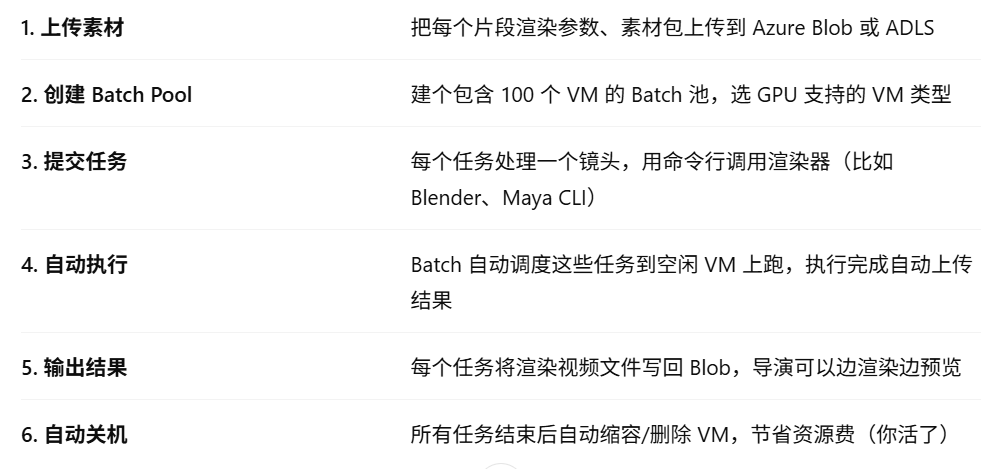
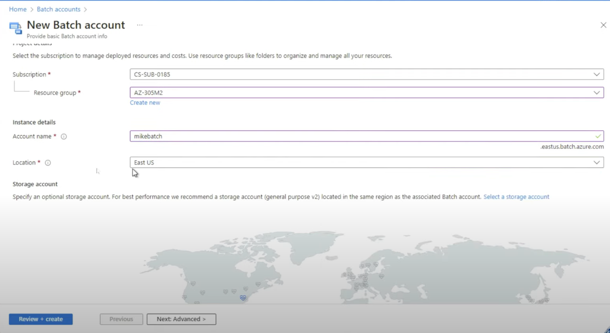
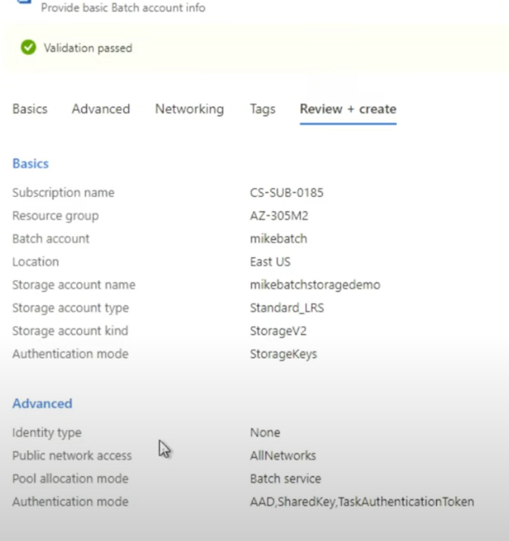
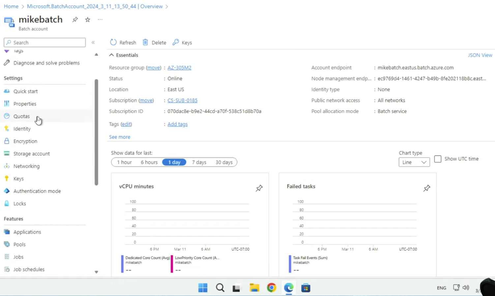
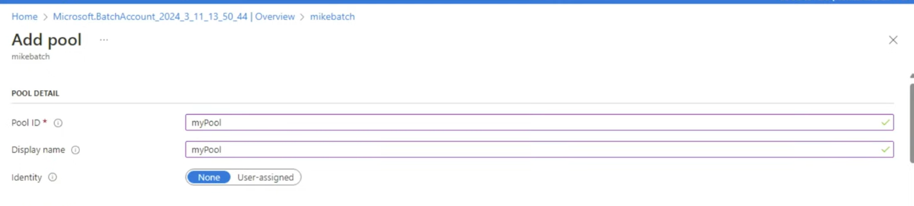
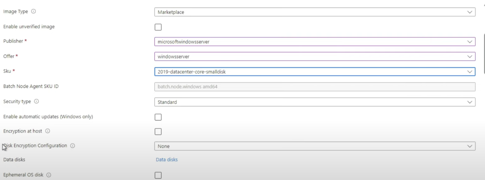
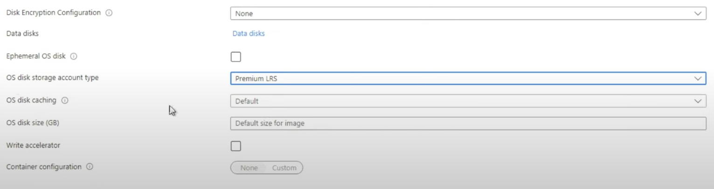
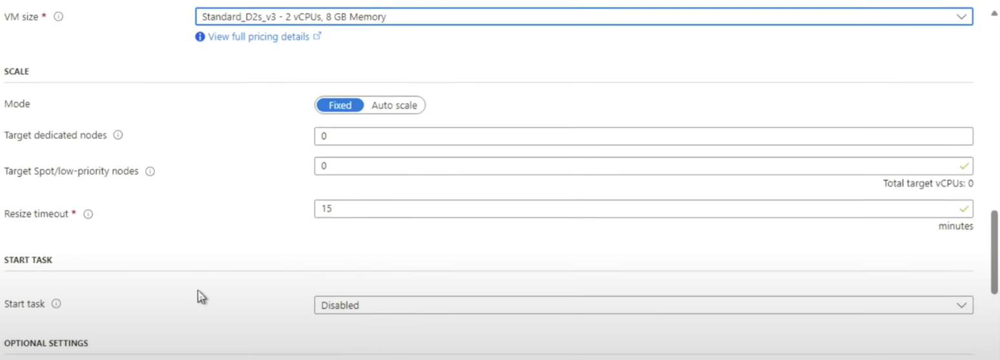
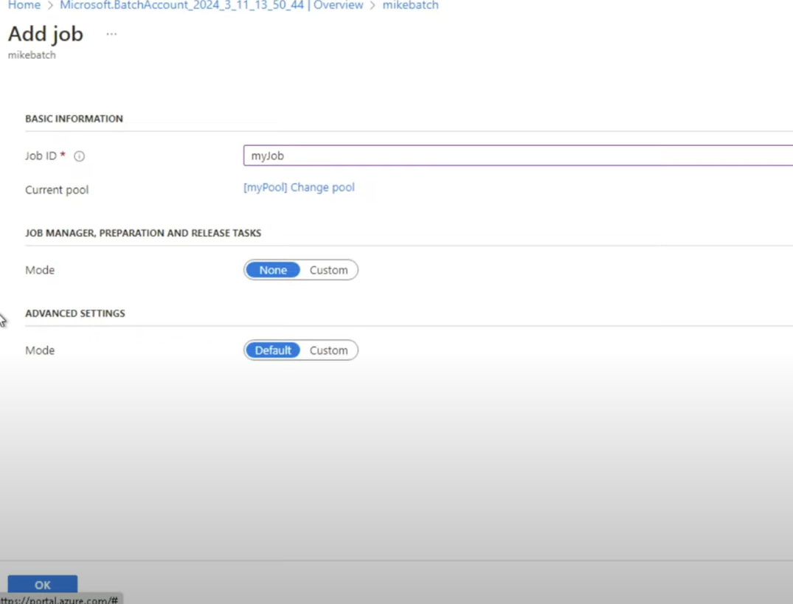
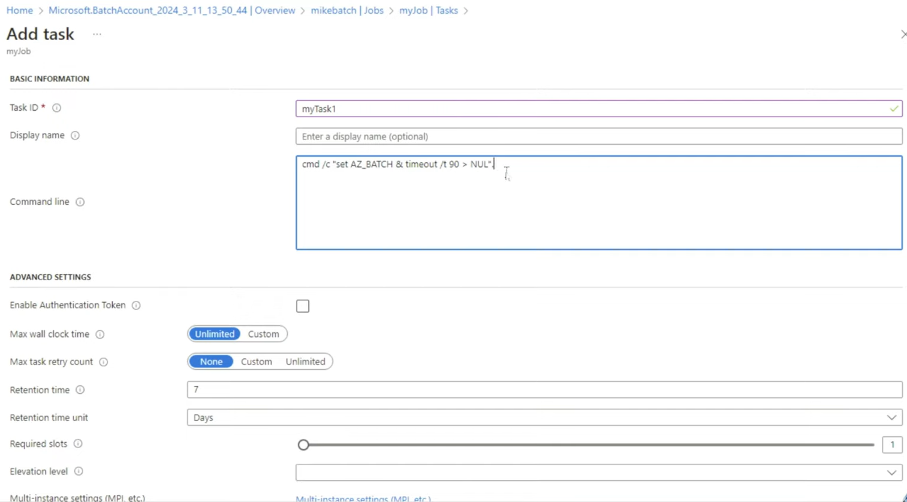

[返回compute](https://github.com/RookieToExpert/interview/blob/main/Cloud/Compute/compute.md)
## Azure Batch
**Azure Batch 是一个面向高性能并行计算的托管服务，能在海量 VM 上批量执行脚本、作业或模拟任务，自动扩缩、调度和重试**

## Lab

1. Create a Batch account along assosicate it with a storage account:

    

    

    Overview:

    

2. Create a pool in batch account:

    

    Operating system:

    

    

    Scaleing option:

    

3. Create a job:

    

4. Create two similar tasks inside the job:

    
    
    

> 可以用azure CLI同时提交上千个task：

