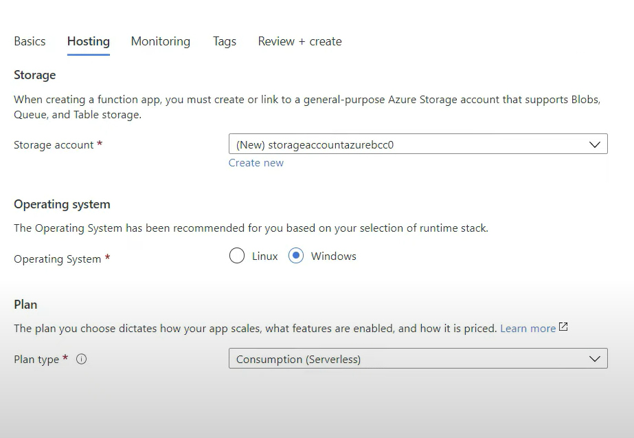
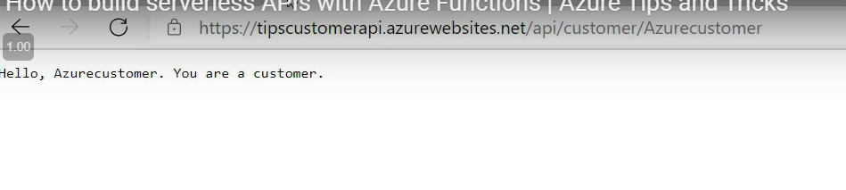

## Build serverless API using azure function

1. Create a function app

    

    Link to a storage account and choose an OS:

    

2. Create a function:

    

    

3. Edit the integration:

    

4. Edit the code:

    

5. Test the code:

    

    

6. Can copy the function URL and test it on a browser:

    

    