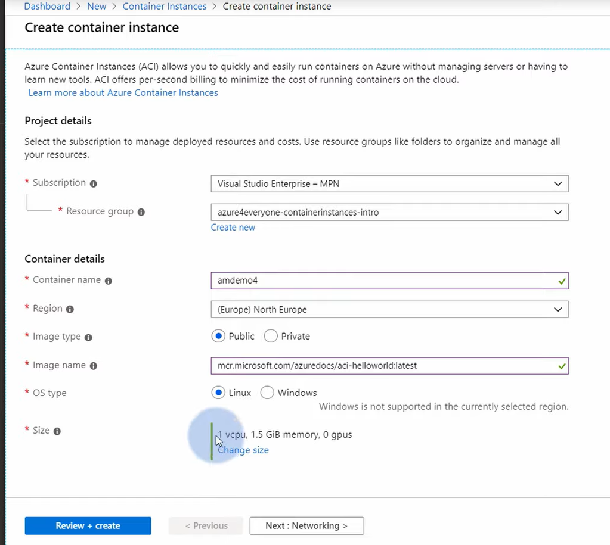
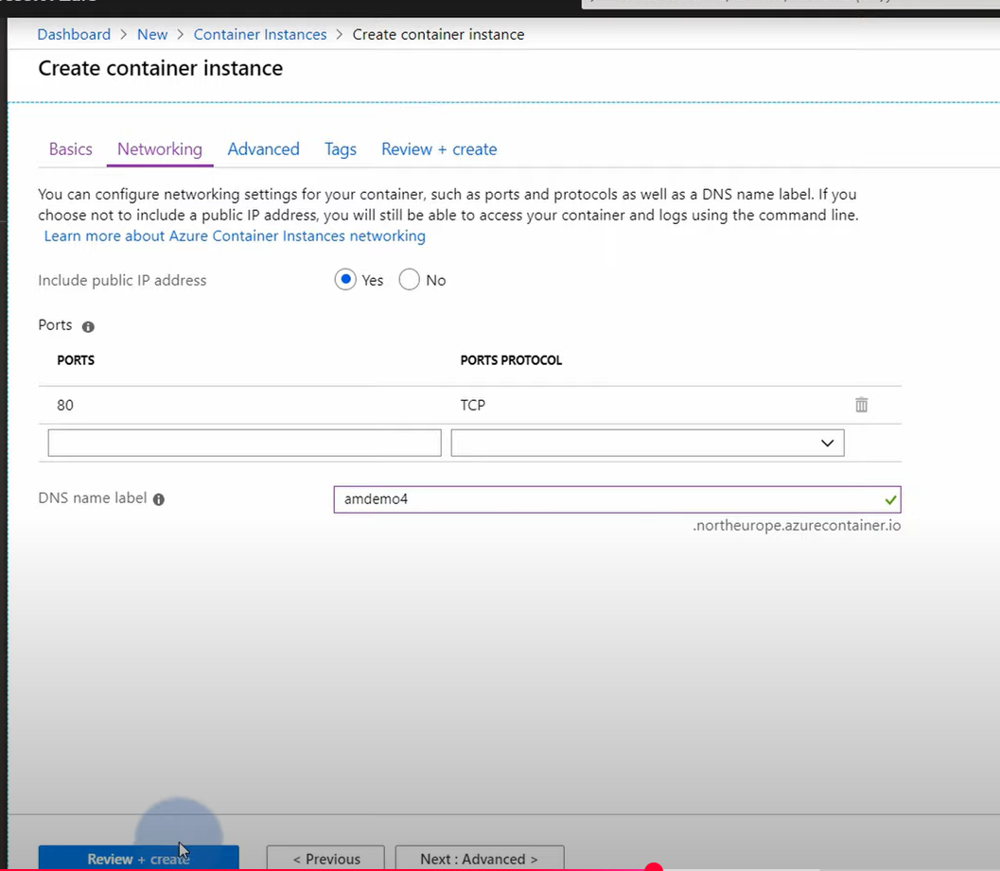
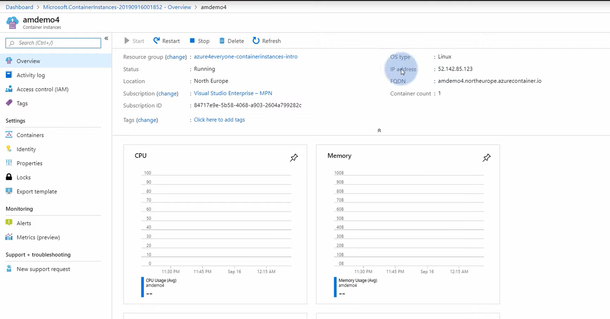
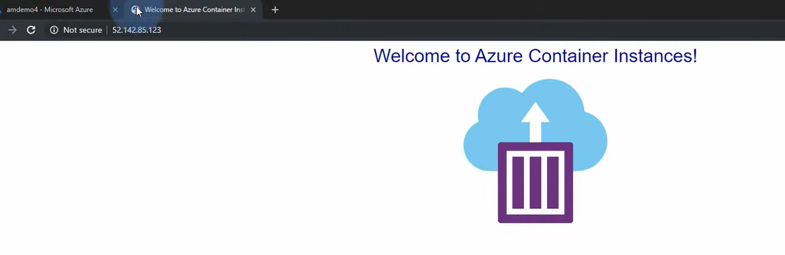
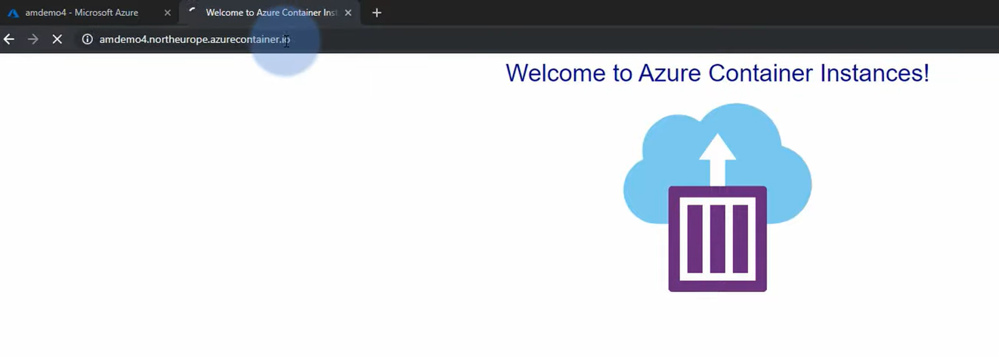

## Azure Container Instance

## Lab创建一个web application:
1. Create Container Instance:

    compute:

    

    network:

    

    Overview page:

    

2. 直接http访问cotainer ip或fqdn就可以访问这个服务：
    IP:

    
    FQDN:

    
