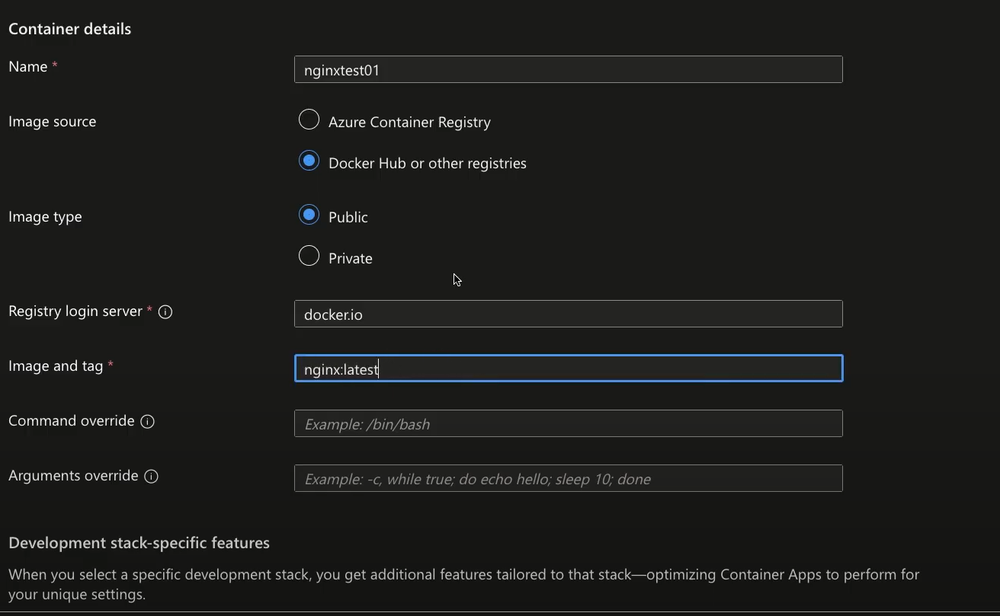

## Azure container app
- powered by Kubernetes，can develop kubnernetes style apps like service discovery and traffic splitting.
- Don't provide direct access to the underlying kubernetes APIs.
- Can build apps like:
    1. Public API Endpoints
    2. Background processing
    3. Event-driven processing
    4. Microservices

        

## Lab
1. Create a container app:

    

    

    

    