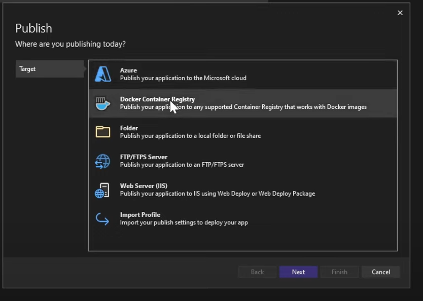
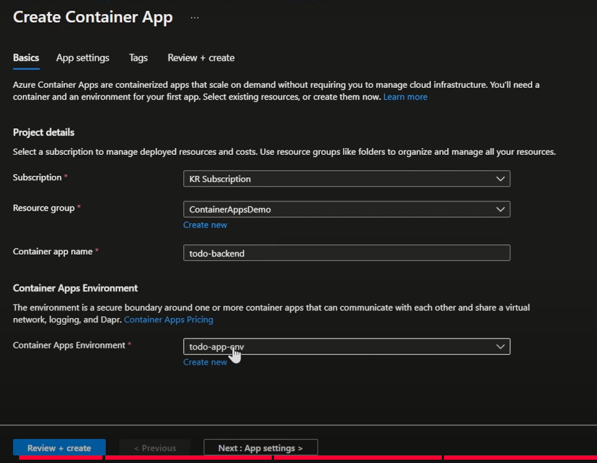
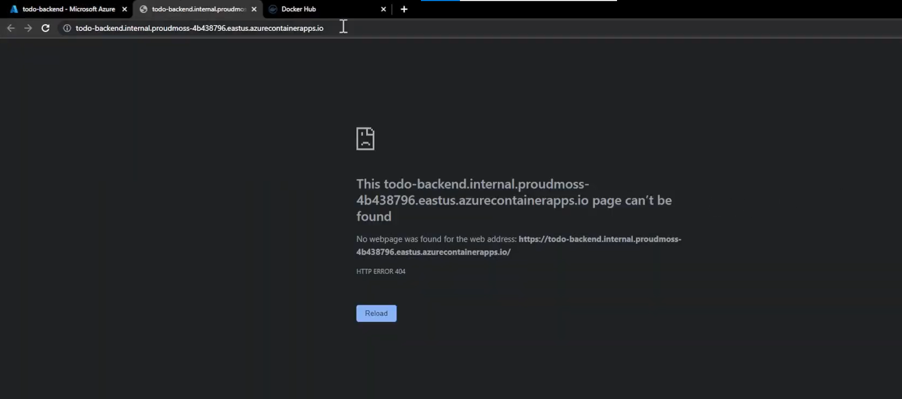

[返回compute](https://github.com/RookieToExpert/interview/blob/main/Cloud/Compute/compute.md)
## Lab: Build a To-do application
#### Build the backend:
## Coding:
1. Create an ASP.NET Web API framework:

    

    

    

    

2. Create and publish the docker image of the frontend app to docker hub:

    

    publish this image to docker hub:

    

3. Add coding to the frontend and backend to ensure they can communicate:
    在前端中创建一个client与后端api(todo class)交互：

    

    

    与后端交互的代码：

    

3. Create the backend container app and use your own image:

    

    仅限container apps通信，没有public access(因为是后端api):

    

    所以直接用broswer访问是禁止的：

    
