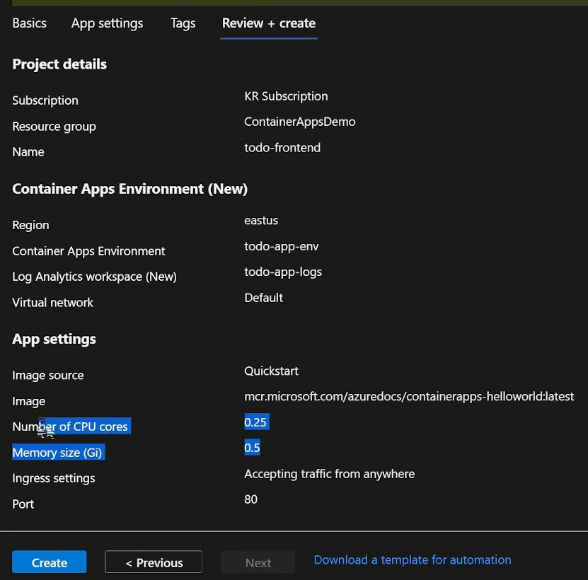

## Lab: Build a To-do application
#### Build the frontend
1. Create a container app called to-do frontend:

    Create an **enviornment** first:

    

    Environment be like:

    

    Linked to a **log analytics workspace**:

    

    Select use you own network if need to engage with on-premise users or apps:

    

    

2. Select the image:
    Use one of the quickstart image to test first:

    
    
    Overview page:

    

3. Test if the container apps work by browsing its URL:

    

#### Write the customized frontend code:
1. Create a visual studio project:

    

    

2. Replace the home index file to my to-do list code and 写一些coding部分:

    

3. Create and publish the docker image of the frontend app to docker hub:

    

    Create a docker file:

    

    Create image of this docker file:

    

    publish this image to docker hub:

    

4. Recreate the container app and use your own image:

    

    