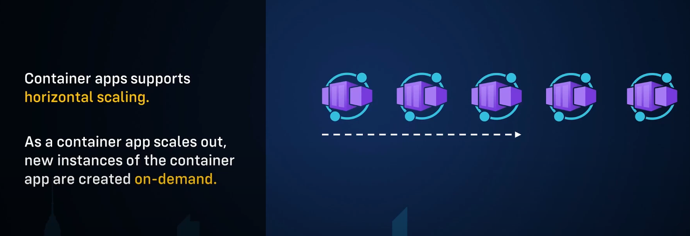
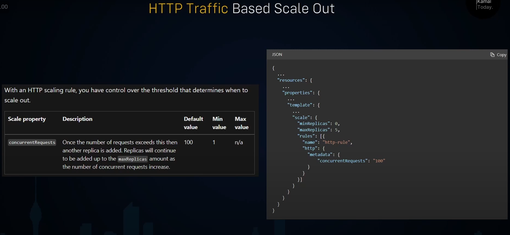
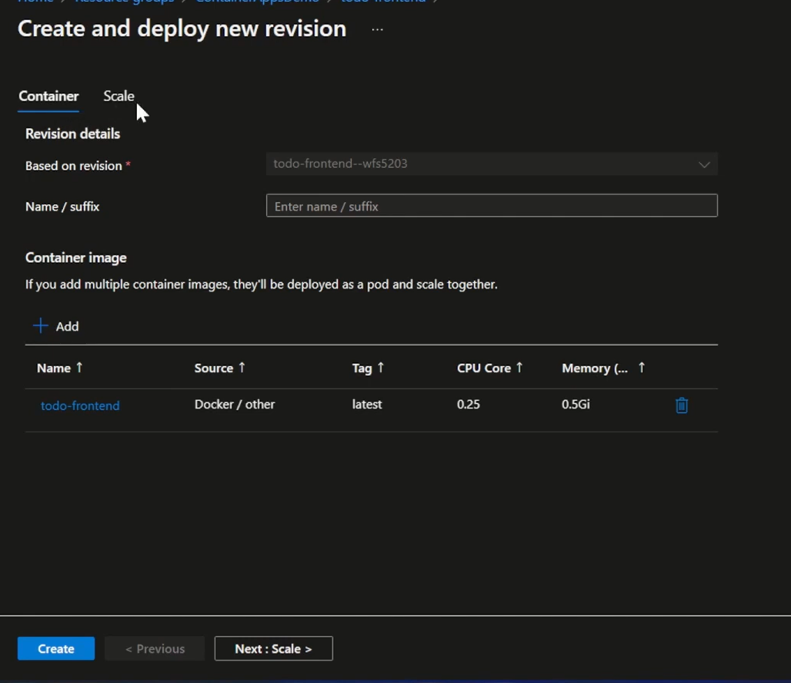
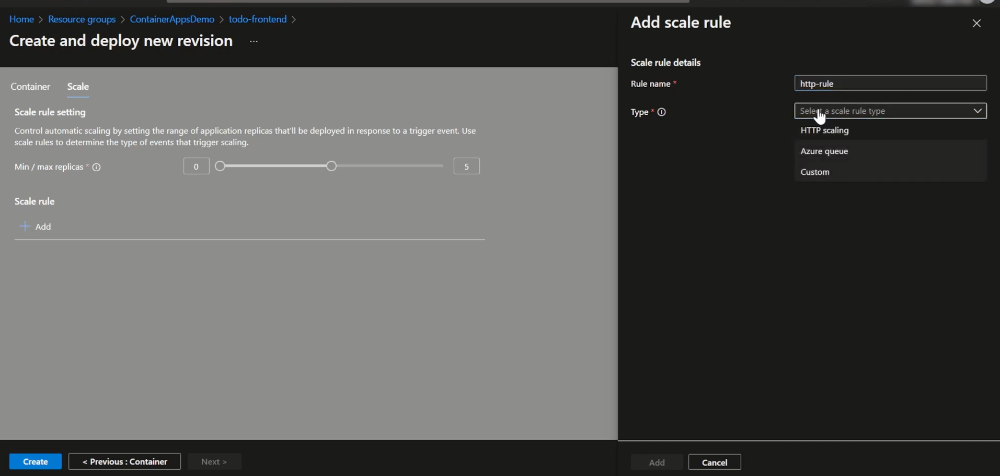
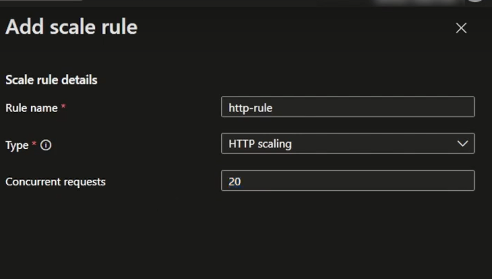
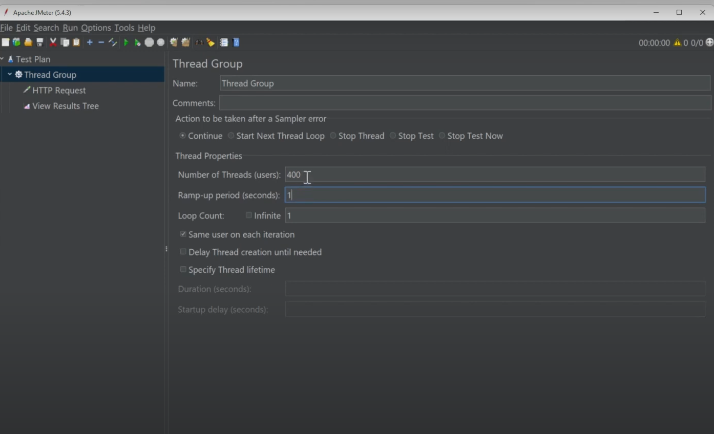
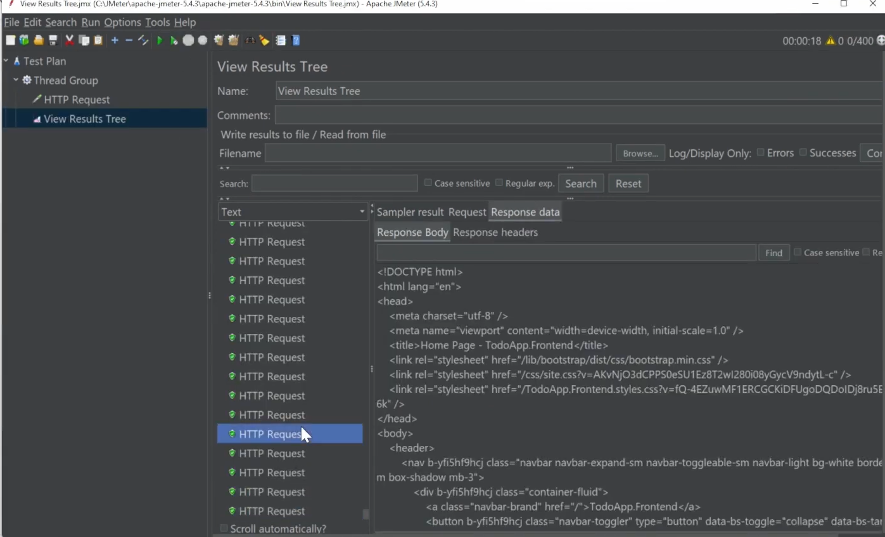
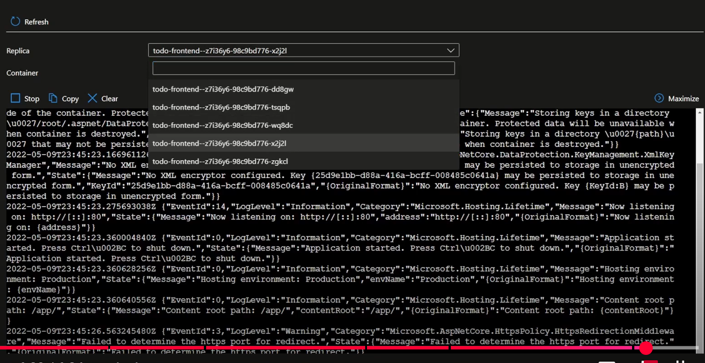

[返回compute](https://github.com/RookieToExpert/interview/blob/main/Cloud/Compute/compute.md)
## Scale out option

- Instances are called replica in container apps scale out option.
- By default the scale rule is set to **0** and 0 replica will have no charge incurred.
- Three types scaling rule:
    1. HTTP traffic
    2. Event driven
    3. CPU/Memory

## HTTP Traffic scaling:

#### Scaling rule configuration:
1. Create scaling rule:

    Select a container:

    

    Set the replica numbers and configure the scale rule:

    

    

2. Use apache JMeter to create 400 https request to the frontend container app:

    

    

    可以看到5个replicas被创建：

    
