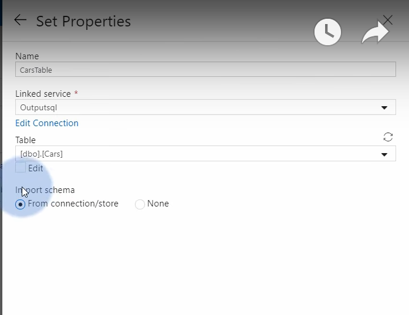

## Azure data factory
用于分析，清洗数据

### Overall structure:

## Demo: Importing CARS.csv data from Blob to Azure SQL using data factory

✅ 第1步: 创建data factory

✅ 第2步: 创建SQL database

✅ 第3步: 创建storage account然后上传csv文件到blob container作为input source

✅ 第4步: 在sql db创建表格作为目标文件载体

✅ 第5步: 在data factory里面创建pipeline:

✅ 第6步: 创建linked service：

✅ 第7步: 定义data set：

选择data的来源：

选择data的类型：

定义文件路径：

✅ 第8步: 重复以上步骤，为目标sql database创建linked service，定义data set：

linked service:

data set:

✅ 第9步: 创建copy activity移动数据：

还有非常多其他的activities，其中copy activity比较常见：

测试数据是否copy成功：

✅ 第10步: 