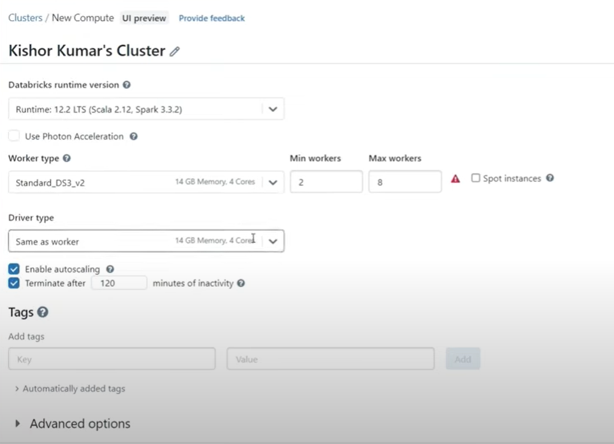
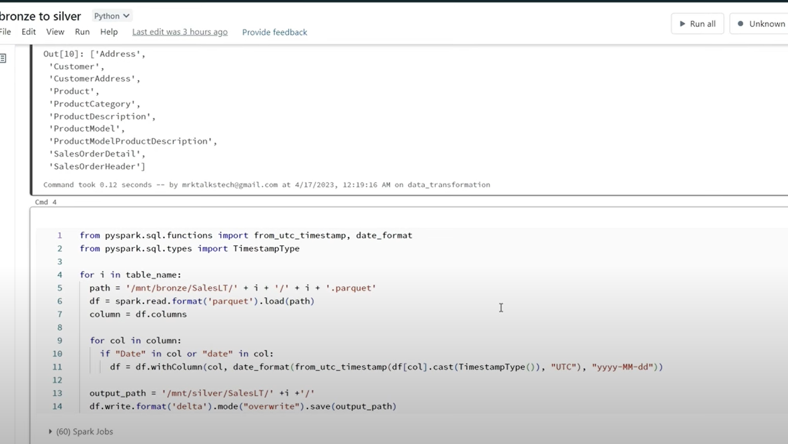
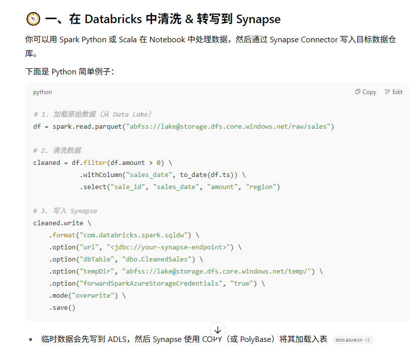

## Azure Databricks
**Azure Databricks 是基于 Apache Spark 的大数据+AI 分析平台**

✅ 第1步:
- 在 Azure Portal 搜索 “Databricks”，创建一个工作区。

✅ 第2步:创建Spark集群
你会选择：
- VM规格（比如 Standard_DS3_v2）
- 是否自动终止
- 是否开启 autoscale



✅ 第3步：写代码（Notebook）
进入工作区 → 新建 Notebook → 你可以写：
```shell
# Python 读取 CSV
df = spark.read.csv("/mnt/datalake/mydata.csv", header=True)
df.show()
```
或者用 SQL 查询 Delta 表：
```sql
SELECT COUNT(*) FROM orders WHERE status = 'delivered';
```



或者清洗数据并写入synapse：

