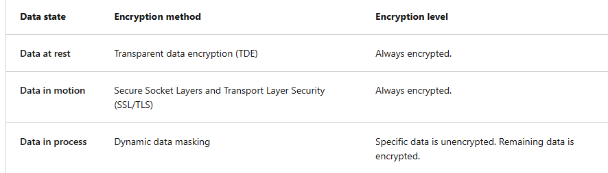
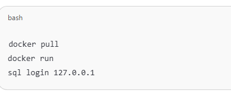

## azure sql database
- 两种计费方式：
    - DTU: Azure自己取的计费单位，他们算好了CPU+内存+IO的组合，并且打个分数
    - vCore: 自己选择CPU核心数，内存大小自己搭配
    - 支持dynamic scalability:
        - vertical:增加或减少单个数据库的计算大小，纵向扩展
        - horizontal:添加或移除数据库数量，横向扩展
## azure sql managed instance
可以使用sql server agent，common language runtime，database mail等服务，无需管理OS或者VM level的问题。
## azure sql server vm
完整的SQL server，需要自行管理OS和SQL server的版本更新。

*比较图：*

## Data encryption for structured data

## Azure SQL edge:
Azure SQL Edge 的使用方式是通过 Docker 部署，支持标准 T-SQL、流处理、机器学习推理，适合边缘场景的数据采集与预处理，并可以与 Azure 云端数据库协同工作。

