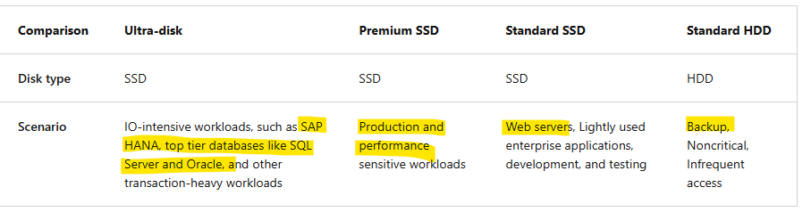
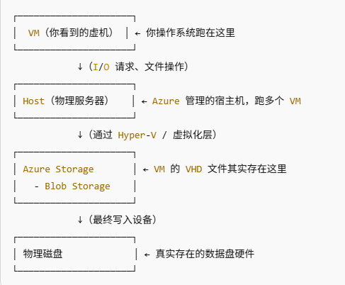
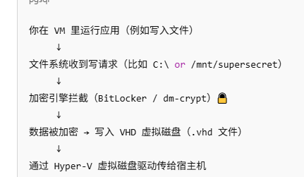
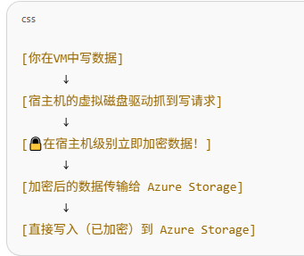

## Azure disk types:

## encryption types for managed disks:

数据传输过程：

**Azure Disk Encryption**

在VM中就通过比如bitlocker/dm-crypt将本地数据加密

**Server-Side Encryption**

host将数据传送到Azure storage blob层时加密

**Encrpytion at host**

在host层就已经加密，传给blob的数据是已经加密过的

