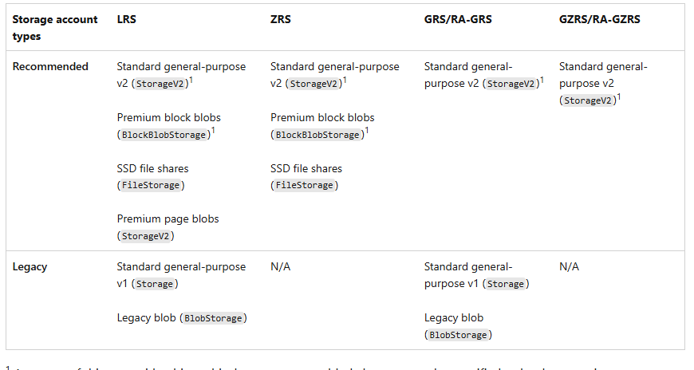

## Immutable storage policies:
- **Time-based retention policies**:
let users set policies to store data for a specified interval. When a time-based retention policy is in place, objects **can be created and read**, but not modified or deleted. After the retention period expires, objects **can be deleted, but not overwritten**. **The Hot, Cool, and Archive access tiers** support immutable storage by using time-retention policies.

- **Legal hold policies**:
store immutable data until the legal hold is explicitly cleared. When a legal hold is set, objects **can be created and read, but not modified or deleted**. **Premium Blob Storage** uses legal holds to support immutable storage.

Supported storage account types:

