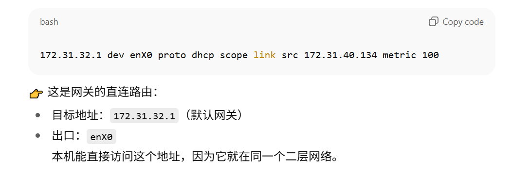

## 印象深刻的案例？
#### Migrate 收集数据原理
- server metadata:

    

    

- performance data:

    

#### 技术板块(迁移时high churn issue)
#### 性能
**S**：之前对接过一个客户，因本地数据中心到期，希望将本地核心业务迁移至云端，整体数据中心的虚机整体采用Azure migrate工具进行平迁至Azure VM，通过site-to-site VPN打通本地和云端网络，云端创建private endpoint，在业务低峰期通过全量+增量备份进行迁移任务。我们作为技术团队负责搭建前期的迁移链路，包括在源端服务器上配置agent，将agent注册至云端保管库并启用agent，建立本地appliance作为迁移任务的中转服务器，一切都正常进行，但是在增量备份阶段，有几台 MySQL 服务器数据同步失败，云端报错 “High churn issue limit”，提示云端磁盘接受的磁盘IO速率过载。

**T**：作为技术对接工程师，核心任务是找到具体数据同步出错的根因，并且给出客户可接受的一个解决方案。

**A**：
- 确认报错：通过后台查看后端日志以及搜去本地sql服务器的代理日志，确认报错信息和portal端一致。

- 定位root cause：随后与客户约定时间，远程接入本地环境，先通过`ps -ef | grep walinuxagent`和`ps aux | grep walinuxagent`看一下这个代理进程是否正常在运行，并且通过`sudo systemctl restart --now walinuxagent.service`，通过```iostat -dx 600 3```以及查看`/proc/diskstats`日志查看磁盘平均每秒写入的数据量和单次写入操作的平均大小：

    

    得到两个指标，一个是`wareq-sz`(write request size)表示平均写 I/O 大小（单位 KB），结合`wkB/s`(write KB per second)可以得到每秒平均写入的总KB，上图则是`wkB/s` = 8543.60 → ≈ 8.34 MB/s,`wareq-sz` = 17 KB。结合两个指标，对比云端的磁盘IOPS的支持表格：

    

    > 通常迁移云端默认使用standard磁盘作为接受对象，软这边磁盘分为两种，standard HDD和preimum SSD，HDD能接受每秒256次IOPS，SSD根据磁盘大小通常是1280次IOPS到2560次IOPS左右，那么根据单次IOPS的大小，通常数据库的话PGsql默认是8KB一个page，mysql innoDB默认是16KB一个page，那么我们会有一个官方的支持表格根据接收磁盘的每秒的IOPS数量和大小可以得到一个每秒的写操作大小的上限。所以大概率是无法承受数据库，日志类型的服务器这种写入量操作非常频繁的服务器。

- 结合根因和最佳实践，我们给出客户的方案是将云端的replica disk类型调整为premium大小，但是由于这个调整会需要客户将当前的blob存储和接收磁盘类型都换成premium的规格，premium规格的blob存储每GB的价格是standard的十倍，SSD disk的规格和相同大小的HDD disk整体价格也是4倍左右，当时客户的迁移buget是比较紧张的，所以客户当下其实是不太愿意去做这个更改，并且还压力我们说是我们不想解决问题，只想着多收钱。

- 但客户拒绝升级，我没有僵持，我是想到我们内部 DMS 可单独迁移数据库，且适配高 IO 场景。虽然我们并不负责DMS的产品，但我立刻联系 DMS 团队的TA，同步客户的 “MySQL 5.7、80GB 数据、停机＜15 分钟” 需求，拉通三方会议：DMS 团队设计 “binlog 实时同步 + 增量切换” 方案。沟通时，我用成本表说服客户：DMS迁移相比服务器迁移，中间不需要去建立多余的中转资源；且长期用 paas的DB自带的高可用、备份及底层的运维从长远来看是能减少更多的成本。同时承诺全程盯测试和迁移，消除他的顾虑。

**R**：最终客户选择通过DMS的方式去迁移，所有数据库服务器迁移成功，数据零丢失，停机也控制在分钟级，从长远来看客户的如果使用paas sql的成本肯定也会更低。客户非常满意，并且后续开case还一直指名要我去对接。


#### 网络
**S**：客户本地的数据中心，希望通过ASR进行异地容灾备份到Azure，但是在初次同步的时候一直卡在初次同步阶段，报错“ErrorCode: 33007, ErrorMessage: Failed to connect to the source server. Verify that the source server is reachable from the configuration server and that the credentials are correct.”。客户本地网络环境比较复杂，且对网络安全要求较高，不允许直接开放所有端口。

**T**：排查网络问题，找出root cause并且给出客户满意的解决方案。

**A**：
- 确认报错：通过后台查看后端日志以及搜去本地配置服务器的代理日志，确认报错信息和portal端一致。

- 定位root cause：
    - 确认网络环境：还是和客户约定时间，了解客户的本地网络环境，查看是否有代理服务器，防火墙设备，是否使用了private endpoint等更细节的网络拓扑图，确保代理服务器和防火墙设备都将所有需要访问的共有节点进行放行，白名单，客户确认已经做好了这一步，并且我们也二次检查，确保所有的端口都已经放行。
    - 到source VM上，通过`ss -tuna | grep 9443`命令检查端口监听情况，看是否有到迁移服务器的9443TCP连接已被建立，发现没有找到任何连接，继续通过`telnet <config server ip> 9443`命令测试，发现无法telnet通，说明网络层面存在问题。
    - 进一步我们怀疑防火墙没有开放9443端口，进一步去排查，发现客户的防火墙设备是有做端口白名单的，并且9443端口并不在白名单中，导致无法访问。给出方案，将端口白名单，再重新去source VM进行`telnet <config server ip> 9443`测试，发现可以telnet通，但是整体数据同步任然失败，此时我们确认source到appliance这里是联通了。
    - 我们进一步去到appliance上，确认appliance和source能互通，那此时就是appliance无法访问ASR的节点，客户本地使用的是site-to-ste VPN连接到的时候ASR的私有节点，进一步我们先检查客户是否能正常域名解析这些ASR节点，发现nslookup timeout，说明客户的DNS服务器无法解析这些域名，此时我们提供了几个方案给客户：
        1. 在azure中建立建立一台dns服务器，将私有dns zone绑定到vnet中，然后在本地的dns服务器上配置转发规则，将这些asr的域名转发到azure中的dns服务器上去解析。
        2. 直接使用azure dns resolver(一个paas服务)，在本地的dns服务器上配置转发规则，将这些asr的域名转发到azure dns resolver上去解析。
        3. 直接在本地的dns服务器上添加这些asr节点的域名和ip的映射关系。
    - 客户在最终选择了第三种方案，因为private endpoint并不多，所以直接添加映射关系是最简单粗暴的方式。
    - 此时域名解决了之后，还是连接不上，我们怀疑VPN的路由没有配置正确，我们联系了网络组的TA，共同来排查问题，最后发现azure VPN gateway绑定的Vnet和私有dns zone绑定的vnet不一致，导致无法访问这些私有节点，所以我们重新绑定以后，问题解决。
> site to site VPN通过IKEv2(负责建立安全关联（SA），协商密钥、加密算法)和IPSec ESP(负责加密数据包，保证机密性和完整性)协议实现通信。

**R**: 从排查到解决仅用 2 天，初次同步成功率 100%，容灾总进度按时完成。后续领导让自己整理 “整理复杂网络迁移前置 checklist”，分享给组内其他成员，同类网络问题解决效率大大提升。


#### K8s&Azure DevOps&Terraform&Sre
**S**：
随着团队成员增多以及新中老同学ready的产品进度不一致，导致TA在手动分配案例时效率低下且容易出错，要么是分配案例不平均，有的人分的多有的人分的少，要么是将一些难的案例分配到了一些新同学手上，新同学还没ready，导致SLA无法达成等一系列问题。

**T**：
**处于团队整体效率及SLA的保证，加上我个人学习的目的，我希望帮助团队搭建一个内部分配案例的小工具，自动化分配案例给合适的成员，主要的代码是我另一个同事完成：**
1. **这个项目是一个轻量级的“自动分单 + 展示”系统。前端部分使用 Vue 和 Vite 构建**：
    - 利用 axios 从后端接口获取数据，并通过 Chart.js 展示统计图表。
2. **主要组件包括一个展示已分配案例的表格，以及一个显示工程师接单数的柱状图。后端核心分单逻辑使用 Python 实现**：
    - 核心分单逻辑位于 main.py 中，系统通过周期性地轮询队列 API（使用 requests）获取新案例，并利用 deque 来管理本地队列，按工程师的能力进行轮转分配，分配结果保存在内存中的 assigned_cases 列表。
3. **后端通过 FastAPI 框架在 api.py 中暴露了多个监控接口，如 /cases 和 /stats，供前端使用**：
系统的配置文件集中存储在 settings.yaml 中，主要包含队列和分单 API 地址、轮询间隔以及工程师的能力配置。该配置文件的默认路径在容器内部为 /app/config/settings.yaml。开发和本地运行时可以通过顶层的 docker-compose.yml 文件一键启动，后端端口映射到 8000，前端端口映射到 8080，同时也支持单独构建和运行 Docker 镜像，相关的 Dockerfile 已经提供。

**我负责搭建K8s底座，以及通过Azure DevOps搭建pipeline实现CICD自动化，包括自动打包镜像推送至dockerhub和推送代码到github上再通过argocd进行部署，以及后期去维护整个系统，包括搭建了一个监控系统，通过Prometheus和Grafana，实时监控我们的小工具的运行状态和性能指标，及时发现和解决问题。** 

具体：
- 底座我们选择在环境中部署了三台服务器，通过kubeadm从0-1搭建了一个K8s集群，作为我们后续部署的基础。
- 通过Azure DevOps的pipeline功能，结合argocd方式，将我们的小工具代码进行自动化部署到K8s集群中，并且通过Helm chart的方式进行版本管理。
- 通过K8s的Service和Ingress功能，将我们的小工具对外暴露，方便团队成员访问。
- 通过K8s的ConfigMap和Secret功能，将我们的小工具的配置文件和敏感信息进行管理，保证安全性。
- 通过K8s的CronJob功能，定时运行我们的小工具，自动化分配案例给合适的成员。
- 通过K8s的Horizontal Pod Autoscaler功能，根据负载情况自动扩展或缩减我们的小工具的实例数量，保证高可用性。
- 同时也搭建了一个监控系统，通过Prometheus和Grafana，实时监控我们的小工具的运行状态和性能指标，及时发现和解决问题。

其中出现了一些问题，我们的前端服务无法访问。

**A**：

**R**：
#### landing架构


## linux排查思路
1. 相关进程：
`pstree -a`：可以看到正在运行的进程及相关用户：


`ps aux`:


`htop` 可视化的htop(top)


2. 查看监听的网络服务：
`ss -ntlp`(-n → 不解析域名，直接显示 IP:Port,-l → 只显示监听（LISTEN）状态,-p → 显示占用进程)：查看tcp端口


`ss -nulp`：查看udp端口


`ss -nxlp`：查看UNIX域套接词


3. CPU和内存使用情况：
> 注意以下问题：
> 1. 还有空余内存吗？服务器是否正在内存和硬盘之间进行swap？
> 2. 还有剩余CPU吗？服务器是几核？是否有某些cpu核负载过多了？
> 3. 服务器最大的负载来自什么地方？平均负载是多少？

`free -m`：查看还剩多少内存 


`uptime`：查看平均负载


`htop` 可视化的htop(top)


4. 查看硬件：
> 注意以下问题：
> RAID卡, CPU，空余的内存插槽。根据这些情况大致了解硬件的来源和性能改进办法。
> 网卡是否设置好？是否正运行半双工状态？速度是10MBps？有没有TX/RX报错？

`sudo dmidecode | more`:主机硬件信息 的工具（通过 DMI/SMBIOS 表）。它能显示：
- BIOS 版本
- 主板型号
- CPU、内存插槽信息
- 厂商信息（比如 Dell, HP, Amazon EC2 虚拟机）


`ip link show` or `ls /sys/class/net`: 查看实际网卡名字


`ethtool eth0`: 查看速率、双工模式、驱动信息


`ip addr show`：查看IP 地址、MAC、状态


`ip route show`：




5. I/O 性能：
> 注意以下问题：
> 1. 检查服务器磁盘是否已满？
> 2. CPU被谁占用了：系统进程？用户进程？虚拟机？
> 3. dstat我的最爱，用它能看到谁在运行IO，是不是MySQL吃掉了所有系统资源？还是你的PHP进程？
`iostat -kx 2`定位磁盘性能瓶颈：表示每隔 2 秒刷新一次数据


`vmstat 2 10`初步判断瓶颈方向：


`mpstat 2 10`分析 CPU 使用模式：显示系统的整体运行情况，包括进程、内存、交换分区、IO、系统中断、上下文切换、CPU 使用情况等


`dstat --top-io --top-bio`快速找出“谁在吃资源”：


四个命令的区别：


6. 挂载点和文件系统：
> 思考以下问题：
> 1. 一共挂载了多少文件系统？
> 2. 有没有某个服务的专用文件系统？比如MySQL
> 3. 文件系统的挂载选项是什么：noatime?default?有没有文件系统被重新挂载成只读模式了？
> 4. 磁盘空间还是否有剩余？
> 5. 是否有大文件被删除但没被清空？
> 6. 如果磁盘空间有问题，你是否会还有空间来扩展一个分区？
`mount`:


`cat /etc/fstab`:


`df -h`


## kubernetes排查思路
**重要组件**：
- **Control Plane**:
    - **kube-apiserver**: 提供集群的统一入口，所有操作（kubectl、controller、scheduler等）都通过 API Server 与集群交互。
    > 其他控制平面组件和节点组件都会通过它通信。
    - **etcd**: 一个分布式键值存储，保存整个集群的状态（如 Pod 定义、ConfigMap、Service 等）。
    > API Server 把集群的所有变更存储到 etcd，控制器和调度器都依赖它的最新状态。
    - **kube-scheduler**: 决定新建的 Pod 应该调度到哪个节点上，考虑资源使用率、亲和性、容忍度等。
    > 它从 API Server 读取未调度的 Pod，做出决策后再写回 API Server。
    - **kube-controller-manager**: 运行各种控制器（如 Deployment 控制器、副本控制器、节点控制器、Endpoint 控制器等），负责保证实际状态逐渐收敛到期望状态。
    > 通过 API Server 获取状态，再下发操作。
- **Worker Node**:
    - **kubelet**: 运行在每个节点上，负责接收 API Server 的指令管理Pod 的生命周期管理（创建、更新、删除），启动/停止容器，并定期向 API Server 汇报节点和 Pod 的状态。
    > 它从 API Server 获取 Pod 定义，然后调用容器运行时（如 Docker、containerd）来启动容器。
    - **kube-proxy**: 负责实现 Kubernetes Service 的网络代理和负载均衡功能，让 Pod 能通过 ClusterIP、NodePort 等方式访问。
    > 它监听 API Server 中 Service 和 Endpoints 的变化，动态更新 iptables 或 IPVS 规则。
    - **容器运行时（Container Runtime）**: 实际运行容器的组件，如 Docker、containerd、CRI-O 等。
    > kubelet 通过容器运行时接口（CRI）与之交互，管理容器的创建和销毁。

- 组件之间的联系：
    1. 用户 → 通过 `kubectl` 或 API 调用 → **kube-apiserver**。
    2. **kube-apiserver** ←→ **etcd**：存取集群状态。
    3. **scheduler / controller-manager** → 监听 **API Server** → 更新状态到 **API Server**。
    4. **kubelet** → 接收 **API Server** 下发的 Pod 信息 → 调用 容器运行时运行容器 → 汇报状态给 **API Server**。
    5. **kube-proxy** → 根据 **API Server** 的 Service/Endpoints 配置 → 实现网络转发。
#### 检查Pod 状态与事件
#### 检查节点（Node）
#### 检查网络
```bash
# 拿到service的endpoint
kubectl get svc <svc-name> -n <ns> -o wide
# Pod 内测试 Service
kubectl exec -it <pod> -n <ns> -- nslookup <service>
kubectl exec -it <pod-name> -n <ns> -- curl http://<svc-name>:<port>
kubectl exec -it <pod-name> -n <ns> -- wget -qO- http://<svc-name>:<port>
kubectl exec -it <pod-name> -n <ns> -- dig <svc-name> +short
# Pod 内测试 Ingress
kubectl exec -it <pod-name> -n <ns> -- curl -v http://<ingress-host>
# 查看 Ingress 配置
kubectl get ingress -n <ns> -o yaml
```
#### 检查组件
1. 看 control-plane 四大组件容器状态（static pods）
`sudo crictl ps -a | egrep 'kube-apiserver|kube-controller-manager|kube-scheduler|etcd'`
2. 抓kube-apiserver,etcd,kublet日志
```bash
# apiserver
AID=$(sudo crictl ps -a | awk '/kube-apiserver/{print $1;exit}')
sudo crictl logs $AID | tail -n 200
# etcd
EID=$(sudo crictl ps -a | awk '/etcd/{print $1;exit}')
sudo crictl logs $EID | tail -n 200
# kublet
journalctl -u kubelet -n 200 --no-pager
```

#### 查看service绑定后端的端口或者其他信息是否对：
`kubectl -n timeapp get endpointslice -l kubernetes.io/service-name=web -o wide`
