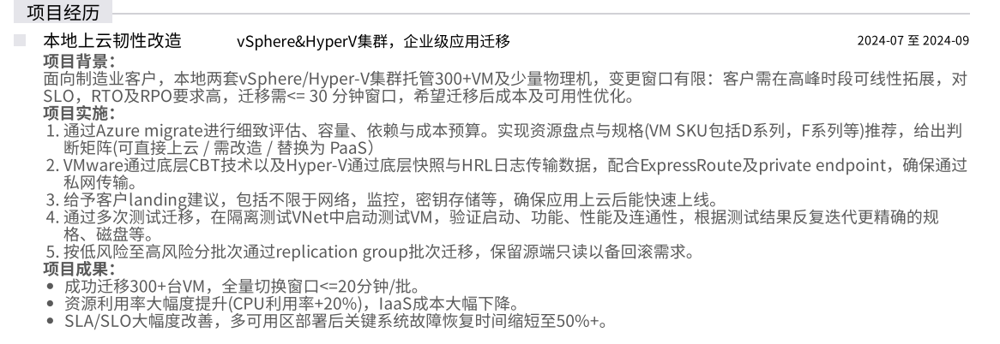
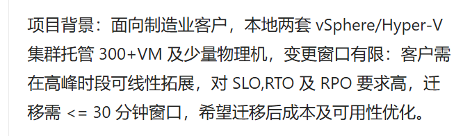
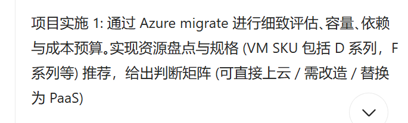
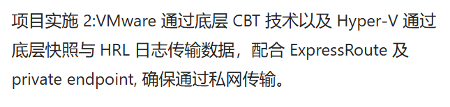
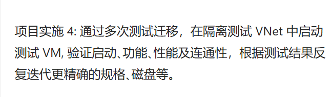
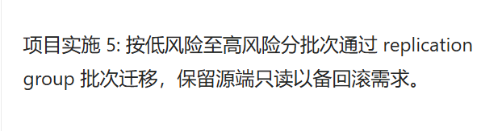

## 项目经历
#### 项目一

问题：

1. **该项目的客户是制造业，其业务特点对迁移有哪些特殊要求？你如何针对性设计迁移方案？**
> 问题：缺少 “测试迁移的具体维度”“数据安全保障措施”“方案落地成效” 等关键环节，难以体现工作闭环。
- **痛点：**
    - 实时性
        - 本地 PLC、传感器等设备产生的数据流需实时同步至业务系统指导生产，要求端到端延迟控制在毫秒级，且数据传输零丢包、低延迟，避免影响生产调度；
    - 高可用约束，停机窗口要求毫秒级
        - 生产线 24 小时连续运行，对 RPO（恢复点目标）要求达分钟级，极端场景下需秒级，迁移割接的业务中断窗口必须极小，防止生产线停摆；
    - 部分服务器因版本，特殊协议及数据合规原因，需保留至本地：
        - 部分核心数据需满足本地合规留存要求，且老旧设备仅支持 Modbus 等传统工业协议或旧版 SDK，无法直接上云，需保障本地设备与云端系统的低延迟通信。”
- **定义分工：**
    明确区分架构师团队与自身团队的职责，架构师负责前期的迁移规划，包括排期方案、迁移顺序、回滚方案和云上landing等，与客户协商完成。自身团队主要聚焦于搭建复制链路，制定技术方案和实施，确保迁移过程的技术可行性和高效执行。
- **迁移线路搭建：**
    - 采用Azure Migrate进行迁移，区分物理机、Hyper-V和VMware虚拟机，采用不同的迁移策略和工具。
    - 物理机通过agent-based方式迁移，Hyper-V和VMware通过agentless方式迁移：
        - 虚拟机（VMware/Hyper-V）：采用无代理（agentless）迁移，通过 VMware CBT（变更块跟踪）技术、Hyper-V HRL 日志追踪，在 hypervisor 层捕获 Guest VM 的数据变化，结合快照机制实现增量备份，无需在原机器安装组件，避免干扰生产；​
        - 物理机：批量部署轻量迁移代理，通过 9443 端口（原表述 “943 端口” 修正）与本地迁移服务器通信，实时采集磁盘数据，适配物理机的异构环境需求。
    - 建立appliance迁移服务器，确保迁移服务器可以与源服务器通过9443端口通信：
        - control plane：将源服务器的元数据通过迁移服务器走公网迁移至云端。
        - data plane：将源服务器的数据通过迁移服务器走专线迁移至云端。
        - 我们在客户本地部署 Microsoft Migration Appliance（迁移服务器）作为中转枢纽：先归集本地全量 / 增量数据，再通过 443 加密端口、专线传输至云端对象存储（Storage Account），最后由云端replica disk，确保传输安全与低延迟。
    - 通过ansible脚本批量安装迁移代理到物理服务器上，减少人工操作。
    - 通过Azure Migrate的工具，评估迁移服务器的兼容性，性能和带宽需求。配置对应的带宽策略，错峰复制，不占用业务高峰期的带宽。
    - 进行初始全量复制和增量复制，通过bitmap及checksum的对比，确保数据一致性。
    - 进行影子测试，确保迁移后的服务器可以正常启动和运行。期间会进行金丝雀测试，确保部分服务器在云端可以正常工作。
    - 正式割接阶段，进行最终的增量复制，确保数据的最新性。进行DNS切换，确保用户可以访问云端的服务器。

2. **项目周期仅 2 个月，如何在短时间内完成 300+VM 的评估和迁移？时间管理上有哪些技巧？**
> 兼容性提前排错、依赖分组迁移、测试问题前置，评估期→执行期→测试期→割接期
- 首先我可能要澄清一下就是，嗯，并不是说整个周期就是在两个月内完成，其实是我们负责的这一部分集群大概是在两个月完成，但是还有其他团队的小伙伴负责，可能周期要翻倍，就是可能4个月。但是我们具体的周期还是不清楚，因为我们完成这一趴之后，这个案例就结束了，后续就不归我们对接。

那但是从时间维度的考虑，那我们肯定还是有非常多方式可以去避免这个迁移周期会拉长：
- 批量兼容性排错
第一个是在评估源机器的时候，通过Azure Migrate的assessment工具去识别机器的兼容性问题的报告，这个报告会产生包括操作系统，磁盘，security boot等等的一系列兼容性检查，比如当时我们查到有数台windows VM 2008系统版本不兼容，我们需要在复制链路的提前三天要完成系统升级适配，避免之后迁移因版本问题导致重新传输数据而导致迁移排期拉长。
- 依赖分组迁移
除了评估兼容性以外，我们还会通过assessment工具得到一组依赖关系图，可以看到每台机器暴露了哪些端口，运行了哪些服务，安装了哪些软件，通过这些信息，我们会去分析它们之间的依赖关系从而知道有些机器是强关联的，可能你这一台机器迁过去，它依赖的另外一台机器还没有迁过去，那么它就会导致后续测试迁移无法正常进行。那么我们通过这个依赖关系图，我们就可以把它们进行分组，确保强关联的机器是成组一起迁移的。那这样的话就会大大降低了之后测试迁移无法正常进行的情况。
- 带宽控制 
在正式执行复制的时候，我们也会根据这一组的服务器的数据量，去按批次的去进行数据复制，避免占用过多生产环境的带宽，导致影响业务的正常运行。同时也会在云端创建多个对象存储的接收点，那这样的话也会避免因为单个对象存储的带宽限制导致复制失败，进一步拉长迁移周期。
- 测试问题前置
那么在测试迁移阶段，我们也要确保每台机器能够正常开机和运行，确保这里出现的所有问题都要解决，避免正式迁移的时候出现问题，导致迁移排期拉长。包括我们当时发现有部分exchange server的服务器出现蓝屏的情况，后面发现azure vm对exchange server有一些特定要求，我们需要去exchange server的源机器上先暂时停止exchange server的服务，然后再去进行测试迁移，才能确保它能正常开机，后续再将exchange server的服务启动。这一步我们就需要确保在测试迁移阶段就要发现并解决，避免正式迁移的时候出现问题，导致迁移排期拉长。

3. 制造业客户的 “高峰时段线性拓展” 需求，在 Azure 中如何实现？你选择了哪些 Azure 服务支撑该需求？

- **项目中 SLO、RTO、RPO 的具体指标是什么？如何通过技术方案保障这些指标的达成？**
> 规范指标界定，补全认知闭环.深化技术方案，明确 “指标→手段→验证” 逻辑
关于具体的SLO, SLA, SLI这些指标，因为这是在迁移前售前团队和业务团队谈合同的时候就达成了一致，但我们团队没有接触到这些具体的合同细节，但对于这些指标类型还是都理解的。
- RPO 指标：
和容灾不一样，迁移对RPO的指标并没有那么严格，我们迁移的工具是根据一个公式去动态调整RPO的间隔的，可能会在6到12个小时之间浮动，具体的RPO间隔是根据上一次增量备份的时间减半去计算下一次增量备份的时间间隔，所以这个RPO其实并不是一个固定值，可能会在6到12个小时之间浮动。这一步的设计也是有原因的，就是因为你频繁的去做增量备份，可能会影响生产环境的稳定性，同时也会增加费用。其次就还是因为迁移它就是一个一次性的动作，并不是长期的容灾备份，所以对RPO的指标要求并不严格。
- RTO 指标：
客户更在意的是RTO的指标，客户要求的是分钟级甚至极端情况下秒级的RTO指标。那其实这个RTO指标更多的是强调整体架构的方案迁移的要求，针对我们迁移的这一部分，其实并不是会直接影响他们生产环境的工厂流水线和应用，所以针对我们负责的部分，RTO的指标相对宽松很多。但是据我了解，针对到工厂流水线和应用的部分，是有专门的架构师和实施专家去对接，他们主要采用的方法还是分批次迁移，先迁移无状态的应用，包括一些静态网页，针对这部分，会保持一个阶段性双活的状态，本地应用还在正常运行，通过金丝雀的方式，部分放流到云端，测试云端服务器是否能正常运行，然后再针对核心数据库去进行迁移，这一部分因为核心数据库的RPO是严格的五分钟，所以最后数据同步的数据量并不会很大，进一步压缩了RTO的时间，控制在分钟级的效果。

5. **变更窗口有限且迁移窗口要求 <=30 分钟，你采取了哪些技术手段缩短迁移时间？**
- 前瞻性的工作，结合上面的回答：
刚刚提到了前期我们做的大量的一些前端性的工作，包括评估时期去解决兼容性问题，再到依据依赖性去分组强关联性的服务器集群，再到后面我们进行测试迁移的时候解决所有服务器无法开机运行的问题，这些都避免了客户在正式迁移的时候出现问题。
- 将停机时间细分为数据同步，机器创建、流量切换：
那此时停机窗口的时间就被划分成三块，一块就是在割接时，去同步最后的差量数据，一块就是实际在云端创建出来的服务器的时间，那么还有一块是去应用连接切换，总体来说就是这三个部分组成了最后停机的窗口时间。
- 数据同步：
针对我们负责的服务器，通过azure migrate去进行服务器rehost的方式，通常都是执行最后一次增量磁盘复制，因为这些服务器不是数据库，所以数据增删改减并不频繁，所以最后增量复制的时间一般都是分钟级，当然，针对数据库，我们是用专门的DMS的工具去进行迁移，DMS的增量复制通常都是秒级延迟，DMS 连接到源数据库和目标数据库，执行 全量迁移（复制架构、表、数据），后续进入 增量复制（CDC）阶段，持续把源库的日志变化应用到目标库。基本上最终cutover的时候也都是能保证在分钟级。
- 机器创建：
关于rehost的方式，就是会在云端基于此前传输数据的磁盘，会创建出一台服务器，这个只要没有出现问题，基本上都是分钟级就创建好了，关于DMS，这个其实早在同步前，云端就创建好了目标的数据库实例的，所以这一步就不需要重新创建。那么最后切换的步骤，其实在停机窗口期间，就可以去进行应用连接切换。那么实际上停机窗口就是最后数据同步的时间，基本上都是能控制在分钟级。

6. Azure Migrate 的评估流程是怎样的？你如何通过其实现准确的容量和依赖评估？
- 整体费用：
通过 Azure Migrate 的评估工具，我们可以获取到每个 VM 在迁移到云上后的预估费用，包括计算、存储和网络等各项费用。这些费用的估算是基于客户当前的使用情况和 Azure 的定价模型，能够帮助客户更好地理解迁移后的成本结构。
- 兼容性评估：
通过 Azure Migrate 的兼容性评估工具，我们可以检查每个 VM 是否符合迁移到 Azure 的要求，包括操作系统版本、磁盘类型、secure Boot 状态、硬件配置等十几类检查项。评估结果会生成一份兼容性报告，列出所有不兼容的 VM 及其具体问题，帮助客户提前解决这些问题，确保迁移过程顺利进行。

- 性能与容量评估：
Azure migrate的迁移服务器会每五分钟采取一次性能数据包括CPU、内存、磁盘和网络等指标，默认采集周期为7天，可以延长至30天，结合一个安全系数，去计算目标VM的规格，比如某 4CPU 8G内存的服务器在95分位CPU平均利用率只有20%、内存利用率只有40%，按 Azure VM 规格会自动匹配为 2CPU 4G内存的一个B2ms系列的实例，通过这样又可以进一步节约客户成本。

- 依赖关系评估：
根据vmware，hyper-V采用无代理，物理服务器需安装一个MMA和Dependency Agent去采集进程级细节，获取 “进程 - 端口 - 数据传输量” 细粒度依赖，基于依赖强度进行分组，确保强关联的服务器成组迁移，避免跨组依赖导致测试迁移失败。

1. 解释一下 VMware 的 CBT 技术和 Hyper-V 的 HRL 日志传输的原理，它们在数据迁移中有哪些优势？
- VMware: VMware vSphere 提供 CBT (Changed Block Tracking) 功能，它是在虚拟机磁盘文件（VMDK）上启用的一个增量变化跟踪机制。当 VM 运行时，CBT 会在 VMkernel 层记录哪些数据块发生了变化。在做增量复制、备份或迁移时，备份/复制工具只需要读取上一次快照以来变化的块，而不是整个虚拟磁盘。具体是当启动虚拟机的 快照 时，VMkernel 会记录磁盘 I/O 的写入位置，复制软件（如 vSphere Replication、第三方备份工具）通过 CBT API 查询出变化块的索引，仅传输这些变化的数据块到目标端，完成增量复制。
- hyper-V：在 Hyper-V 的 Hyper-V Replica 功能中，使用 HRL (Hyper-V Replica Log) 来追踪虚拟机磁盘的数据变化。每当 VM 的虚拟硬盘 (VHDX) 有写操作时，变化会先被记录到 HRL 日志文件。在复制同步周期到达时，HRL 会被发送到目标主机，目标端根据日志内容在对应磁盘上重放这些变化。

2. ExpressRoute 和 private endpoint 如何保障数据传输的安全性？配置过程中需要注意哪些网络配置细节？
首先我认为用户需要就是使用 express route 和 private Endpoint 是一定是对网络的安全性、数据的安全性和网络稳定性有非常大需求的客户。
- private endpoint：公网访问阻断+Vnet边界隔离+数据传输加密：
    - 启用 Private Endpoint 后，云端服务自动禁用公网 IP 访问，仅允许来自客户 VNet 或 peered VNet 的私网流量访问，从网络层杜绝公网攻击面。
    - Private Endpoint 需部署在客户 VNet 的专用子网中（建议单独创建 “PrivateEndpointSubnet”），且需通过 NSG（网络安全组）配置入站 / 出站规则（如仅允许 ERP 服务器 IP 访问 SQL DB 的 1433 端口），实现精细化访问控制。
    - Private Endpoint 与云端服务的通信基于 Azure backbone 网络，默认启用 TLS 1.2 加密，且支持客户托管密钥（CMK）对传输数据二次加密，满足合规要求。
- Express route: 物理链路隔离+端到端加密+身份与路由认证
    - 物理链路隔离：数据传输不经过公网，直接通过微软主干网或合作伙伴 ISP 的专用线路传输，避免公网传输中的窃听、篡改风险，链路稳定性达 99.9% 以上。
    - 端到端加密：链路层加密（如 MPLS VPN），由 ISP 提供；应用层加密（如 TLS/SSL），由客户应用配置，确保数据在传输过程中全程加密，防止中间人攻击。
    - 身份与路由认证：配置时需通过 Azure AD 或 API 密钥进行身份验证，且通过 BGP 协议交换路由时需启用 MD5 哈希认证，防止路由劫持与虚假路由注入。
那么必然的客户需要去配置一个 express route 或者 VPN Gateway。去访问这个私有节点，那么具体是如何保证数据传输的安全性？主要是从一个公网私网的概念，如果说没有这个私有节点和 express route，那么数据全部都是通过公网的方式去进行传输，并且是传输到，也是传输到一个公网的节点，那么这一部分微软并不能很好的去承诺能保护你的一个数据安全，同时也无法去确认就是这个线路它的一个网络抖动。或者它的一个网络延迟的一个情况，那么这一部分都会影响你日后进行传输的一个效果。那么此时使用 express roll 的时候，它会保证你走的是微软的主干网，同时这条主干网上他会有一个你，假如你买了一个像500兆或者1千兆的一个带宽，它能保证你达到这个带宽，那么进一步避免了你的网络抖动。只是日后传输有延迟等等，那么这一块我认为是。express rule，它能够保证你的数据安全性的情况，但是具体的配置过程实际上我们并不会负责这一部分，但是据我理解，配置的时候你会是需要和当地的 ISP 去沟通协商。首先可能我认为会从你的带宽的需求出发，再到。你的一个周期的出发，再到你对这个。我认为就是一个周期和带宽需求。
3. 若私网传输过程中出现带宽瓶颈，你如何排查和解决？

1. 网络方面的 landing 建议具体有哪些？比如 VNet 设计、子网划分、安全组配置等。

2. 针对该项目的应用特点，你推荐了哪些监控工具和指标？如何确保监控体系在上线后立即生效？

3. 密钥存储使用了 Azure 的哪些服务？如何配置密钥的访问权限和轮换策略？

1. 测试迁移的次数和每次的重点是什么？如何设计隔离测试 VNet 的环境，确保与生产环境的一致性？
- 根据不同类型的组的VM分批次迁移：
    - 先检查：vm开机和服务检查→网络连通性检查→DNS解析检查：
主要是根据不同组的服务器进行批量的测试，测试也会分成两类：服务器开机与服务检查，确保 100% VM 能正常开机，核心服务启动状态正常；还有确保基础网络连通性和DNS基础解析检查，比如同组内 VM 的 Ping 连通性、核心端口（如 80、1433）的可达性，通过 nslookup 验证测试环境的域名能否正确解析至测试 IP。
    - 再检查：业务深度验证：
    这一步主要是客户去进行，比如 Web 组调用 API 组、API 组连接数据库组的全链路 API 调用测试；模拟 ERP 订单创建、MES 生产计划下发等真实业务场景，检查数据流转是否正确；
    - 预割接仿真验证:
    灰度，蓝绿测试，数据一致性校验等等。

2. 性能验证中关注了哪些指标？比如 CPU、内存、磁盘 IO、网络延迟等，如何优化不达标项？

1. 如何划分低风险和高风险的 VM？replication group 的分组依据是什么？
- 低风险 VM：通常是一些关键业务影响较小的应用，或者在测试环境中运行的应用。这些 VM 的故障不会对业务造成重大影响，可以在迁移过程中进行一定程度的容错。
- 高风险 VM：这些 VM 通常是关键业务应用，故障会导致业务中断，必须确保在迁移过程中保持高可用性。分组依据主要考虑业务重要性、依赖关系、性能要求等因素。

2. 源端只读的配置方式是什么？若需要回滚，回滚流程和时间预期是怎样的？

源端只读的配置方式是通过负载均衡（load balance）实现金丝雀放流策略。具体而言，我们通过专线打通本地与云端环境，采用全局负载均衡机制，在 L4 负载均衡设备上配置后端监听本地和云端数据库的域名节点。根据预设权重，将流量按比例分发至不同数据库节点，以此实现源端只读配置。​
当需要回滚时，系统通过心跳检测、事务超时、错误率阈值等多维度指标判定云端数据库是否不可用。一旦触发回滚条件，首先将本地数据库的负载均衡权重动态调整为 100%，强制流量切回本地；同时，应用连接串通过自动化脚本批量更新，将所有数据库连接指向本地实例，确保服务快速恢复。整个回滚过程采用 “先切流量，后改配置” 的原子化操作，回滚窗口严格控制在 5 分钟以内。