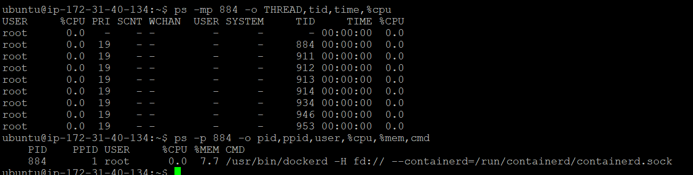
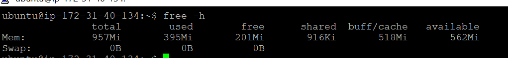
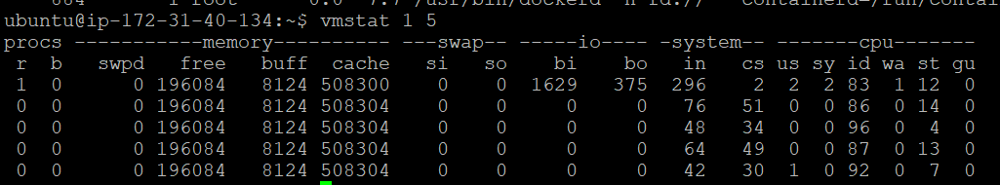
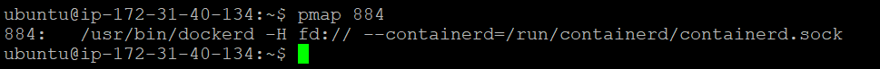
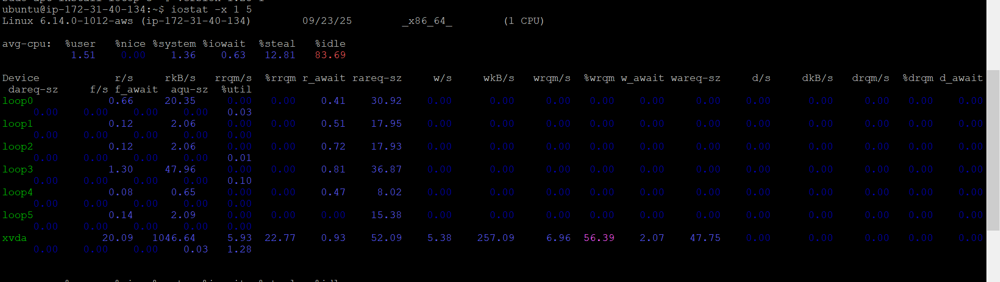

**口试版（3分钟精简）**：
我是该项目的技术负责人，负责核心业务（ERP、MES、部分中间件）上云与平台落地。我们把业务层与平台层分离：保留工厂端低延迟的控制逻辑，业务应用与分析迁到云端。

迁移分四步：
1. 评估（用 Azure Migrate 采集 CPU/IO/依赖图、确定迁移顺序与SKU）
2. 复制（ASR/appliance：先全量后增量，基于 VMware CBT/Hyper‑V HRL无代理迁移、裸金属物理机代理迁移，用块校验与 checksum 保证一致性）
3. 测试（Pilot Light/影子环境验证 API 与数据一致性）
4. 割接（蓝绿/金丝雀，最终增量通过专线完成，示例：50–100GB 数据、500Mbps 专线，停机约 25 分钟）。

#### 关键问题与处理：
- 面临的问题是，部分物理机无法自动push install mobility agent，需要手动下载，但是服务器数量过大，手动下载工作量过大，我们帮助客户编写ansible脚本，通过远程命令行的方式批量安装agent，解决了这个问题。
    1. 创建文件：
    ```bashx
    #/etc/ansible/hosts
    [mobility_servers]
    192.168.1.11
    192.168.1.12
    192.168.1.13
    192.168.1.14
    192.168.1.15
    192.168.1.16
    192.168.1.17
    192.168.1.18
    192.168.1.19
    192.168.1.20
    ```
    2. 编写自动安装agent的yaml文件：
    ```yaml
    ---
    - hosts: mobility_servers
    become: yes
    tasks:
        - name: 上传 Mobility Agent 包
        copy:
            src: ./Microsoft-ASR_UA_version_LinuxVersion_GA_date_release.tar.gz
            dest: /tmp/Mobility_Agent.tar.gz
            mode: '0644'

        - name: 解压安装包
        shell: |
            cd /tmp && tar -xvf Mobility_Agent.tar.gz

        - name: 执行安装
        shell: |
            cd /tmp/Microsoft-ASR* && sudo ./install -q -r MS -v VmWare -c CSPrime

        - name: 注册 Agent
        shell: |
            /usr/local/ASR/Vx/bin/UnifiedAgentConfigurator.sh -S config.json -q -c CSPrime
    ```
    3. 执行脚本：
    ```ansible-playbook install_mobility.yml```

- 客户怀疑我们mobility agent占用太多内存和CPU资源，具体排查思路：
    1. `top -c`: c 参数显示完整命令，按 P 排序（CPU 使用率），M 排序（内存），找到异常进程 PID。
    2. `ps -p <PID> -o pid,ppid,user,%cpu,%mem,cmd`： 查看进程详细信息

        

    3. `free -h`：查看内存整体使用情况
       
        

    4. `vmstat 1 5`:

        

    5.  `pmap <PID>` : 查看进程内存映射

        

    6. `iostat -x 1 5`: 查看磁盘IO

        

- 有部分linux服务器传输数据报错，需要查看日志：
    1. `grep -E "error|timeout|fail" /var/log/<agent> | awk 'BEGIN{OFS="\t"} {print $1,$2,$3,$0}' | tail -20`：查看最近20条错误日志
    2.  `Mismatch of fingerprints between received:`
    3. 解决办法：Generate mobility service configuration file and re-register mobility agents with appliance.

- 数据库：Oracle → PostgreSQL 时用 DMS+SCT 自动迁 约70%，其余手工改造并替换驱动；SAP HANA 使用 HANA System Replication 并选认证 VM。 
- 网络与 DNS：Private Endpoint 的解析问题我们用 Host 暂时应急，随后通过 Private DNS Zone + 条件转发修复；对硬编码 IP 的应用，优先推广 FQDN+私有 DNS，无法改造时临时用 DNAT/SNAT 或反向代理兼容。 
- 性能与带宽：遇到高 churn 磁盘切换到 Premium 存储、分散到多个存储账户；并对 appliance 做 scale‑out、白天限速夜间放开策略以缓解带宽压力。

成果：工厂实时控制继续在本地，核心 ERP/MES 成功迁云，数据库实现高可用与自动容灾，网络安全集中化、合规达标。通过分波迁移、影子验证与可回退方案，迁移风险可控、无重大回滚事故，客户获得了云端弹性与成本优化。

**复制阶段**：
再到搭建复制链路，这一步我们会协助客户在本地部署ASR/迁移Appliance，初始做全量备份，是因为虚拟机的硬盘和内存本质上都是由宿主机模拟出来的文件和资源， Hypervisor 在宿主层完全控制 Guest 的虚拟磁盘和内存，宿主机只要把这些文件和内存当下的状态“冻结”，直接在存储虚拟化层重定向写入生成差分文件，并在需要时捕获 vRAM 状态，而无需进入 Guest OS，得到一个快照文件：
- VMware 快照文件：差分 .vmdk + 元数据 .vmsd +（可选）内存状态 .vmsn

- Hyper-V 快照文件：差分 .avhdx + VM 配置元数据 +（可选）内存 .bin / 设备状态 .vsv


VMware和Hyper-V是通过基于VMware的CBT，Hyper-V侧用HRL日志跟踪去然后做增量备份去做到数据一致性。关于复制周期，我们采用的是基于上次增量备份耗时的一半，最短不低于1小时，以及最长不超过12小时，保证后续数据同步并维持应用一致性。

#### 关于数据校验机制：
- 磁盘chunk校验：在增量备份阶段，我们会通过将源磁盘划分成512字节的扇区，每个扇区都映射到bitmap中的一个bit，同时，在数据传输到azure的托管磁盘后，托管磁盘也会创建一个bitmap，最后会通过对比两个bitmap，确保没有遗漏任何已更改的块，如果发现有任何不匹配的情况，当前复制周期会被视作为失败，那么在下一次复制周期，又会重新进行同步，断点复制同步的机制。

- checksum校验：第二个是会确保当前azure的托管磁盘与源磁盘的数据是否相同，简单来说就是每次已上传的数据都会被作为blob进行压缩和加密后存储到存储账户中，并在压缩前计算此块的校验和(checksum)，如果不匹配，则不会写入azure磁盘中，并且视为当前周期失败，和刚刚一样，在下一次复制周期，又会重新进行同步。


#### 底层复制技术讲解
(vmware appliance上会有data replication agent和gateway agent)
然后就是进行数据的第一次传输也叫initial replication，azure migrate第一次会给每个VM都做一次VMware snapshot，然后，通过azure appliance将快照磁盘中的完整数据副本通过HTTPS和TLS 1.2先传到云上的一个storage account，然后再通过storage account复制到目标订阅中的托管磁盘(静态加密)，初始复制完成后，会进入到增量复制的阶段，相当于基于上一次复制以来发生的所有数据更改会被打包复制并写入副本托管磁盘，确保托管磁盘数据和源VM保持同步。底层用的是VMware的CBT技术获得当前快照与上次成功的快照之间的更改，当然最后正式客户点迁移的那一刻，会最后进行一次数据校验，把剩余所有剩余的更改过的数据最后复制到托管磁盘，然后此时必须关闭本地VM，防止迁移过程有任何新增数据无法同步。
同时azure migrate也会有一个数据校验的方式，第一个是确确保每次复制周期同步上来的数据是一致性的，在增量备份阶段，我们会通过将源磁盘划分成512字节的扇区，每个扇区都映射到bitmap中的一个bit，同时，在数据传输到azure的托管磁盘后，托管磁盘也会创建一个bitmap，最后会通过对比两个bitmap，确保没有遗漏任何已更改的块，如果发现有任何不匹配的情况，当前复制周期会被视作为失败，那么在下一次复制周期，又会重新进行同步。第二个是会确保当前azure的托管磁盘与源磁盘的数据是否相同，简单来说就是每次已上传的数据都会被作为blob进行压缩和加密后存储到存储账户中，并在压缩前计算此块的校验和(checksum)，如果不匹配，则不会写入azure磁盘中，并且视为当前周期失败，和刚刚一样，在下一次复制周期，又会重新进行同步。
#### 复制周期逻辑讲解
复制周期的逻辑是先进行初次的完整复制，并在初次完整复制后马上进行第一个增量备份，下一个增量备份会通过一个公式，min[max[1 hour, (<Previous delta replication cycle time>/2)], 12 hours]，这个公式比较抽象，简单来说就是下一次周期会在上一次增量备份所花费的时间除以二，并且这个时间不会低于1小时也不会高于12小时。假如上一次增量备份花了8小时才完成，那下一次增量备份会在4小时以后进行。

#### Hyper-V底层机制
关于hyper-V,就是基于Hyper-V replica去追踪每次磁盘的变化数据，并记录到log files(hrl文件)，这个log文件与磁盘是在同一个文件夹当中，每个磁盘都会有一个关联的hrl文件，会发送到云端的storage account，为每次增量备份去做一个追踪。

---
## 完整版
**确认方案：**
讲一下已经确认的架构(把业务层和平台层分开)
我们主要负责客户的核心系统如下：
- **MES**(制造执行系统)：
前端应用rehost到Azure VM上，现场数据采集留在本地厂房。
数据库通过DMS迁移到Azure SQL instance上。
- **ERP**(企业资源计划)：
SAP应用服务器通过rehost至Azure VM。
数据库通过DMS迁移到Azure SQL instance上。
- **应用以及SCADA**(工业制造系统)：
实时控制保留在本地工厂，确保延迟最低，但数据采集以及分析通过replace在Azure上运行。

客户其他管理类系统(监控，配置与运维平台，工单系统，DevOps工具链)，安全类(身份与访问管理 (IAM)，密钥/证书管理，网络与应用安全，审计与合规)，支持类(办公/协作系统，人力/财务/行政系统，客户关系管理 (CRM))等系统由其他团队负责。

---

**实际落地：**
**landing**：
> 简单描述云上landing有哪些部分
- 我们主要负责支持客户landing云上网络底座，采用 Terraform 基础设施即代码统一部署与管控。
- 整体遵循 **Microsoft CAF 的 Hub-Spoke** 参考架构，全局入站通过部署Azure Front Door(全球加速 + L7 WAF + 多区域故障切换)，后端接各区域 Application Gateway（WAF），在区域内实现TLS 终结与路径路由。
- 使用Hub+Spoke方式，Hub:
    - 放 VPN/ExpressRoute Gateway，BGP启用动态路由Hub Gateway（BGP）与本地互通，按域/前缀精确控制传播与访问面，并禁用无关 Spoke 的路由传播。
    - 部署 Azure Bastion 作为安全跳板访问。
    - 以及部署Azure Firewall，所有出站统一经 Azure Firewall Premium 审计与策略控制（含威胁情报/URL FQDN 细粒度放通），由 Firewall 做 SNAT。其它 测试Spoke可以走 NAT Gateway 本地直出以出站，SNAT伸缩与成本效率。
    - 部署 Azure Private DNS Resolver（Hub）+ Private DNS Zones，实现 DNS Split-horizon：工厂内部域名定向转发，本地/公共域名按规则集转发；PaaS（如 Azure SQL、存储、IoT Hub）统一 Private Endpoint 私有化访问与解析。
    - 北向入站：Internet → AFD(WAF) → AppGW(WAF) → 应用子网（私有回源优先，搭配 Private Link/PE）。
    - (南向出站)生产环境出站：生产 Spoke 的应用子网绑定绑定两条路由，一条到本地网络（例如 10.10.0.0/16，或工厂侧 IP 段） → 下一跳 ExpressRoute Gateway。在 UDR：0.0.0.0/0 → Azure Firewall（Hub）。
    - (东西向)跨 Spoke：通过 UDR 将对端网段下一跳指向 Firewall，在 Firewall 显式放通；同一 Spoke 内由 NSG 进行最小化放行与隔离。
    - Azure Monitor/Log Analytics + Defender for Cloud；按需汇入 Microsoft Sentinel 实现 SOC 分析与告警编排。
    - 预留 应急直连通道（Emergency VPN/Direct Access）受控启用，用于突发场景下的受限访问与故障排障。
    - Azure SQL（Auto-failover Groups + Private Endpoint），以区域内高可用 + 跨区主动/被动为主；结合业务制定 分层同步/子集同步 策略而非盲目全量跨区复制，兼顾一致性、带宽与成本。


    


**评估：**
那么迁移前，我们会协助客户使用微软Migrate中的assertment评估工具去对它当前架构做基线评估，我们会通过在客户本地部署的Azure迁移服务器，去收集虚机的数据包括但不限于CPU利用率、磁盘的IO读写等等。按照P95性能样本再加上客户确认的安全系数，得出一个推荐Azure虚机的SKU。除此之外，评估还会包括就绪性整改清单，主要是去检查本地服务器和云服务器的兼容性，包括像OS版本，磁盘大小，内核版本等，此清单会评估客户本地虚机的一些改造列表。最后也会产出他本地的依赖图，最终我们得出迁移顺序是先迁移Web/静态/跳板机，然后迁移中间件与业务API，最后迁移核心数据库。那么可能我们整体的目标方案采用一个专线Express route加上云上的private endpoint的数据接收终端，所以相当于数据面采用私网复制，控制面最小放通关于一些公有终端的443端口。

**复制阶段**：
再到搭建复制链路，这一步我们会协助客户在本地部署ASR/迁移Appliance，初始做全量备份，是因为虚拟机的硬盘和内存本质上都是由宿主机模拟出来的文件和资源， Hypervisor 在宿主层完全控制 Guest 的虚拟磁盘和内存，宿主机只要把这些文件和内存当下的状态“冻结”，直接在存储虚拟化层重定向写入生成差分文件，并在需要时捕获 vRAM 状态，而无需进入 Guest OS，得到一个快照文件：
- VMware 快照文件：差分 .vmdk + 元数据 .vmsd +（可选）内存状态 .vmsn

- Hyper-V 快照文件：差分 .avhdx + VM 配置元数据 +（可选）内存 .bin / 设备状态 .vsv


VMware和Hyper-V是通过基于VMware的CBT，Hyper-V侧用HRL日志跟踪去然后做增量备份去做到数据一致性。关于复制周期，我们采用的是基于上次增量备份耗时的一半，最短不低于1小时，以及最长不超过12小时，保证后续数据同步并维持应用一致性。

#### 关于数据校验机制：
- 磁盘chunk校验：在增量备份阶段，我们会通过将源磁盘划分成512字节的扇区，每个扇区都映射到bitmap中的一个bit，同时，在数据传输到azure的托管磁盘后，托管磁盘也会创建一个bitmap，最后会通过对比两个bitmap，确保没有遗漏任何已更改的块，如果发现有任何不匹配的情况，当前复制周期会被视作为失败，那么在下一次复制周期，又会重新进行同步，断点复制同步的机制。

- checksum校验：第二个是会确保当前azure的托管磁盘与源磁盘的数据是否相同，简单来说就是每次已上传的数据都会被作为blob进行压缩和加密后存储到存储账户中，并在压缩前计算此块的校验和(checksum)，如果不匹配，则不会写入azure磁盘中，并且视为当前周期失败，和刚刚一样，在下一次复制周期，又会重新进行同步。


#### 底层复制技术讲解
(vmware appliance上会有data replication agent和gateway agent)
然后就是进行数据的第一次传输也叫initial replication，azure migrate第一次会给每个VM都做一次VMware snapshot，然后，通过azure appliance将快照磁盘中的完整数据副本通过HTTPS和TLS 1.2先传到云上的一个storage account，然后再通过storage account复制到目标订阅中的托管磁盘(静态加密)，初始复制完成后，会进入到增量复制的阶段，相当于基于上一次复制以来发生的所有数据更改会被打包复制并写入副本托管磁盘，确保托管磁盘数据和源VM保持同步。底层用的是VMware的CBT技术获得当前快照与上次成功的快照之间的更改，当然最后正式客户点迁移的那一刻，会最后进行一次数据校验，把剩余所有剩余的更改过的数据最后复制到托管磁盘，然后此时必须关闭本地VM，防止迁移过程有任何新增数据无法同步。
同时azure migrate也会有一个数据校验的方式，第一个是确确保每次复制周期同步上来的数据是一致性的，在增量备份阶段，我们会通过将源磁盘划分成512字节的扇区，每个扇区都映射到bitmap中的一个bit，同时，在数据传输到azure的托管磁盘后，托管磁盘也会创建一个bitmap，最后会通过对比两个bitmap，确保没有遗漏任何已更改的块，如果发现有任何不匹配的情况，当前复制周期会被视作为失败，那么在下一次复制周期，又会重新进行同步。第二个是会确保当前azure的托管磁盘与源磁盘的数据是否相同，简单来说就是每次已上传的数据都会被作为blob进行压缩和加密后存储到存储账户中，并在压缩前计算此块的校验和(checksum)，如果不匹配，则不会写入azure磁盘中，并且视为当前周期失败，和刚刚一样，在下一次复制周期，又会重新进行同步。
#### 复制周期逻辑讲解
复制周期的逻辑是先进行初次的完整复制，并在初次完整复制后马上进行第一个增量备份，下一个增量备份会通过一个公式，min[max[1 hour, (<Previous delta replication cycle time>/2)], 12 hours]，这个公式比较抽象，简单来说就是下一次周期会在上一次增量备份所花费的时间除以二，并且这个时间不会低于1小时也不会高于12小时。假如上一次增量备份花了8小时才完成，那下一次增量备份会在4小时以后进行。

#### Hyper-V底层机制
关于hyper-V,就是基于Hyper-V replica去追踪每次磁盘的变化数据，并记录到log files(hrl文件)，这个log文件与磁盘是在同一个文件夹当中，每个磁盘都会有一个关联的hrl文件，会发送到云端的storage account，为每次增量备份去做一个追踪。

**测试阶段(Pilot Light / Shadow Migration)**:
在正式迁移阶段，我们会分批次进行测试迁移，期间先不切流量，在云端验证各应用之间API能跑通，运行一个影子环境，检查一些基础虚拟机功能，也包括对数据库进行业务数据校验测试，行业里叫 Pilot Light / Shadow Migration，是个过渡阶段。


**正式割接**：
把实际业务流量切换到云端，停用或逐步下线本地 IDC：
    - 数据：完成 最终增量复制 + 数据校验。

    - 应用：通过 蓝绿/金丝雀发布 切换流量。

    - 网络：调整 DNS / 负载均衡指向云端。

    - 运维：监控迁移后性能指标，确保 SLA 达标。
测试迁移完成之后，会进入正式迁移割接阶段。通过使用入口frontdoor，逐渐放流至云端web应用，数据库任然指向本地数据库，此时保持专线打通，验证云端前端应用运行正常，逐步放流至100%时，暂时保留本地前端应用，作为回滚备份方案。此时对于数据库，暂时停止本地数据库写入操作，进行最终增量复制，割接的总量数据约为50-100GB左右，专线带宽为500Mbps，总停机窗口耗时为25分钟左右，停机期间，通过DNS切换指向云端数据库，确保割接完成后，应用能立马上线，并反向同步云端数据库至本地数据库，实现将本地数据库作为暂时的容灾区域，并作为回滚方案。(确认 生产 Spoke → Firewall → 云端 SQL Private Endpoint 的出站端口（1433/TCP 或相应）已放通，否则割接时 DMS/应用访问可能失败。)

## 遇到的问题：
#### 数据库迁移：
1. Oracle转到azure db for PGsql：
    1. 版本不兼容， 老版本 Oracle (Oracle 11gR2 (11.2.0.4))的数据类型、函数在 PG 中没有对应实现。
    2. SDK接口不一致，应用层调用 JDBC/ODBC 时要替换 driver。
    3. 数据格式不同，Oracle 的 NUMBER、DATE、CLOB 在 PG 中需要映射，部分触发器（如 BEFORE INSERT 级别）迁移后逻辑冲突。

- 解决方案：
    - 使用 Azure DMS + Schema Conversion Tool (SCT) 进行自动化迁移评估和转换，识别 70% 自动可转化，30% 需人工改造。
    - 制定 数据类型映射表统一替换规则（NUMBER → NUMERIC，CLOB → TEXT）。
    - 应用 JDBC 驱动替换为 org.postgresql.Driver，.NET 项目替换 Npgsql。
    - 通过 读写分离 + 索引优化 弥补 PG 在性能上的不足。
    - 建立 双写/回切机制（例如 Oracle 作为主库，PG 做增量同步，验证后再切换）。
    - 建立 双活同步：Oracle 作为主库，PG 增量同步（通过 GoldenGate → Kafka → PG），验证后再平滑切换。

2. SAP HANA官方工具不支持：
    1. Azure DMS 不支持 SAP HANA，HANA 对硬件依赖高（需要认证的 VM SKU / 专用裸机），迁移停机窗口难以接受（ERP 系统必须 7x24）。
    2. HANA license 绑定硬件，需要与 SAP 协调。
    3. 数据量极大（TB~几十 TB），全量导入导出不可行。

- 解决方案：
    1. 使用 SAP HANA System Replication (HSR)，先做全量复制，再保持增量实时同步，最终切换时只需停机几分钟。
    2. 对于版本升级场景，使用 SAP SUM with DMO（边迁移边升级）。
    3. 在 Azure 上部署时选择 认证 VM（M 系列、Mv2）或 HANA Large Instance，确保性能。
    4. 提前和 SAP 确认 license 转移方式。
    5. 使用 ANF (Azure NetApp Files) 或高速专线传输（ExpressRoute）来减少数据迁移时间。

3. 安全与合规：
    1. 云端启用数据库自带TDE加密，对静态数据进一步加密。
    2. 要求所有应用通过 SSL/TLS 连接数据库，拒绝明文连接。
    3. 将相关TDE加密密钥，传输层加密文件，应用访问凭证包括用户名密码等统一管理交由 Azure Key Vault，满足密钥轮换、审计要求。
    4. 在云端数据库(内置 审计日志导出)上启用 审计日志 (Audit Logs)，记录所有用户的登录、查询、DDL、DML 操作。将日志集中导出到 Azure Monitor / Log Analytics 满足企业合规（SOX、ISO、PCI DSS 等）。
    5. 利用 Azure Policy + Defender for SQL 自动生成合规性检查报告（例如是否启用了加密、是否存在高危配置）。定期导出合规状态，作为内审和外部监管的审计凭据。

- 解决方案：启用 TDE（透明数据加密）+ Azure Key Vault 做密钥管理。
#### 网络：
1. 迁移网络遇到的问题：
当时一开始卡在私网复制出了问题，一开始是azure终端的private endpoint不联通，客户一直出问题的原因是他们在dns中加了一个forwarder到azure的public dns ip 168.63.129.16，然后一直还是nslookup出问题，当时我们因为迁移窗口短，所以是直接到host file上加映射IP和地址解决的，
2. 迁移后，IP发生改变，先前使用IP互相调用的应用会失联，怎么办？
    #### 情况一：用户本地可以将IP硬编码统一改成域名：
    1. 用FQDN取代硬编码，**本地DNS**服务器做域名解析**指向本地IP**。
    2. 在云端做好Azure private DNS Zone，并打通云端DNS resolver和本地的网络，在本地DNS做conditional forwarded。
    3. 降低TTL到60-300秒，预热缓存。
    4. 迁移日，把域名的权威解析/记录切换成云端IP/Private endpoint；客户端随TTL过期后自动指向新后端。
    #### 情况二：本地全面改代码代价太大：
    ##### A. NAT转换
    1. 本地放置一台NAT/防火墙设备(F5、Palo等等)，把目的地为旧IP流量引流到NAT，然后通过NAT做DNAT规则，比如旧IP:端口号指向新IP:端口号。
    2. 为避免回程不对称，对所有DNAT规则启用SNAT，把源改成NAT侧地址。
    3. 云端确保有Expressroute/VPN，VNet到本地的路由包含本地网段，允许回程到NAT的地址。
    ##### B. 反向代理/网关：
    1. 本地部署一台网关/代理(Nginx/F5)，对外仍监听旧IP/端口，转发到云端后端。
    2. 在代理上监听旧IP：端口并且后端指向新IP：端口。
    3. 云端部署ILB，将迁移上来的应用放入后端。

#### 割接问题：
1. 简单一点，看客户需要做蓝绿，还是灰度。
2. 蓝绿则就是比较简单，比如拿azure举例子，在云端准备好一个公网入口的形态，可以是Azure Front door(全球加速 + 权重/健康探测 + WAF，推荐),Azure application gateway(区域入口，四层配合公有 SLB)或者就是简单的公有load balancer(最轻，但没有 L7 能力；灰度靠上层或 Traffic Manager)。
3. 拿AFD举例子，在AFD准备两个入口，一个是你本地的公网出口(可能是一个反代理服务器)的公网地址，一个是你的云上公网地址，割切时，将权威DNS的对外域名改成CNAME指向AFD的endpoint，之后你就可以在AFD上切换优先级，把优先级改成云上公网地址。但在这之前你还要在AFD上做一些校验和配置等等，AFD需要确保这个域名是你的。
#### disk churn：
然后当时解决了PE解析的问题以后，最多的问题还是disk churn/iops超了限制，那么我们就是要去切换成high churn模式，把缓存数据的cache storage account改成premium block blob，这样单机可提升到100MB/s，当然还是有部分VM尤其是数据库本地磁盘churn太高了，我们当时就把复制压力分散到多个存储账户，避免单个账户的入口限速，当然还有一些磁盘就是高写入，那我们只能先去排除掉这些高churn磁盘，然后再做迁移，事后再去把剩余几个高churn的磁盘去单独做数据传输，除了单个disk churn的问题，还有就是客户客户复制超过300台VM，超出了单个appliance支持的上限，需要scale out appliance。
#### 宽带压力：
就是并行复制大量磁盘时，本地带宽压力比较大，所以也是分批去进行复制，并且也是改了VMware appliance上的限流策略，白天的时候限流100Mb/s，晚上放开,Hyper-V是通过C:\Program Files\Microsoft Azure Recovery Services Agent\bin\wabadmin.msc去调整限速策略。

---
## 注：Azure 产品 → 百度 产品 对照（便于阅读时统一参考）

> 下面是文中提到的主要 Azure 产品与百度智能云常见对应关系，供面试或文档对照使用。

- `Azure Front Door` → 百度 CDN + WAF（或百度智能云全局加速）
- `Azure Application Gateway` → 百度应用防火墙/应用网关
- `ExpressRoute` → 专线连接（百度云专线/IDC 专线接入）
- `Azure Firewall` / `Azure Firewall Premium` → 百度云防火墙（CFW）
- `Azure Bastion` → 堡垒机（跳板机）
- `Private Endpoint` / `Private Link` / `Private DNS Zone` / `Private DNS Resolver` → 百度 PrivateLink / 私有链路 + 私有域名解析方案
- `Azure SQL` / `Azure Database` → 百度 RDS（托管数据库服务）
- `Azure Database Migration Service (DMS)` → 百度 DTS（数据迁移服务）
- `Azure Site Recovery (ASR)` / `Azure Migrate` → 百度迁移/容灾工具（迁移评估与复制 appliance 相应方案）
- `Azure Blob Storage` / `Premium Blob` → 百度 BOS / 高性能对象存储
- `Azure NetApp Files (ANF)` → 百度 NAS/高性能文件服务（按需对照）
- `Azure Monitor` / `Log Analytics` / `Defender for Cloud` / `Microsoft Sentinel` → 百度监控/安全（对应云监控、日志服务与安全中心/SOC 能力）
- `Azure Front Door / Traffic Manager`（流量管理/灰度）→ 百度负载均衡/全局流量管理

（上述为常见对照，实际项目中请以各云厂商最新产品文档与选型为准）

监控与回退：

#### Azure Site Recovery 复制设备:
1. 设备中的所有组件都与复制设备协调。此服务负责监督所有端到端 Site Recovery 活动，包括监视受保护计算机的运行状况、数据复制、自动更新等。
2. 虚拟机会使用VMware的CBT技术去进行快照管理，然后通过端口 HTTPS 443和HTTPS 9443端口与这个复制设备appliance。进行通信，向设备发送复制数据（入站）。
3. 该设备接收复制数据，对其进行优化和加密，然后通过端口 443 将其发送到 Azure 存储。复制数据日志首先存储在 Azure 中的缓存存储帐户中。
4. 这些日志经过处理后，数据存储在 Azure 托管磁盘（称为asrseeddisk）中。恢复点将在此磁盘上创建。

#### 迁移前评估
1. performance-based，按照当前的CPU/内存利用率，还有磁盘IOPS/吞吐去计算，得出一个推荐的azure sku.
2. 简单来说azure migrate会**通过appliance去收集数据**，**比如vmware是每20s，hyper-V是每30s取样创建一个数据点**，然后每10分钟聚合成一个峰值点，然后发送到Azure migrate。
3. 评估期一般是一周到一个月不等，按照客户设置的**百分位利用率(常用P95,95百分位)取代标点，再乘以安全系数(1.3-2.0不等)**去给出推荐规格。
4. 比如客户当时有一个16vCPU的服务器，然后根据性能数据样本去按照升序排序，然后最终评估出该服务器在第95百分位内仅利用了20%的可用CPU，因此其实只需要4vCPU就足以支持它的负载，然后最后客户确定了一个安全系数为2，我们最终得出的建议是8核vCPU，
5. 当然还会有关于**Azure Readiness的评估**，比如会去判断服务器的Windows版本是不是过低，或者是有服务器磁盘超过64TB也无法支持直接迁移上云等，然后azure migrate会给相应的remediation guidance在迁移前去该升级升级，该修复修复。
6. 当然我们还会根据azure migrate**产出的依赖图**去做一个成组迁移清单，把一些强依赖集群，规划成一组迁移。


#### Hydration
然后最终我们才开始正式的迁移，当然迁移的背后，azure migrate会做一个叫hydration的过程，简单来说就是azure会临时起一台中介VM，把源盘挂上然后对驱动啊，代理什么的做必要的改动，再生成最终的VM。然后就是正式迁移了，正式迁移的过程中，因为是分批迁移，所以要确保先迁移上去的web vm啊，api啊还能和本地数据库连接，以及就是要确保把业务域名更换到客户云上的frontdoor等，当然最后最重要的数据库迁移，就还是会有一个短暂的停机，并且azure migrate再迁移前会做一次last sync，确保数据一致性，然后再正式迁移。

## 遇到的问题：
#### 数据库迁移：
1. Oracle转到azure db for PGsql：
    1. 版本不兼容， 老版本 Oracle (Oracle 11gR2 (11.2.0.4))的数据类型、函数在 PG 中没有对应实现。
    2. SDK接口不一致，应用层调用 JDBC/ODBC 时要替换 driver。
    3. 数据格式不同，Oracle 的 NUMBER、DATE、CLOB 在 PG 中需要映射，部分触发器（如 BEFORE INSERT 级别）迁移后逻辑冲突。

- 解决方案：
    - 使用 Azure DMS + Schema Conversion Tool (SCT) 进行自动化迁移评估和转换，识别 70% 自动可转化，30% 需人工改造。
    - 制定 数据类型映射表统一替换规则（NUMBER → NUMERIC，CLOB → TEXT）。
    - 应用 JDBC 驱动替换为 org.postgresql.Driver，.NET 项目替换 Npgsql。
    - 通过 读写分离 + 索引优化 弥补 PG 在性能上的不足。
    - 建立 双写/回切机制（例如 Oracle 作为主库，PG 做增量同步，验证后再切换）。
    - 建立 双活同步：Oracle 作为主库，PG 增量同步（通过 GoldenGate → Kafka → PG），验证后再平滑切换。

2. SAP HANA官方工具不支持：
    1. Azure DMS 不支持 SAP HANA，HANA 对硬件依赖高（需要认证的 VM SKU / 专用裸机），迁移停机窗口难以接受（ERP 系统必须 7x24）。
    2. HANA license 绑定硬件，需要与 SAP 协调。
    3. 数据量极大（TB~几十 TB），全量导入导出不可行。

- 解决方案：
    1. 使用 SAP HANA System Replication (HSR)，先做全量复制，再保持增量实时同步，最终切换时只需停机几分钟。
    2. 对于版本升级场景，使用 SAP SUM with DMO（边迁移边升级）。
    3. 在 Azure 上部署时选择 认证 VM（M 系列、Mv2）或 HANA Large Instance，确保性能。
    4. 提前和 SAP 确认 license 转移方式。
    5. 使用 ANF (Azure NetApp Files) 或高速专线传输（ExpressRoute）来减少数据迁移时间。

3. 安全与合规：
    1. 云端启用数据库自带TDE加密，对静态数据进一步加密。
    2. 要求所有应用通过 SSL/TLS 连接数据库，拒绝明文连接。
    3. 将相关TDE加密密钥，传输层加密文件，应用访问凭证包括用户名密码等统一管理交由 Azure Key Vault，满足密钥轮换、审计要求。
    4. 在云端数据库(内置 审计日志导出)上启用 审计日志 (Audit Logs)，记录所有用户的登录、查询、DDL、DML 操作。将日志集中导出到 Azure Monitor / Log Analytics 满足企业合规（SOX、ISO、PCI DSS 等）。
    5. 利用 Azure Policy + Defender for SQL 自动生成合规性检查报告（例如是否启用了加密、是否存在高危配置）。定期导出合规状态，作为内审和外部监管的审计凭据。

- 解决方案：启用 TDE（透明数据加密）+ Azure Key Vault 做密钥管理。
#### 网络：
1. 迁移网络遇到的问题：
当时一开始卡在私网复制出了问题，一开始是azure终端的private endpoint不联通，客户一直出问题的原因是他们在dns中加了一个forwarder到azure的public dns ip 168.63.129.16，然后一直还是nslookup出问题，当时我们因为迁移窗口短，所以是直接到host file上加映射IP和地址解决的，
2. 迁移后，IP发生改变，先前使用IP互相调用的应用会失联，怎么办？
    #### 情况一：用户本地可以将IP硬编码统一改成域名：
    1. 用FQDN取代硬编码，**本地DNS**服务器做域名解析**指向本地IP**。
    2. 在云端做好Azure private DNS Zone，并打通云端DNS resolver和本地的网络，在本地DNS做conditional forwarded。
    3. 降低TTL到60-300秒，预热缓存。
    4. 迁移日，把域名的权威解析/记录切换成云端IP/Private endpoint；客户端随TTL过期后自动指向新后端。
    #### 情况二：本地全面改代码代价太大：
    ##### A. NAT转换
    1. 本地放置一台NAT/防火墙设备(F5、Palo等等)，把目的地为旧IP流量引流到NAT，然后通过NAT做DNAT规则，比如旧IP:端口号指向新IP:端口号。
    2. 为避免回程不对称，对所有DNAT规则启用SNAT，把源改成NAT侧地址。
    3. 云端确保有Expressroute/VPN，VNet到本地的路由包含本地网段，允许回程到NAT的地址。
    ##### B. 反向代理/网关：
    1. 本地部署一台网关/代理(Nginx/F5)，对外仍监听旧IP/端口，转发到云端后端。
    2. 在代理上监听旧IP：端口并且后端指向新IP：端口。
    3. 云端部署ILB，将迁移上来的应用放入后端。

#### 割接问题：
1. 简单一点，看客户需要做蓝绿，还是灰度。
2. 蓝绿则就是比较简单，比如拿azure举例子，在云端准备好一个公网入口的形态，可以是Azure Front door(全球加速 + 权重/健康探测 + WAF，推荐),Azure application gateway(区域入口，四层配合公有 SLB)或者就是简单的公有load balancer(最轻，但没有 L7 能力；灰度靠上层或 Traffic Manager)。
3. 拿AFD举例子，在AFD准备两个入口，一个是你本地的公网出口(可能是一个反代理服务器)的公网地址，一个是你的云上公网地址，割切时，将权威DNS的对外域名改成CNAME指向AFD的endpoint，之后你就可以在AFD上切换优先级，把优先级改成云上公网地址。但在这之前你还要在AFD上做一些校验和配置等等，AFD需要确保这个域名是你的。
#### disk churn：
然后当时解决了PE解析的问题以后，最多的问题还是disk churn/iops超了限制，那么我们就是要去切换成high churn模式，把缓存数据的cache storage account改成premium block blob，这样单机可提升到100MB/s，当然还是有部分VM尤其是数据库本地磁盘churn太高了，我们当时就把复制压力分散到多个存储账户，避免单个账户的入口限速，当然还有一些磁盘就是高写入，那我们只能先去排除掉这些高churn磁盘，然后再做迁移，事后再去把剩余几个高churn的磁盘去单独做数据传输，除了单个disk churn的问题，还有就是客户客户复制超过300台VM，超出了单个appliance支持的上限，需要scale out appliance。
#### 宽带压力：
就是并行复制大量磁盘时，本地带宽压力比较大，所以也是分批去进行复制，并且也是改了VMware appliance上的限流策略，白天的时候限流100Mb/s，晚上放开,Hyper-V是通过C:\Program Files\Microsoft Azure Recovery Services Agent\bin\wabadmin.msc去调整限速策略。


