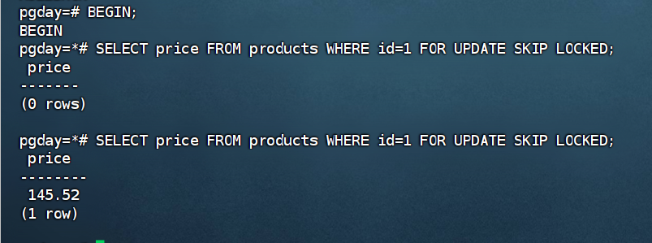

## 创建数据库
```sql
\pset pager off    -- 禁用分页器，结果一次性输出。
\timing on         -- 显示每条语句耗时。
\x auto            -- 宽表/JSON 自动展开显示。

CREATE DATABASE pgday;     -- 创建新数据库。
\c pgday                  -- 切换连接到指定数据库。

CREATE EXTENSION IF NOT EXISTS "uuid-ossp";  -- 安装扩展（功能插件）
CREATE EXTENSION IF NOT EXISTS pg_trgm;      
```
## 创建schema
```sql
CREATE SCHEMA app;                -- 对象命名空间；同名表可在不同 schema 并存。
SET search_path=app,public;       -- 对象查找顺序；先在 app 找，再到 public。
```
## 创建表格
```sql
-- 用户表
CREATE TABLE users(
  id BIGINT GENERATED ALWAYS AS IDENTITY PRIMARY KEY,  -- BIGINT:64 位整数（8字节）。GENERATED ... AS IDENTITY：标准自增列（替代 SERIAL）。ALWAYS/BY DEFAULT:是否允许手动赋值（ALWAYS 更严格）。PRIMARY KEY:主键=唯一+非空，并自动建 B-Tree 索引。
  email TEXT UNIQUE NOT NULL,                          -- TEXT：可变长字符串（不限制长度）。UNIQUE：唯一约束（允许多个 NULL）。NOT NULL：非空约束。
  name  TEXT NOT NULL,                                 
  created_at TIMESTAMPTZ NOT NULL DEFAULT now()        -- 带时区时间戳（以 UTC 存，显示按会话时区）。DEFAULT now()：默认值=语句开始时间。
);

-- 商品表
CREATE TABLE products(
  id BIGINT GENERATED ALWAYS AS IDENTITY PRIMARY KEY,  
  sku TEXT UNIQUE NOT NULL,                            
  name TEXT NOT NULL,                                  
  price NUMERIC(10,2) NOT NULL CHECK (price >= 0),     -- NUMERIC(p,s)：定点小数（金融类避免浮点误差）。,CHECK(...)：行级检查约束，条件需为真。
  tags TEXT[] NOT NULL DEFAULT '{}',                   -- TEXT[]：文本数组类型。
  created_at TIMESTAMPTZ NOT NULL DEFAULT now()        
);

-- 订单表（按时间范围分区）
CREATE TABLE orders(
  id BIGINT GENERATED ALWAYS AS IDENTITY,              
  user_id BIGINT NOT NULL REFERENCES users(id),        -- FOREIGN KEY / REFERENCES：外键约束到另一表的主键/唯一键。
  status TEXT NOT NULL CHECK (status IN ('created','paid','shipped','cancelled')), -- status
  total  NUMERIC(12,2) NOT NULL CHECK (total >= 0),    
  extra  JSONB NOT NULL DEFAULT '{}'::jsonb,           -- 参见JSONB：二进制 JSON，支持索引/运算符/局部更新。'{}'::jsonb
  created_at TIMESTAMPTZ NOT NULL,                     
  PRIMARY KEY(id, created_at)                          -- 复合主键含分区键：分区表的唯一性必须包含分区键以保证全局唯一。
) PARTITION BY RANGE (created_at);                      -- PARTITION BY RANGE：按区间（如时间）把表水平切成多个分区。  

-- 动态创建近6个月的月度分区 orders_YYYYMM
DO $$                                        -- DO $$ ... $$：执行一段 PL/pgSQL 过程代码（可循环/条件/动态 SQL）。
DECLARE d DATE := date_trunc('month', now())::date - interval '5 months';  -- 参见date_trunc('unit', ts)：把时间截到指定精度（如月初）。format('%L/%s', ...)：安全拼 SQL；%L 会自动加字面量引号。interval：时间段类型/字面量（如 '5 months'）。
BEGIN
  WHILE d <= date_trunc('month', now())::date LOOP                           
    EXECUTE format($f$
      CREATE TABLE IF NOT EXISTS orders_%s
      PARTITION OF orders
      FOR VALUES FROM (%L) TO (%L);
    $f$, to_char(d,'YYYYMM'), d, (d + interval '1 month'));                  -- to_char(value, fmt)：把值格式化为字符串（如日期转 YYYYMM）。
    d := d + interval '1 month';                                             
  END LOOP;
END$$;

-- 订单明细表
CREATE TABLE order_items(
  order_id BIGINT NOT NULL,                                        
  order_created_at TIMESTAMPTZ NOT NULL,                           
  product_id BIGINT NOT NULL REFERENCES products(id),             
  qty INT NOT NULL CHECK (qty > 0),                                
  price NUMERIC(10,2) NOT NULL CHECK (price >= 0),                 
  PRIMARY KEY(order_id, order_created_at, product_id),             
  FOREIGN KEY(order_id, order_created_at) REFERENCES orders(id, created_at)  -- FOREIGN KEY / REFERENCES：外键约束到另一表的主键/唯一键
);

-- 基础索引
CREATE INDEX ON users(created_at);                    -- CREATE INDEX：建立索引（默认 B-Tree）。
CREATE INDEX ON products((lower(name)));              -- 表达式索引：对表达式结果建索引，如 lower(name)。
CREATE INDEX ON orders(status);                         

-- JSON 表达式索引
CREATE INDEX ON orders((extra->>'channel'));          
CREATE INDEX ON orders(((extra->>'vip')::bool));      JSON提取->/->>: ->取JSON值；->>取文本；  ::type：把目标值转换成目标类型比如::bool
```
## 批量造数
```sql
-- 2万用户
INSERT INTO users(email,name,created_at)
SELECT 'user'||i||'@ex.com', 'User '||i,
       now() - (random()*180||' days')::interval       -- random():返回0~1的随机数； interval:时间段类型/字面量
FROM generate_series(1,20000) i;                       -- 参见㊺

-- 3000 商品
INSERT INTO products(sku,name,price,tags,created_at)
SELECT 'SKU'||i, 'Product '||i,
       round((random()*500+5)::numeric,2),             -- ::numeric/round(x,s):数值类型转换/四舍五入到s位小数
       ARRAY['cat_'||((i%10)+1),                       -- ARRAY[...]:数组字面量
             CASE WHEN random()<0.2 THEN 'hot' ELSE 'norm' END],
       now() - (random()*180||' days')::interval       
FROM generate_series(1,3000) i;                        

-- 8万订单（含 JSONB 随机字段）
INSERT INTO orders(user_id,status,total,extra,created_at)
SELECT
  (SELECT id FROM users OFFSET floor(random()*20000) LIMIT 1),      -- OFFSET ... LIMIT ...：偏移/限制结果（此处用于“随机取一行”的简便法）。
  (ARRAY['created','paid','shipped','cancelled'])[floor(random()*4)+1],
  round((random()*200+10)::numeric,2),                          
  jsonb_build_object('channel',                                   -- jsonb_build_object(k,v,...)：构造 JSONB 对象。  
    (ARRAY['web','app','mini','partner'])[floor(random()*4)+1], 
    'vip', (random()<0.25),
    'note', to_jsonb(md5(random()::text))),                       -- md5(text) / to_jsonb(x)：返回 md5；把值转为 JSONB。
  date_trunc('day', now() - (random()*150||' days')::interval)  
    + (random()*23||' hours')::interval                         
FROM generate_series(1,80000);                                  

-- 每单1条明细
INSERT INTO order_items(order_id,order_created_at,product_id,qty,price)
SELECT o.id, o.created_at,
       (SELECT id FROM products OFFSET floor(random()*3000) LIMIT 1), 
       (floor(random()*4)+1)::int,                                   
       round((random()*200+5)::numeric,2)                              
FROM orders o;

ANALYZE;   -- 参见52
```
## 查询与窗口
```sql
-- 最近7天：下单用户数与订单数
WITH d AS (SELECT now() - interval '7 days' AS t)     -- WITH ... AS (...)（CTE）：给子查询命名复用，提升可读性
SELECT COUNT(DISTINCT o.user_id) AS users_7d,         -- DISTINCT：去重。
       COUNT(*) AS orders_7d
FROM orders o, d
WHERE o.created_at >= d.t;
# 更简单的写法：
SELECT COUNT(DISTINCT o.user_id) AS users_7d,         
       COUNT(*) AS orders_7d
FROM orders o
WHERE o.created_at >=now() - interval '7 days';

-- 近30天消费额 Top10
SELECT u.id, u.email, SUM(o.total) AS amt
FROM users u
JOIN orders o ON o.user_id = u.id                     -- JOIN：表连接。
WHERE o.status != 'cancelled' AND o.created_at >= now() - interval '30 days'      
GROUP BY u.id, u.email                                -- GROUP BY：分组聚合。
ORDER BY amt DESC                                     -- ORDER BY：排序。
LIMIT 10;                                             -- LIMIT：限制返回行数。
```
```sql
-- 窗口：累计消费与排名
SELECT u.id, u.email,
       SUM(o.total) AS amt,
       SUM(SUM(o.total)) OVER (ORDER BY SUM(o.total) DESC) AS running_amt,  -- 窗口函数 ... OVER(...)：在不折叠行的前提下做排名/累计/移动计算。SUM(...) OVER(...)：窗口累计和。
       RANK() OVER (ORDER BY SUM(o.total) DESC) AS rnk                       -- RANK()：排名函数（并列会跳号）。  
FROM users u
JOIN orders o ON o.user_id=u.id
GROUP BY u.id, u.email
ORDER BY rnk
LIMIT 20;

-- 每日 GMV 与 7 日移动平均
WITH d AS (
  SELECT date_trunc('day', created_at) AS d, SUM(total) AS gmv  -- date_trunc('unit', ts)：把时间截到指定精度（如月初）。
  FROM orders GROUP BY 1
)
SELECT d, gmv,
       AVG(gmv) OVER (ORDER BY d ROWS BETWEEN 6 PRECEDING AND CURRENT ROW) AS gmv_ma7  -- ROWS BETWEEN ...：以“行数”定义窗口范围（如前6行到当前行）。
FROM d ORDER BY d DESC LIMIT 20;
```
## JSONB 实战
```sql
-- 取 JSON 子字段 + 类型转换
SELECT id,
       extra->>'channel' AS ch,                 
       (extra->>'vip')::bool AS vip             
FROM orders
WHERE (extra->>'vip')::bool = true              
ORDER BY id DESC LIMIT 5;

-- 局部更新 JSON（不全列覆盖）
UPDATE orders
SET extra = jsonb_set(
  extra,                                        -- 原 JSONB
  '{flags}',                                    -- 路径（顶层key） JSON 路径 {a,b,0}：表示 a.b[0]。
  jsonb_build_object('reviewed', true),         -- jsonb_build_object(k,v,...)：构造 JSONB 对象。
  true                                          -- 不存在则创建
)
WHERE id IN (SELECT id FROM orders ORDER BY random() LIMIT 100);   --ORDER BY random() 的意思就是：对表里的所有行，给每行生成一个随机数，然后按随机数排序。

-- 验证表达式索引命中
EXPLAIN ANALYZE                                  -- EXPLAIN ANALYZE：执行并显示真实计划与耗时。
SELECT id FROM orders
WHERE extra->>'channel' = 'web'                  
LIMIT 100;                                       
```

## 事物与锁(两窗口操作)
```sql
BEGIN;                                           -- BEGIN / COMMIT / ROLLBACK：开启/提交/回滚事务。
UPDATE products SET price = price WHERE id = 1;  -- 获得该行的行级锁 行级锁：更新某行会持有该行锁，其他事务更新同一行需等待。
-- （保持不提交）

UPDATE products SET price = price + 1 WHERE id = 1;  -- 会等待上面的行锁释放

-- 查看等待的锁
SELECT pid, granted, mode, relation::regclass
FROM pg_locks                                     pg_locks：系统视图，查看锁与等待状态。
WHERE NOT granted;

-- 任务队列范式：跳过被锁行
BEGIN;
SELECT price 
FROM products 
WHERE id=1 
FOR UPDATE SKIP LOCKED;                            -- FOR UPDATE SKIP LOCKED：锁定选中行并跳过已被锁行（任务队列常用）。

ROLLBACK;                                         -- BEGIN / COMMIT / ROLLBACK：开启/提交/回滚事务。

COMMIT;                                           -- BEGIN / COMMIT / ROLLBACK：开启/提交/回滚事务。

SHOW default_transaction_isolation;               -- default_transaction_isolation：默认隔离级别。
-- SET TRANSACTION ISOLATION LEVEL SERIALIZABLE;  -- SET TRANSACTION ISOLATION LEVEL：设置当前事务隔离级别。
```
(FOR UPDATE SKIP LOCKED会跳过被锁的行，直到锁解开)



## 索引与执行计划
```sql
-- 复合索引（user_id, created_at）
CREATE INDEX ON orders(user_id, created_at);      -- 复合索引（多列）：一个索引包含多列，典型“等值+范围+排序”。

EXPLAIN (ANALYZE,BUFFERS,TIMING)                  -- EXPLAIN (ANALYZE, BUFFERS, TIMING)：显示耗时与缓冲（I/O）信息。
SELECT * FROM orders
WHERE user_id = (SELECT id FROM users ORDER BY random() LIMIT 1)  
  AND created_at >= now() - interval '90 days'     
ORDER BY created_at DESC                           
LIMIT 50;                                          

-- 部分索引：仅针对已付款/已发货
CREATE INDEX ON orders(created_at)
WHERE status IN ('paid','shipped');               -- 部分索引：仅对满足 WHERE 条件的行建索引，体积小、针对性强。

EXPLAIN ANALYZE
SELECT COUNT(*) FROM orders
WHERE status IN ('paid','shipped')
  AND created_at >= now() - interval '30 days';   

-- 模糊搜索：trigram + GIN
CREATE INDEX products_name_trgm
ON products USING gin (name gin_trgm_ops);        -- USING gin：指定 GIN 索引结构（适合数组/全文/三元组等）。gin_trgm_ops：trigram 操作类，支持 ILIKE '%...%' 模糊匹配。

EXPLAIN ANALYZE
SELECT id,name FROM products
WHERE name ILIKE '%duct 12%'                      -- ILIKE：不区分大小写的 LIKE。
LIMIT 20;

## 分区裁剪与维护
EXPLAIN ANALYZE
SELECT COUNT(*) FROM orders
WHERE created_at >= date_trunc('month', now())::date;  
-- 计划里应看到只扫描当月分区（分区裁剪） 分区裁剪：优化器只扫描命中的分区而非全表。

-- 新增下月空分区
DO $$
DECLARE d DATE := date_trunc('month', now())::date + interval '1 month';  
BEGIN
  EXECUTE format(
    'CREATE TABLE IF NOT EXISTS orders_%s PARTITION OF orders FOR VALUES FROM (%L) TO (%L);',
    to_char(d,'YYYYMM'), d, (d + interval '1 month')                       
  );
END$$;
```

## 权限与最小授权
```sql
CREATE ROLE app_rw LOGIN PASSWORD 'rwpass';   -- CREATE ROLE ... LOGIN PASSWORD：创建可登录角色（用户）。
CREATE ROLE app_ro LOGIN PASSWORD 'ropass';  

GRANT USAGE ON SCHEMA app TO app_ro, app_rw; -- GRANT USAGE ON SCHEMA：允许在该 schema 下“可见/可用”对象（不含读写表数据）。
GRANT SELECT ON ALL TABLES IN SCHEMA app TO app_ro;                      -- GRANT SELECT/INSERT/UPDATE/DELETE：授予表级读写权限。
GRANT SELECT,INSERT,UPDATE,DELETE ON ALL TABLES IN SCHEMA app TO app_rw; 

ALTER DEFAULT PRIVILEGES IN SCHEMA app                                   -- ALTER DEFAULT PRIVILEGES：为“将来新建对象”设置默认授权。
  GRANT SELECT ON TABLES TO app_ro;

ALTER DEFAULT PRIVILEGES IN SCHEMA app
  GRANT SELECT,INSERT,UPDATE,DELETE ON TABLES TO app_rw;
```
## 常用辅助命令
```sql
\dn            -- 列出所有 schema                         
\dt app.*      -- 列出 app 下所有表                        
\d+ app.orders -- 查看表结构与存储信息                     
\di+           -- 列出索引                                 
\dx            -- 列出扩展                                 
\conninfo      -- 当前连接信息                             

SELECT * FROM pg_stat_activity;         -- 查看当前会话/SQL  
SELECT * FROM pg_locks WHERE NOT granted;  -- 等锁明细
```

## 常见系统表格
| 系统表/视图 | 作用 | 常见字段/参数 |
|-------------|------|----------------|
| **pg_stat_activity** | 查看所有会话的执行状态、SQL、等待情况 | `pid` (进程号), `usename` (用户名), `datname` (数据库名), `state` (状态), `query_start` (SQL开始时间), `wait_event` (等待事件), `query` (正在执行的SQL) |
| **pg_locks** | 当前数据库中的锁信息，排查阻塞/死锁 | `pid` (持锁进程), `locktype` (锁类型：relation/page/tuple), `relation` (表OID), `mode` (锁模式), `granted` (是否已授予) |
| **pg_stat_user_tables** | 用户表的访问/修改统计信息 | `relname` (表名), `seq_scan` (顺序扫描次数), `idx_scan` (索引扫描次数), `n_tup_ins` (插入行数), `n_tup_upd` (更新行数), `last_vacuum` (最近手工vacuum), `last_autovacuum` (最近自动vacuum) |
| **pg_stat_user_indexes** | 用户索引的使用统计 | `relname` (表名), `indexrelname` (索引名), `idx_scan` (索引扫描次数), `idx_tup_read` (索引返回条目数) |
| **pg_statio_user_tables** | 表的 I/O 统计（命中/读盘情况） | `relname` (表名), `heap_blks_read` (读磁盘块), `heap_blks_hit` (缓冲命中块) |
| **pg_indexes** | 查看表的索引定义 | `schemaname` (schema名), `tablename` (表名), `indexname` (索引名), `indexdef` (索引定义SQL) |
| **pg_class** | 存放表、索引、序列的元信息 | `relname` (对象名), `relkind` (对象类型: r=table, i=index), `relnamespace` (schema OID), `reltuples` (表估计行数) |
| **pg_attribute** | 表/索引的列定义 | `attname` (列名), `atttypid` (数据类型OID), `attnotnull` (是否非空), `attnum` (列序号) |
| **pg_roles** | 数据库角色/用户信息 | `rolname` (角色名), `rolsuper` (是否超级用户), `rolcreatedb` (是否可建库), `rolreplication` (是否复制用户) |
| **pg_settings** | 当前数据库参数配置，等价 `SHOW` | `name` (参数名), `setting` (值), `unit` (单位), `source` (值来源: default/config/override) |
| **pg_stat_replication** | 主库上查看从库同步状态 | `pid`, `application_name` (从库名), `state` (流复制状态), `sync_state` (同步/异步), `replay_lag` (延迟) |
| **pg_stat_progress_vacuum** | VACUUM 进度信息 | `pid`, `datname`, `relid` (表OID), `phase` (阶段), `heap_blks_total/heap_blks_scanned` (进度统计) |

