## 背景
比如你有一个电商网站，是用tight coupling的方式也就是每个api之间直接互相调用彼此：

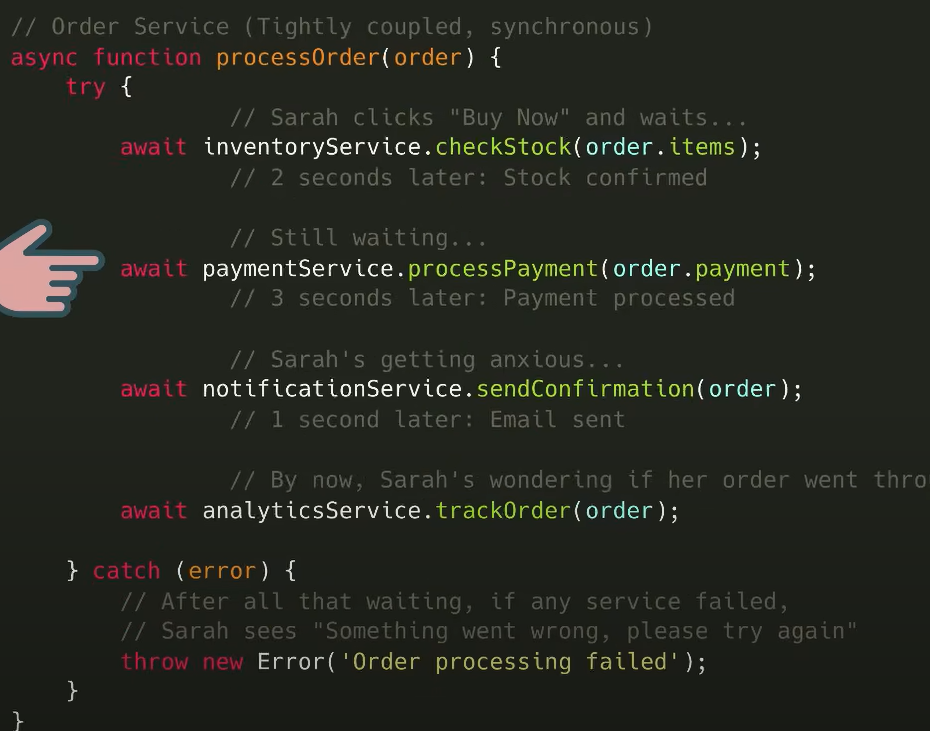

坏处：
1. 一旦流量上来，一台服务器比如order这个api会直接crash掉，唯一扩容的办法只能是scale up或者scale down，但是其他不需要扩容的服务也会跟着扩容，造成不必要的浪费。
2. 是一个同步操作的过程，前面的步骤没有完成，后面的步骤就会卡着。
3. single points of failure:一旦一个服务崩溃，所有服务都会跟着崩溃。

## kafaka
api变成了**producer**传递"快递"也就是**event**给kafaka，kafaka就像是每个api中间的一个“邮局”也就是**broker**去传递event。其实就是通过kafaka producer的api：

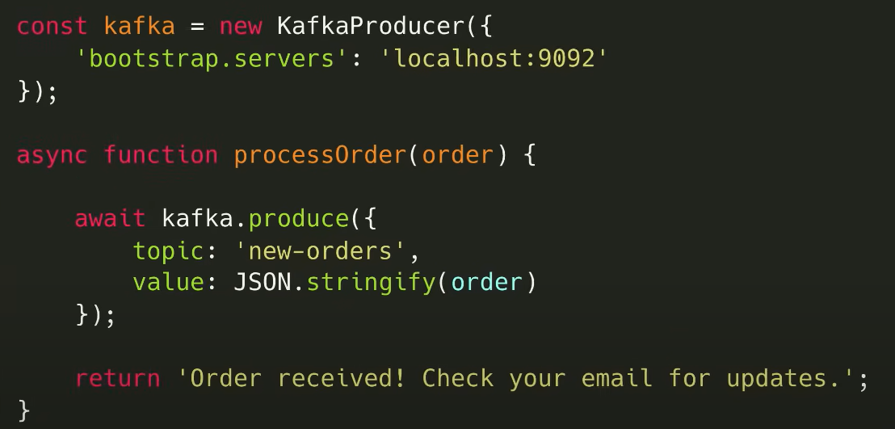

- event：包含一对键值，key和value，以及timestamp和一些metadata，每一个event会有一个唯一的序号叫做offset用来标示event的位置，consumer通过offset来跟踪已消费的事件，确保不会重复/漏消费：

    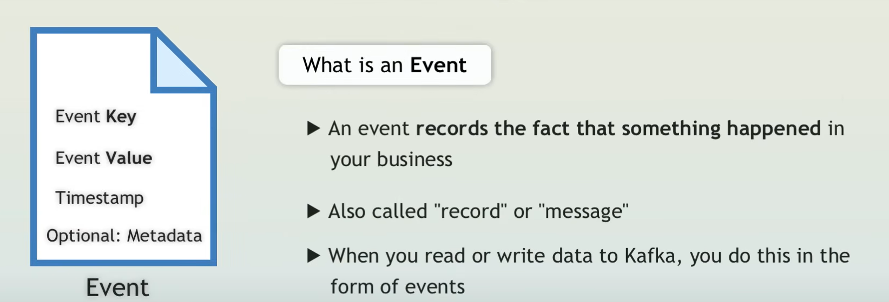

但是如果只有一个broker，会导致全部producer都把event送到一起，无法保证效率和顺序，所以kafaka还有topic的概念，将相同的类型的event聚集到一个topic当中：

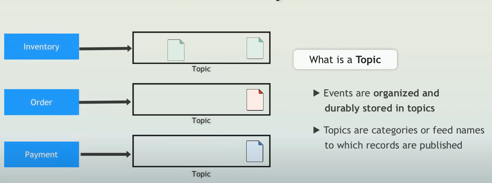

- topic：定义了不同类型的event并将同类项聚集在一起：

    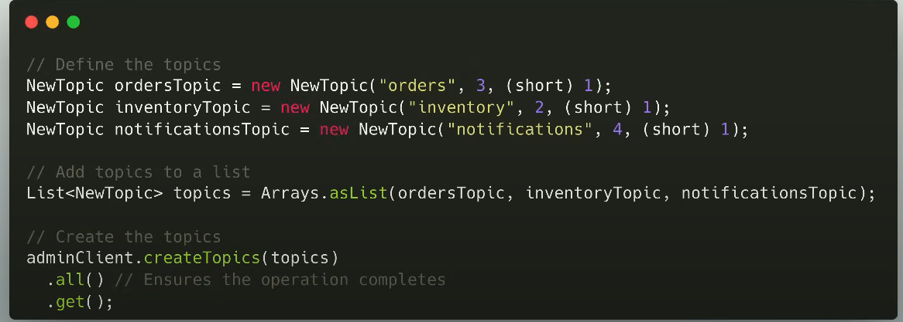

此时，另外的一边，去接受这个topic的event变成了consumer：

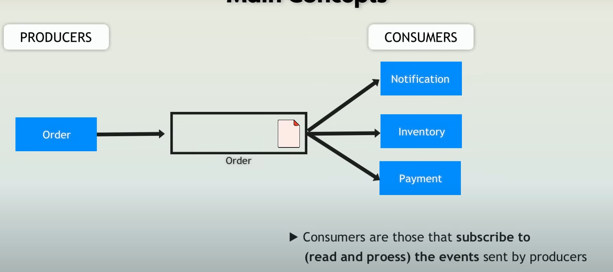

- consumer：订阅这个topic，一旦有任何event出现，所有consumer会被topic提醒

另一个kafaka的核心是real-time processing(strams)，可以实时观察到目前的event，并实时的去做一下检测，比如会有一个库存系统，会实时看现在库存是否低于某一个阈值，一旦低于某一个阈值，会去触发增加库存的动作：

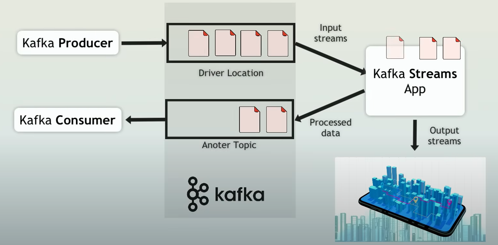

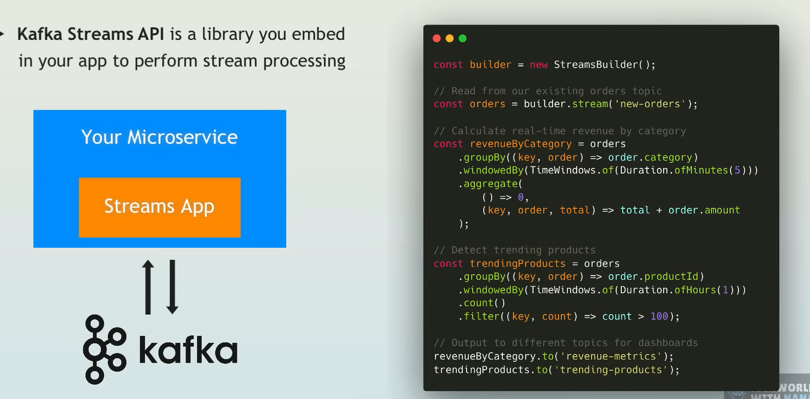

但一旦用户的体量是成百万的体量，单纯用topic的形式，可能也会支撑不住，此时也需要去做一个扩容，patition就出现了，可以将topic在细分成不同的partition，比如分成不同地区的： 

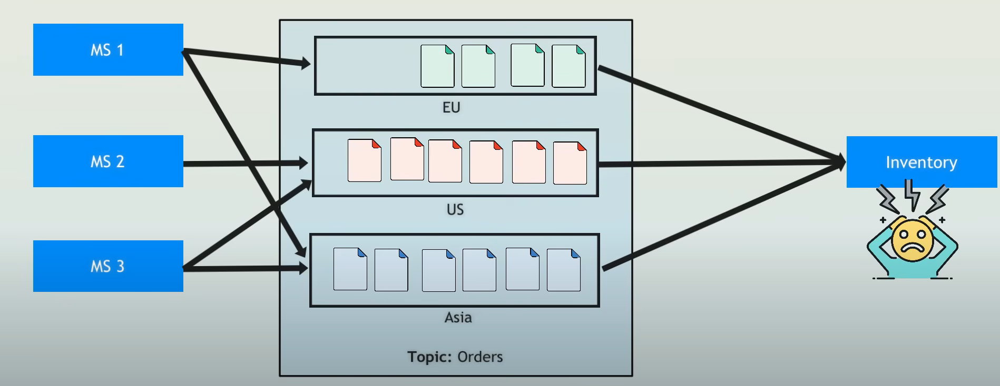

但这时consumer可能也会overload，此时consumer group也会出现了，这里的consumer group里可能是K8s的replica，kafaka通过他们的group id去知道他们是什么组，并且kafaka会自动地将load去分配到可支配的group里面的replica，一旦有一个replica停止工作了，对应的线路会自动分配到其他线路：

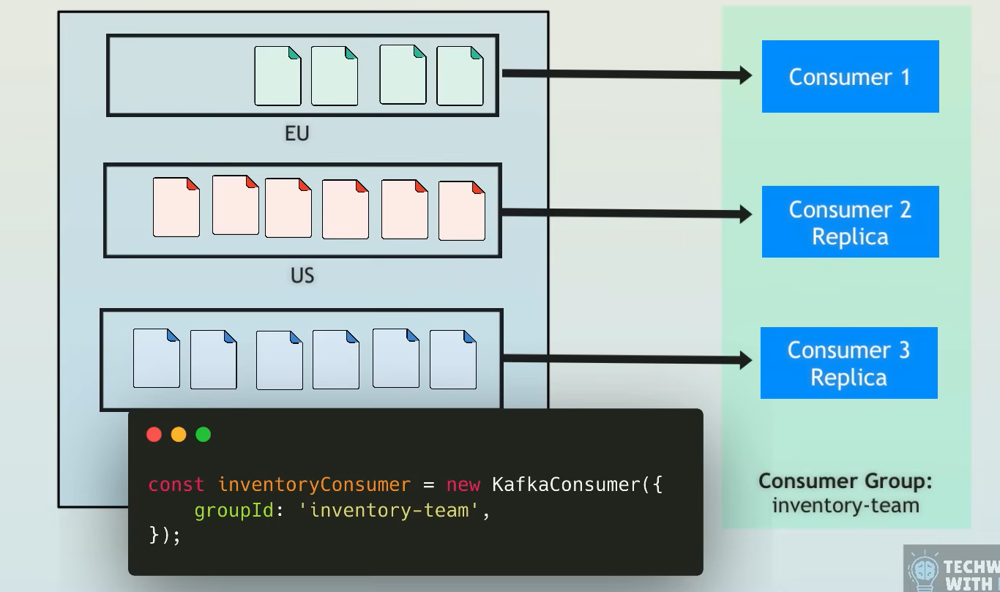

数据都是存在每一个kafaka的broker上的，并且每个broker之间会复制彼此的数据去避免Fault Tolerance容错,即使当前的broker出问题，其他的broker也会有它的数据，这也是kafaka和其他消息队列的区别，像rabbitMQ或者activeMQ,当event/message被consumer接受后就删除，但是kafaka可以保存这些event到磁盘，客户可以设定一个retention date：

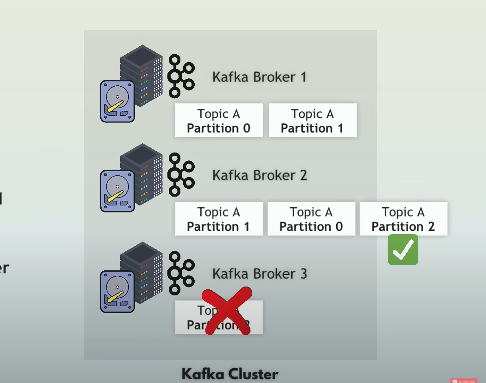

同时，kafaka经常和zookeeper配合使用，作为一个中心服务去管理各个分布式的broker的metadata，但是到kafaka3.0以后，出现了kRaft，逐渐取消了对zookeeper的依赖。
好处：
1. 前面的api再传送完这个event之后，就可以继续之后的操作，而不是等到其他api都完成才继续。