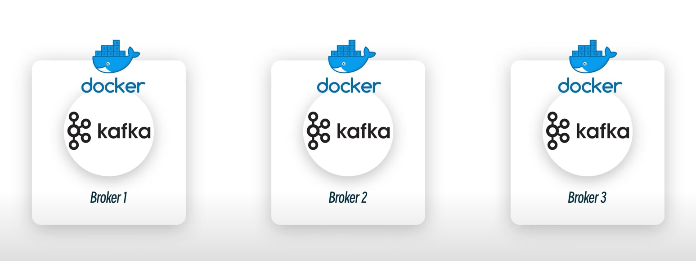
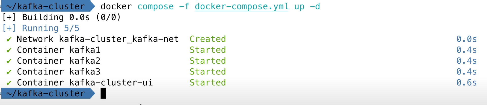

## 安装
```bash
docker pull apache/kafka:4.0.0
docker run -d --name kafka -p 9092:9092 apache/kafka:4.0.0
# 通过docker ps查看
docker ps
# 进入容器
docker exec -it kafka bash
# 查看所有kafka命令
cd /opt/kafka
ls bin
# 比如查看kafka版本
bin/kafka-topics.sh --version
```

## 创建和删除topics
```bash
# 查看所有主题，如果是本地的kafka服务，就直接localhost:port
bin/kafka-topics.sh --bootstrap-server localhost:9092 --list

# 创建my-topic主题
bin/kafka-topics.sh --bootstrap-server localhost:9092 --create --topic my-topic

# 查看所有主题的详细信息，比如分区数，replica等等
bin/kafka-topics.sh --bootstrap-server localhost:9092 --describe

# 修改主题配置，entity-type为修改的对象，name则是具体对象的名字，alter表示修改，这里则是将保存时间改为10秒
bin/kafka-configs.sh --bootstrap-server localhost:9092 --entity-type topics --entity-name my-topic --alter --add-config retention.ms=10000

# 删除topics
bin/kafka-topics.sh --bootstrap-server localhost:9092 --delete --topic my-topic
```

## 模拟生产者，发生event到主题
```bash
# 会进入到交会界面，每一行都会代表一个event发送到指定topic中
bin/kafka-console-producer.sh --bootstrap-server localhost:9092 --topic my-topic
>welcome to ray world.
>你挺牛。
>^C
```

## 模拟消费者，读取event
```bash
# 如果继续在生产者终端发送消息，那么在这个终端也会持续显示新的消息
bin/kafka-console-consumer.sh --bootstrap-server localhost:9092 --topic my-topic
welcome to ray world.
你挺牛。

```

## 实际程序使用kafka
#### 创建nodejs项目和一个producer的文件
```bash
# 初始化一个nodejs项目
pnpm init
# 安装一个kafkajs库
pnpm install kafkajs
# 新建一个js文件
mkdir producer.js

# 文件内容大致如下：
const { Kafka } = require('kafkajs')

// 创建 Kafka 实例
const kafka = new Kafka({
  clientId: 'my-producer',
  brokers: ['localhost:9092']
})

// 创建 Producer
const producer = kafka.producer()

// 初始化 Producer（连接一次即可）
async function initProducer() {
  await producer.connect()
  console.log("✅ Producer 已连接")
}

// 封装发送消息的函数
async function sendMessage(topic, message, key = null) {
  try {
    const result = await producer.send({
      topic: topic,
      messages: [{ key: key, value: message }],
    })
    console.log(`📤 已发送到 ${topic}:`, result)
  } catch (error) {
    console.error("❌ 发送失败:", error)
  }
}

// 优雅关闭
async function shutdown() {
  await producer.disconnect()
  console.log("🛑 Producer 已断开连接")
}

// 示例：调用
;(async () => {
  await initProducer()

  await sendMessage("my-topic", "Hello Kafka!", "key1")
  await sendMessage("my-topic", "Second message")
  await sendMessage("my-topic", "第三条消息")

  await shutdown()
})

## 通过运行这个文件就能发送消息
node producer.js
```
#### 创建一个consumer的文件
```bash
mkdir consumer.js
# 文件内容
const { Kafka } = require('kafkajs')

// 创建 Kafka 实例
const kafka = new Kafka({
  clientId: 'my-consumer',
  brokers: ['localhost:9092']   // Kafka broker 地址
})

// 创建 Consumer，属于一个消费组
const consumer = kafka.consumer({ groupId: 'test-group' })

// 封装消费函数
async function consumeMessages(topic) {
  try {
    await consumer.connect()
    console.log("✅ Consumer 已连接")

    // 订阅 Topic
    await consumer.subscribe({ topic: topic, fromBeginning: true })
    console.log(`📌 已订阅 Topic: ${topic}`)

    // 开始消费
    await consumer.run({
      eachMessage: async ({ topic, partition, message }) => {
        console.log(
          `📥 收到消息: ${message.value.toString()} | Topic: ${topic} | Partition: ${partition}`
        )
      },
    })
  } catch (error) {
    console.error("❌ 消费失败:", error)
  }
}

// 启动 Consumer
consumeMessages("my-topic")
## 通过运行这个文件就能发送消息
node consumer.js
```

## 创建三个broker的kafka集群



```bash
# 创建docker网络
docker network create kafka-net --subnet 172.20.0.0/16

# 创建kafka配置的文件
mkdir kafka-cluster
cd kafka-cluster
mkdir -p kafka1/data kafka2/data kafka3/data

# 创建docker compose文件来定义docker集群的配置
vi docker-compose.yml
# 文件内容：
version: '3.8'

services:
  # -------------------
  # Kafka Broker 1
  # -------------------
  kafka1:
    image: confluentinc/cp-kafka:7.8.0
    container_name: kafka1
    hostname: kafka1
    ports:
      - "9092:9092"   # 数据平面（Producer/Consumer 用）
      - "9093:9093"   # 控制平面（Controller/Broker 内部通信）
    environment:
      # 基本配置
      KAFKA_NODE_ID: 1
      KAFKA_PROCESS_ROLES: broker,controller   # 既是 broker 又是 controller
      KAFKA_LISTENERS: PLAINTEXT://:9092,CONTROLLER://:9093
      KAFKA_ADVERTISED_LISTENERS: PLAINTEXT://kafka1:9092
      KAFKA_CONTROLLER_LISTENER_NAMES: CONTROLLER
      KAFKA_INTER_BROKER_LISTENER_NAME: PLAINTEXT

      # 控制器集群配置
      KAFKA_CONTROLLER_QUORUM_VOTERS: 1@kafka1:9093,2@kafka2:9093,3@kafka3:9093

      # 存储目录
      KAFKA_LOG_DIRS: /var/lib/kafka/data

      # Topic 默认副本/同步配置
      KAFKA_OFFSETS_TOPIC_REPLICATION_FACTOR: 3
      KAFKA_DEFAULT_REPLICATION_FACTOR: 3
      KAFKA_MIN_INSYNC_REPLICAS: 2

    volumes:
      - ./kafka1/data:/var/lib/kafka/data
    networks:
      - kafka-net

  # -------------------
  # Kafka Broker 2
  # -------------------
  kafka2:
    image: confluentinc/cp-kafka:7.8.0
    container_name: kafka2
    hostname: kafka2
    ports:
      - "9094:9092"
      - "9095:9093"
    environment:
      KAFKA_NODE_ID: 2
      KAFKA_PROCESS_ROLES: broker,controller
      KAFKA_LISTENERS: PLAINTEXT://:9092,CONTROLLER://:9093
      KAFKA_ADVERTISED_LISTENERS: PLAINTEXT://kafka2:9092
      KAFKA_CONTROLLER_LISTENER_NAMES: CONTROLLER
      KAFKA_INTER_BROKER_LISTENER_NAME: PLAINTEXT
      KAFKA_CONTROLLER_QUORUM_VOTERS: 1@kafka1:9093,2@kafka2:9093,3@kafka3:9093
      KAFKA_LOG_DIRS: /var/lib/kafka/data
      KAFKA_OFFSETS_TOPIC_REPLICATION_FACTOR: 3
      KAFKA_DEFAULT_REPLICATION_FACTOR: 3
      KAFKA_MIN_INSYNC_REPLICAS: 2
    volumes:
      - ./kafka2/data:/var/lib/kafka/data
    networks:
      - kafka-net

  # -------------------
  # Kafka Broker 3
  # -------------------
  kafka3:
    image: confluentinc/cp-kafka:7.8.0
    container_name: kafka3
    hostname: kafka3
    ports:
      - "9096:9092"
      - "9097:9093"
    environment:
      KAFKA_NODE_ID: 3
      KAFKA_PROCESS_ROLES: broker,controller
      KAFKA_LISTENERS: PLAINTEXT://:9092,CONTROLLER://:9093
      KAFKA_ADVERTISED_LISTENERS: PLAINTEXT://kafka3:9092
      KAFKA_CONTROLLER_LISTENER_NAMES: CONTROLLER
      KAFKA_INTER_BROKER_LISTENER_NAME: PLAINTEXT
      KAFKA_CONTROLLER_QUORUM_VOTERS: 1@kafka1:9093,2@kafka2:9093,3@kafka3:9093
      KAFKA_LOG_DIRS: /var/lib/kafka/data
      KAFKA_OFFSETS_TOPIC_REPLICATION_FACTOR: 3
      KAFKA_DEFAULT_REPLICATION_FACTOR: 3
      KAFKA_MIN_INSYNC_REPLICAS: 2
    volumes:
      - ./kafka3/data:/var/lib/kafka/data
    networks:
      - kafka-net

  # -------------------
  # Kafka UI 管理界面
  # -------------------
  kafka-ui:
    image: provectuslabs/kafka-ui:latest
    container_name: kafka-cluster-ui
    ports:
      - "8080:8080"
    environment:
      KAFKA_CLUSTERS_0_NAME: local
      KAFKA_CLUSTERS_0_BOOTSTRAPSERVERS: kafka1:9092,kafka2:9092,kafka3:9092
    depends_on:
      - kafka1
      - kafka2
      - kafka3
    networks:
      - kafka-net

# -------------------
# Docker 网络
# -------------------
networks:
  kafka-net:
    driver: bridge

## 运行这个文件
docker compose -f docker-compose.yml up -d
```



```bash
# replia表示主题的副本数，partitions表示分区数
bin/kafka-topics.sh --bootstrap-server localhost:9092 --create --topic my-topic --replication-factor 3 --partitions 3
```