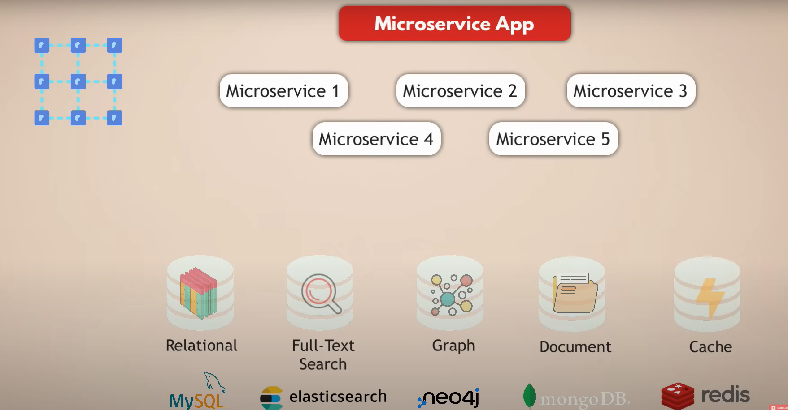
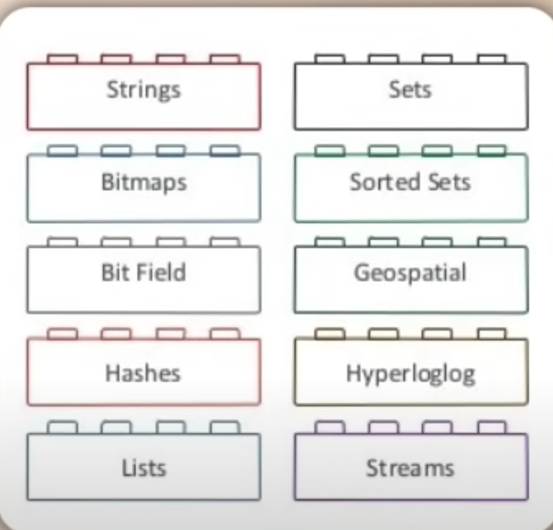
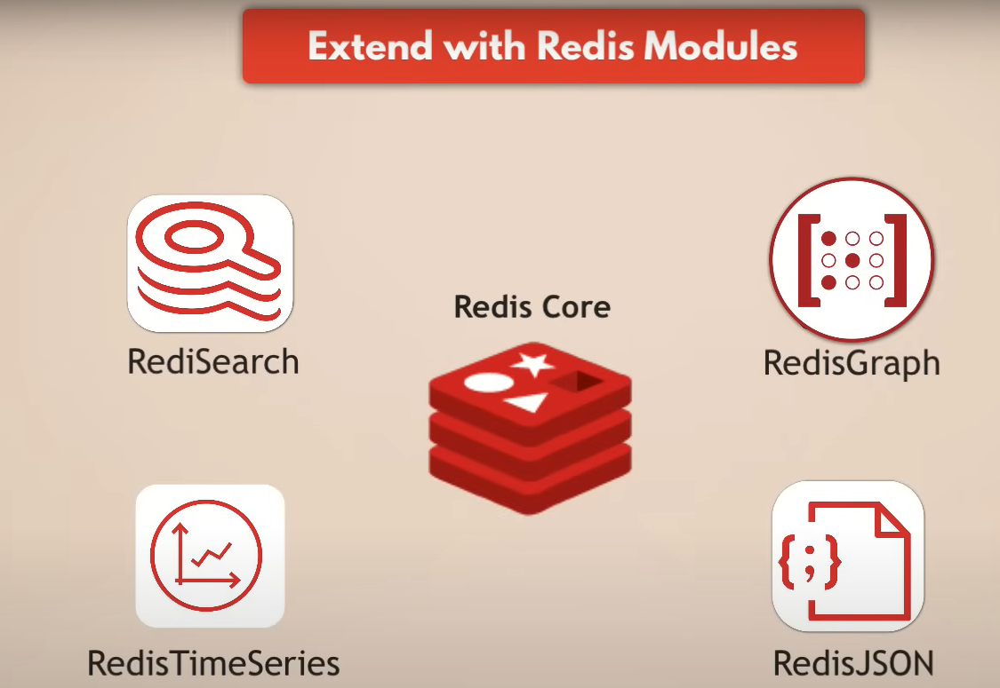
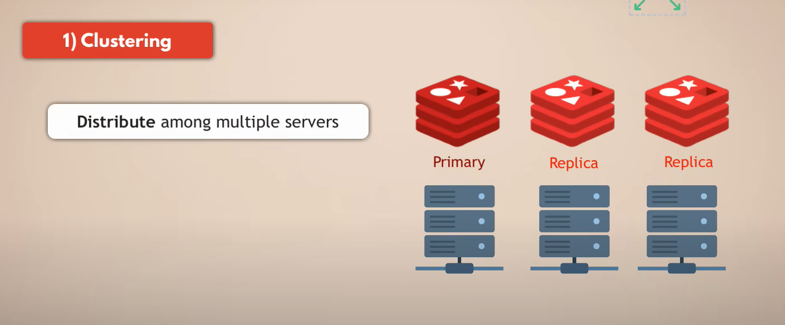
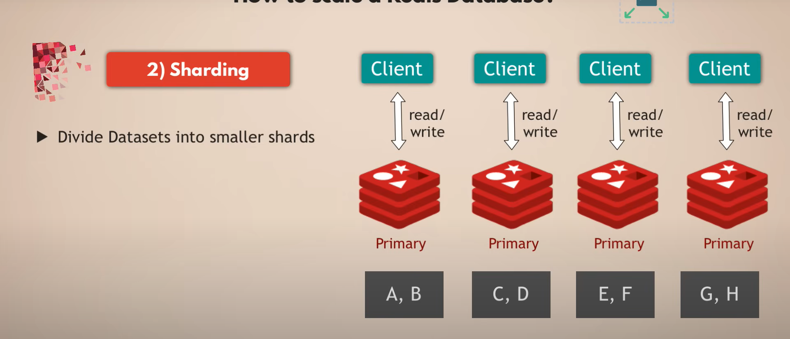
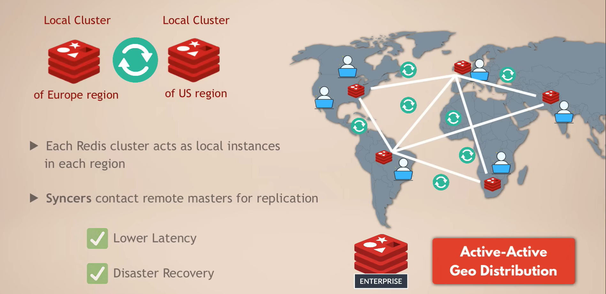

## Redis(Remote Dictionary Server)

#### 常见微服务使用的中间件

痛点：
- 如果没有redis，其实应用需要去单独调用不同的数据库类型拿到不同的数据库数据，会造成代码上非常复杂，需要多个connector
- 网络延迟也是一个问题，和不同数据库之间通信的延迟

redis的用处：
- redis可以作为中间件，保存各种类型数据库的数据类型
- 应用只需要和redis通信

#### Redis如何使用
- 可以存储多种类型数据：
    - redis core:作为一个key-value的存储，本身就已经可以存非常多不同类型的数据

        

    - 还可以通过redis extend你的redis modules到多种不同类型的数据类型，根据你的业务需求

        

- redis的高可用选项：
    - 通过replica多个redis副本，确保数据高可用
    - Snapshot备份
    - Append Only File(AOF)

- redis on flash：
    - 标准 Redis所有数据（Keys + Values）都放在 RAM 中，但 RAM 成本很高，数据量一旦非常大（比如 TB 级），成本会变得非常高昂。
    - Redis on Flash则是将Keys 和热数据（Hot Values）存放在 RAM，温数据（Warm Values）存放在 SSD/Flash 存储，适合存储不常用但仍需随时访问的数据。

- Redis的scale option：
    - clustering：
        - 解决单个 Redis 节点 内存容量有限 和 性能瓶颈 的问题。

        

    - sharding：
        - Sharding 就是把一整个大数据库拆分成多个 小分区（shard），每个 shard 存放一部分数据，并运行在不同的 Redis 节点（Primary）。
        - 客户端在读写时，按照某种规则（比如 key 的 hash 值）决定该去哪个 shard。
        - Redis 常见的分片算法：
            - 哈希取模（mod）
            - 一致性哈希（Consistent Hashing）
            - Redis Cluster 的 Slot 机制（官方实现）

        

- 跨区域的高可用和容灾：
    - 适用于enterprise redis，叫做active-active Geo Distribution 
    - 使用CRDT解决相同key的冲突：
        - G-Counter（增长计数器）：每个节点只能增加计数，最后值是所有节点计数的和。
        - LWW-Register（最后写赢寄存器）：带时间戳，冲突时选最新的写入。
        - OR-Set（观察-移除集合）：集合支持 add/remove，冲突时能正确合并元素。
        
        