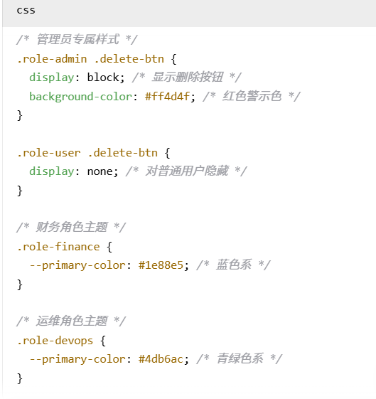

## Troubleshoot思路
1. UI 层：
    - 常见问题：按钮不见/UI错乱
    - 排查思路：Elements面板查看DOM是否存在，样式是否隐藏，HTML结构是否正确，CSS是否生效。
    - 比如常见的问题，按钮不见了，先去检查是否DOM是否存在
        - 如果存在，再检查CSS样式是否被隐藏(display:none)，可能的权限问题或者位置偏移(out of screen)：

            

        - 如果不存在，检查HTML代码是否正确加载，是否有拼写错误等。

2. 交互层：
    - 常见问题：按钮点击无反应/功能异常
    - 排查思路：Console面板查看是否有JS报错，检查事件绑定是否正确，调试JS代码逻辑。
3. 通讯层：
    - 常见问题：数据无法加载/提交失败，401/403/500错误
    - 排查思路：Network面板查看请求和响应，检查URL、请求方法、请求头和响应状态码，查看后端日志。
4. 逻辑层：
    - 常见问题：数据处理错误/功能异常，操作失败
    - 排查思路：检查前后端代码逻辑，验证数据流和状态管理，使用断点调试代码。
5. 数据层：
    - 常见问题：数据不一致/丢失，查询失败，数据没有同步/保存
    - 排查思路：检查数据库连接和配置，验证数据完整性，查看数据库日志和执行的SQL语句。

## 常见http状态码和解决思路
1. 200 OK：请求成功，通常不需要额外处理。
2. 304 Not Modified：资源未修改，浏览器可以使用缓存版本，通常不需要额外处理。
3. 400 Bad Request：请求格式错误，检查请求参数和数据格式，确保符合API要求。
4. 401 Unauthorized：未授权，检查是否需要登录或提供正确的认证信息:
    - 情景：点击按钮，返回401错误，原因可能为SSO/认证层问题，Token失效或未认证
    - 解决方法：重新登录获取新的Token，检查认证流程是否正确。
5. 403 Forbidden：禁止访问，检查权限设置，确保用户有访问该资源
    - 情景：点击按钮，返回403错误，原因可能为权限问题，角色/审批阶段不允许
    - 解决方法：联系管理员分配正确权限，或者调整用户角色。
6. 404 Not Found：资源未找到，检查URL是否正确，确保资源存在。
    - 情景：表示 API路径/模块没找到。
    - 解决方法：检查请求的URL路径，确认资源是否存在，修正路径错误。
7. 409 Conflict：冲突，检查请求是否与当前资源状态冲突，可能需要调整请求内容。
    - 情景：点击按钮，返回409错误，原因可能为资源状态冲突，比如重复创建资源等。(两个人同时编辑 / BOM版本冲突)
    - 解决方法：检查资源状态，确保请求内容不与现有资源冲突，可能需要先删除或修改现有资源。
8. 422 Unprocessable Entity：无法处理的实体，检查请求数据是否符合服务器要求，可能需要修正数据格式或内容。
    - 情景：格式不对 / 必填项缺失 / 前端校验未阻止
    - 解决方法：检查请求数据，确保符合API要求，修正格式或补全必填项。
9. 500 Internal Server Error：服务器内部错误，检查服务器日志，排查代码错误或配置问题。
    - 情景：点击按钮，返回500错误，原因可能为后端代码异常，数据库连接失败等。
    - 解决方法：查看服务器日志，定位错误原因，修复代码或配置问题。
10. 502 Bad Gateway：网关错误，检查上游服务器状态，确保其正常运行。
11. 503 Service Unavailable：服务不可用，检查服务器负载和状态，可能需要扩展资源或修复服务。
12. 504 Gateway Timeout：网关超时，检查网络连接和上游服务器响应时间，可能需要优化请求或增加超时时间。
    - 情景：503或者504通常是平台级/云层故障。
    - 解决方法：联系云服务提供商，检查平台状态，等待服务恢复。

## 常见的console报错：
1. TypeError: Cannot read properties of undefined (reading 'value')
    - 说明：JS 逻辑在访问一个不存在的对象属性，前端预期应该拿到某个字段 / 数据，但 API 或条件不满足
    - 解决思路：检查变量的定义和赋值，确保在访问属性之前对象已正确创建。

2. ReferenceError: workflowAction is not defined
    - 说明：JS 变量从未声明 / 加载失败，页面依赖的脚本文件未加载或加载顺序错乱，常出现在产品升级 / 版本补丁后
    - 解决思路：检查脚本文件是否正确加载，前端资源未加载成功（可能404），确保变量在使用前已声明。

3. Uncaught SyntaxError: Unexpected token
    - 说明：JavaScript 文件损坏 / 传回的是HTML而不是JSON，通常是 API 返回异常 HTML（如错误页面）
    - 解决思路：多见于 API 返回 500和后端异常关联很强。

4. Uncaught (in promise) TypeError: Failed to fetch
    - 说明：发出的 fetch() / Promise 没有被正确处理，可能是网络问题或请求被阻止。
    - 解决思路：检查网络连接，确保请求的URL正确，查看浏览器的网络面板获取更多信息。
