1. kubernetes的基本组件及功能？
- master node
    - kube-apiserver:作为Kubernetes API的前端，提供了**RESTful风格的API接口**，作为各组件通信的唯一桥梁，接收并转发所有集群请求，是 K8s 的 “入口”。**负责RBAC 权限控制（验证用户 / 组件的操作权限**，确保集群安全）。
    - etcd：K8s 集群唯一的**高可用的分布式键值（key-value）存储**，保存集群所有资源的 **“配置信息” 与 “运行状态”**（如 Deployment 的期望副本数、Pod 的运行节点、Service 的 IP 地址）； 提供高可用（多节点部署）与数据一致性保障（基于 Raft 协议）；确保在集群中的多个节点之间数据的一致性和可靠性。

        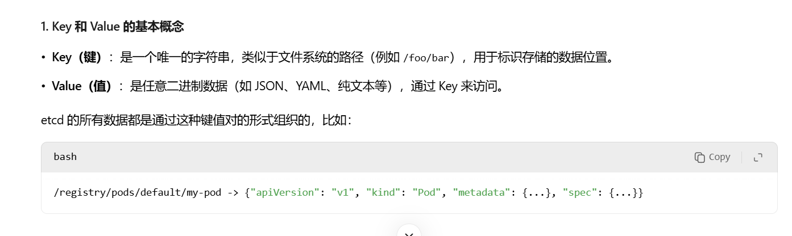

    - kube-scheduler：根据节点的**资源可用性、Pod的资源请求、节点的亲和性和反亲和性等策略**，对所有可用节点进行评估和筛选，选择最优的节点来运行Pod。
    - kube-controller-manager：是一组控制器的集合，每个控制器负责管理集群中特定类型的资源，**确保集群的状态始终符合用户定义的期望状态**。

        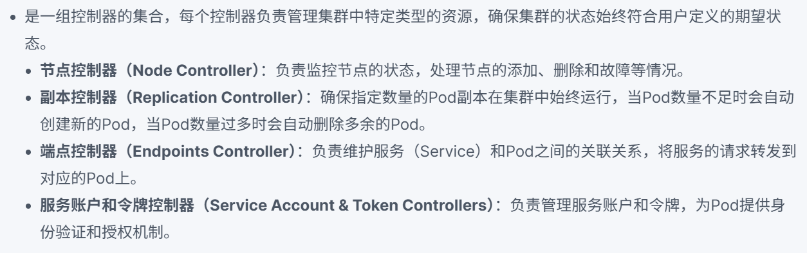

    - cloud-controller-manager(optional)：与云服务提供商的API进行交互，将与云平台**相关的控制逻辑从主控制平面中分离出来**。允许Kubernetes与不同的云服务提供商（如AWS、GCP、Azure等）集成，**实现云资源的管理和调度**，如弹性IP、负载均衡器等。
- worker node
    - kubelet：作为节点上的代理，负责与控制平面进行通信，接收和执行控制平面下发的任务比如管理节点上的**Pod和容器的生命周期**，监控**容器的资源使用情况**，并将**节点和容器的状态信息**反馈给控制平面。
    - kube-proxy：**在每个节点上运行**，负责实现Kubernetes服务的**网络代理和负载均衡功能**，为服务创建和**维护网络规则(iptable)**， 将 Service 的请求（如 ClusterIP、LoadBalancer）转发到后端的 Pod，实现负载均衡（如轮询调度）；**实现服务的外部访问和内部通信**，支持多种代理模式，如用户空间代理模式、IPVS代理模式等。
    - Container Runtime：负责在节点上**运行和管理容器**，是容器化应用程序的运行环境，Kubernetes支持多种容器运行时，如Docker、Containerd、CRI-O等，kubelet**通过 CRI 调用容器运行时（如 containerd）执行‘拉取镜像、创建容器、启动容器’等底层操作”**。

        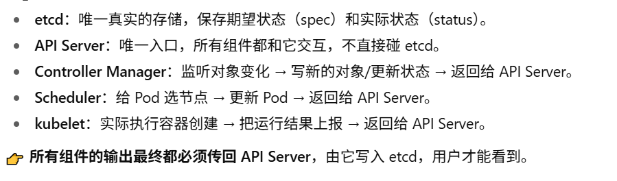

- 回答：K8s集群核心架构分为控制平面master node，以及计算节点worker node，在master node上面常见的组件就是 API server，etcd，control manager以及 scheduler。关于api server，它是相当于所有组件沟通的唯一通信枢纽，提供 RESTful API，负责权限验证与请求校验，也是所有操作的唯一入口并且负责将合法请求写入etcd。etcd是一个高可用的分布式键值存储，它也是 Kubernetes 中唯一的一个数据源，存储集群所有资源的配置与状态，通过 Raft 协议保障高可用与数据一致性；Controller是一组控制器集合(Deployment，Node和Endpoints controller)，通过 Watch 机制监控资源状态，确保实际状态与期望状态一致（如补充缺失的 Pod）；那么再接下来就是 schedule，根据节点的**资源可用性、Pod的资源请求、节点的亲和性和反亲和性等策略**，对所有可用节点进行评估并选择最优的节点，最终写入etcd。 关于work node，上面有三个核心组件，Kublet，container runtime和kube-proxy。Kublet是负责去接收 KPI Server 下达的命令，管理Pod和容器的生命周期，并且它也会定期将节点的和容器的资源使用情况和运行情况反馈给 API Server，那它也是通过CRI调用container runtime去执行底层的像拉取镜像、创建容器、启动容器等操作。那么最后就是 kube-proxy，在每个节点上运行，负责实现Kubernetes服务的网络代理和负载均衡的功能。通过 iptables/ipvs 维护网络规则，实现服务的外部访问和内部通信以及service的负载均衡。


2. 详细说明K8S的架构和资源对象。
- **核心资源对象**：
    - Pod:是K8S中**最小的可部署和管理的计算单元**，一个Pod可以包含一个或多个紧密相关的容器。Pod中的容器共享**网络命名空间(同一 IP 和端口空间)和存储卷**，它们可以通过localhost进行通信，并且可以访问共享的存储。
    - Node:表示K8S集群中的一个**物理节点**，可以是物理机或虚拟机。
    - Namespace:用于将集群资源**划分为不同的逻辑组**，不同的Namespace之间相互进行**逻辑隔离**。可以在不同的Namespace中创建同名的资源对象，常用于多租户环境或不同项目的资源隔离。(Node、PV（持久卷）等集群级资源不属于任何 Namespace，仅命名空间级资源（Pod、Deployment、Service 等）受 Namespace 隔离；)
- **工作负载资源对象**
    - Deployment: 是一种用于**管理Pod副本**的资源对象，**通过ReplicaSet管理 Pod 副本**（Deployment→ReplicaSet→Pod 的层级关系），支持**滚动更新**（逐步替换旧 Pod，零 downtime）和**回滚**（恢复到历史版本）。
    - StatefulSet：用于管理有状态的应用，如数据库等。与Deployment不同，StatefulSet中的每个**Pod都有唯一的网络标识(名称不变和DNS绑定)和持久化存储**，并且在Pod重新调度时会保留其状态。**有序操作**：创建（0→1→2）、删除（2→1→0）按序号进行（适合主从架构，如先启动主库再启动从库）
    - DaemonSet：确保在集群中的每个节点（或指定的节点）上都运行一个Pod副本。常用于运行系统级的守护进程，如日志收集、监控代理等。
- **服务发现和负载均衡资源对象**
    - Service：**通过selector关联 Pod（如app=nginx），为动态变化的 Pod 提供固定访问入口**。Service可以通过ClusterIP、NodePort、LoadBalancer等不同的类型暴露给**外部或内部客户端访问**。
    - ingress：是一种用于**管理外部访问 Service 的 HTTP/HTTPS 路由规则**。它可以根据HTTP/HTTPS请求的域名、路径等信息将请求转发到不同的Service，实现了基于**域名和路径的路由**。
- 存储资源对象
    - PersistentVolume（PV）：是集群中的存储资源，它是独立于Pod的存储抽象。**PV可以是NFS、iSCSI、Ceph等不同类型的存储**，为Pod提供持久化存储。
    - PersistentVolumeClaim（PVC）：**是用户对存储资源的请求，它与PV进行绑定**，为Pod提供具体的存储卷。PVC可以根据存储的大小、访问模式等要求动态分配PV。
- 回答：资源对象的话，那首先就是有一些核心的资源对象，包括 namespace、Pod，以及 node。 那 name space 它是一个将不同的资源组划分成不同的一个逻辑。组，那这个就是每个逻辑组就是一个 name space，那 name space 它是通过逻辑隔离将不同的资源隔离开，那这个是一个 name space，那在就是 Pod，Pod 是这个 key space 中部署和可调度的最小单位，那它是一个 POS 上可以有一个或者一组容器运行在内。那每个 POS 它都会有一个唯一的网络命名空间，包括一个固定的 IP 和这个端口空间，那再就是 NODE，NODE 就是实际的运行的物理节点，它可以是一台虚拟机，也可以是一个物理机，那么在接下来就是。工作复杂的资源类型，那就其中比较常见的就是 deployment，它通过 safe set 去管理 Pod，通常 deployment 它都是管理一些无状态的 Pod，那他通过精通可以实现包括滚动更新和回滚的操作，确保这个炮的时钟运行在一个期望的一个副本数。那在就是到这个 stable set 和 deployment 不一样，它通常是管理有状态的一些应用，那包括像数据库、Redis 等等，那通常 stable or set 它是。有，对，每一个 Pod 会有唯一的一个命名空间，命名，命名的空间就是相当于有一个固定的 Pod，有一个固定的名字，不管它重启、删除、创建，它都是有固定的一个名字，并且会有一个配对的标识符，DNS 的标识符。还有再包括他对每个 Pod 都是一个有序操作，包括创建，比方说是零一2创建，那他删除的时候就是210这样删除，那。再就是他对每一个 Pod 都会有一个存储卷绑定、PVC 绑定，确保每一个应用它不论是删除、重启它的一个状态始终是能够持可持有、持久化的保存着的，那再就到。一个网络方面的资源，就是包括 service 和 Ingress，那 service 它就是通过。一，他就是相当于他就实现了为动态的一个抛提供一个唯一的网络入口，那它通常就是有通过像 class 的 IP、NODE、port，还有 loadbalancer 等等组件去实现网络外或者网络内的一个通信，就是 POS 之间的通信。那具体就是，还有就是 Ingress，它就是负责外部 serve 对外暴露的 service 的流量的一个。Http。http s 的一个。路由规则，它实现了具体的基于，就是这个 host name 和 path 之间的一个路由规则。那最后就是一个，嗯，这个存储类型的资源，包括像 PV。persistent volume 它通常是可以是一个警告，可以是一个 NFS 这些具体的一个存储配置，那它是独立于 Kubernetes 的一个单独的一个配置资源，并且不。独立于 Pod 的一个抽象概念，那通常它会跟通过，就是通常资源会通过 PVC 去绑定到对应的一个 PV，那 PVC 就会定义了这个资源需要的一些存储的一个信息。


    **2.1.**：Kubernetes里的Service、Deployment、Pod、StatefulSet分别是什么

    - Service：**为一组Pod提供统一的网络访问入口，实现了服务发现和负载均衡功能**。
        - ClusterIP：默认类型，在集群内部创建一个**虚拟 IP**，只能在集群内部访问。
        - NodePort：在每个**节点上开放一个端口**，通过节点的 IP 地址和该端口可以从集群外部访问服务。
        - LoadBalancer：使用**云提供商的负载均衡器将流量分发到服务**，适用于公有云环境。
        - ExternalName：将**服务映射到外部的 DNS 名称**，用于将集群内的服务与外部服务进行关联。

    - deployment: 是一种用于管理Pod副本的资源对象，它可以实现Pod的滚动更新、回滚等功能。它为 Pod 和 ReplicaSet 提供了声明式的更新能力，通过指定Deployment的副本数量，K8S会自动创建和管理相应数量的Pod副本，并确保它们的状态与配置一致。
        - **自动伸缩**（：可以根据业务需求调整 Pod 的副本数量，以应对不同的负载。
        - **滚动更新**：在更新应用版本时，Deployment 可以逐步替换旧的 Pod 实例，确保服务的连续性。
        - **回滚**：如果更新过程中出现问题，可以快速回滚到之前的版本。
    
    - pod：是K8S中**最小的可部署和管理的计算单元**，一个Pod可以包含一个或多个紧密相关的容器。Pod中的容器共享网络命名空间和存储卷，它们可以通过localhost进行通信，并且可以访问共享的存储。

    - statefulset：StatefulSet 是 Kubernetes 中用于**管理有状态应用的工作负载资源**。与 Deployment 管理的无状态应用不同，有状态应用通常需要保留一些持久化的数据，并且每个实例都有唯一的标识。
        - **稳定的网络标识**：每个 Pod 都有一个唯一的、稳定的网络标识（主机名），可以通过该标识进行访问。
        - **有序部署和扩展**：Pod 按照顺序依次创建和删除，确保应用的状态正确。
        - **持久化存储**：StatefulSet 可以为每个 Pod 关联一个持久化存储卷，保证数据的持久化。

3. K8s创建pod的详细流程？
- kubectl → API Server: 用户通过kubectl工具与API Server通信。
- API Server ↔ etcd: API Server与etcd进行数据存取。
- Controller ↔ API Server: watch 到新的 Deployment → 调用 API Server 创建 ReplicaSet/Pod 对象
- API Server ↔ Scheduler: Scheduler从API Server中拉取调度信息。
- Scheduler ↔ API Server: 更新Pod的调度状态。
- API Server ↔ Kubelet: Kubelet拉取Pod信息，并上报状态。
- Kubelet ↔ 容器运行时: Kubelet指示容器运行时启动和管理容器。
- Pod ↔ Service: Pod通过Service进行负载均衡和服务发现。
- 我的回答：首先用户通过 kubectl发起 Pod 创建请求，包括用 kubectl apply -f nginx-deploy.yaml或kubectl create deployment nginx --image=nginx，kubectl 将请求封装为 RESTful API 调用，发送给 API Server，API server要去做语法，权限和资源的验证，然后再将具体的配置信息写入到etcd 当中，那么此时Controller Manager 中的Deployment Controller通过‘watch API’监听 etcd 中 Deployment 的变化，发现‘期望状态（副本数 3）’与‘实际状态（初始无 ReplicaSet/Pod）’不一致，会向 API Server 发起请求创建 1 个 ReplicaSet（关联 Deployment，期望副本数 3），API Server 验证后将 ReplicaSet 写入 etcd。Controller Manager 中的ReplicaSet Controller也通过 watch 发现新的 ReplicaSet，然后再请求创建pod这一系列操作。Scheduler 通过‘watch API’监听 etcd 中‘状态为 Pending 且未绑定 Node’的 Pod，那 API Server 就会去进行节点筛选，去结合pod的资源请求的情况以及评估节点的资源情况，还有就是节点亲和性、pod 亲和性反亲等等这些策略去判断得到一个最优的节点，然后通过api server将节点同步回etcd。每个 Node 上的 Kubelet 通过‘watch API’监听 etcd 中‘绑定到本 Node 的 Pod’，通过 CRI（容器运行时接口）调用 containerd/Docker，发送‘拉取镜像→创建容器→启动容器’的指令。

4. 在k8s中，如何进行日志和监控的管理
- 综合解决方案：
    - ELK Stack (Elasticsearch, Logstash, Kibana)：用于日志的收集、存储和可视化。
    - **EFK Stack (Elasticsearch, Fluentd, Kibana)**：Fluentd 替代 Logstash 来做日志收集。
    - **Prometheus + Grafana**：用于监控和可视化。
- 最佳实践：
    - **日志等级管理**：合理设置应用程序的日志等级，可以帮助管理存储和提升日志的查找效率。
    - **记录重要事件**：务必将关键事件、错误消息和异常情况进行详细记录。
    - **数据保留策略**：设置日志和监控数据的保留策略，以平衡存储成本和历史数据的可用性。
    - **安全性**：确保日志和监控数据的访问控制，以保护敏感信息。

5. 当pod出现问题，如何进行排查？
    1. **确认 Pod 状态**：`kubectl get pods -n <namespace>`
    2. **查看 Pod 详细信息**：`kubectl desribe pod <podname>`
    3. **检查容器日志**：`kubectl logs <podname>`
    4. **检查资源限制和请求**：`kubectl get pod <podname> -o yaml`
    5. **检查网络配置**：
    - `kubectl get pods -o wide` 
    - `kubectl get networkpolicies` 
    - `kubectl -exec -it <podname> -- ping <ip>` or `kubectl -exec -it <podname> -- curl <url>`

        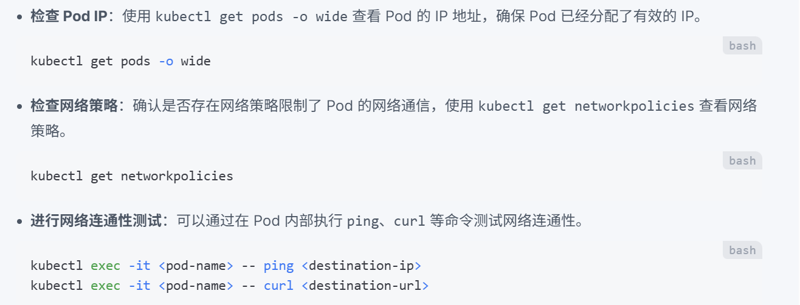

    6. **检查存储配置**：`kubectl describe pod <podname>`

        

    7. **检查节点状态**：`kubectl get node <nodename>` or `kubectl desribe node <nodename>`
    8. **检查核心api组件的命令**：
    - 是否存活：
        ```bash
        ps -ef | grep kube-apiserver        # 二进制部署
        kubectl -n kube-system get pods | grep apiserver
        ```
    - **健康检查：用systemctl或者curl去测试是否正常运行**
        ```bash
        curl -k https://127.0.0.1:6443/heathz
        curl -k https://127.0.0.1:6443/livez
        curl -k https://127.0.0.1:6443/readyz?verbose
        systemctl status kubelet -l
        ```
    - **日志排查**：
        ```bash
        journalctl -u kubelet -xe
        kubectl -n kube-system logs kube-apiserver-<node-name>
        crictl ps -a | grep etcd
        crictl logs <etcd-container-id> 
        ```
    9. **检查 RBAC 配置**：
        ```bash
        kubectl get serviceaccounts
        kubectl get roles
        kubectl get rolebindings
        ```
    - 我的回答：首先如果 Pod 出现问题了，那先我想到了思路是去检查 Pod 的本身的一些情况，第一层，查看pod本身的状态，第一个通过get命令全去看它的状态，常见的有Pending（调度失败）、CrashLoopBackOff（容器反复崩溃）、ImagePullBackOff（镜像拉取失败）等，以及node情况，是否有绑定到一个node，如果没有，可能是调度情况等，还可以加上-o yaml的选项去查看具体pod request和limit的资源是多少。第二个通过describe命令看具体的event日志，可以看到一些关于镜像拉取失败，PVC绑定失败，资源不足等的一些日志。第三个可以通过logs去实际查看上一次容器崩溃的具体日志（排查 CrashLoopBackOff 原因）。第四个通过exec去测试网络连通性，包括用ping，curl，nc等进行一些端口连通性，如果是数据库就尝试连接数据库判断是不是网络联通问题。然后就是查看node的状态，第一个通过get命令全去看它的状态，看节点是不是ready。第二个通过 describe命令，看节点的taint，还有Allocatable vs Allocated：节点已分配的 CPU / 内存是否接近 Allocatable。然后可以在宿主机上用htop去看一看资源使用情况。第三个可以通过journalctl看kubelet的日志，日志中可能可以看到容器启动失败和网络插件异常等报错。 此时我会去查看上层核心组件相关的问题，包括 API,Server、etcd 等等，第一，通过get -n kube-system看组件是不是running的状态。第二，通过 logs 去查看具体的日志。如果api-server有问题，你无法通过kubectl查看日志，可以通过crictl或者去宿主机上看/var/log/kubernetes/apiserver.log。最后去看RBAC权限相关的问题，serviceaccounts，roles，roleblinding等。
  

6. 请介绍Kubernetes的三种探针
    - **存活探针（livenessProbe）**:判断容器是否“活着”
        - 工作流程：
            - Pod 启动 10 秒后（initialDelaySeconds: 10），kubelet 开始检查。
            - 每隔 5 秒（periodSeconds: 5）发一次 HTTP 请求：http://<pod-ip>:8080/healthz。
            - 如果返回 200-399 → 健康；否则认为容器“挂了”。
            - 失败时 kubelet 会重启容器。

    - **就绪探针（readinessProbe）**:判断容器是否“准备好接收流量”。
        - 工作流程：
            - Pod 启动 5 秒后，kubelet 开始检查。
            - 每隔 10 秒 尝试建立 TCP 连接到容器的 3306 端口。
            - 如果能连通 → Pod 被标记为 Ready，会被加到 Service 的 endpoints。
            - 如果失败 → Pod 标记为 NotReady，Service 不会把流量转给它。

    - **启动探针（startupProbe）**:专门为“慢启动应用”设计，避免启动阶段被误杀。
        - 工作流程：
            - kubelet 每隔 10 秒执行一次 cat /tmp/ready。
            - 最多允许失败 30 次 → 也就是最多给 5 分钟启动时间。
            - 在 startupProbe 成功之前，不会执行 livenessProbe 和 readinessProbe。
            - 如果一直失败 → kubelet 会杀死容器并重启。  

        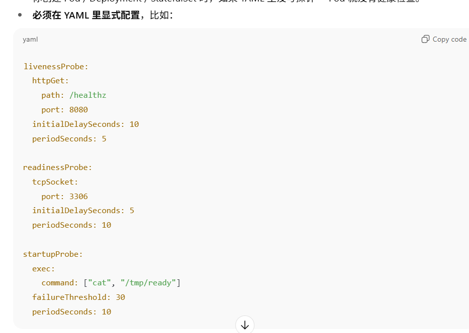

        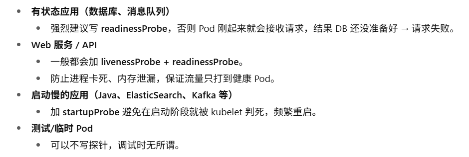

    - 回答：密码 有三种探针，第一种是 Liveness Probe 就是存活探针，第二种是 redness probe，就是就绪探针。第三个是 STARTUP probe，就是启动探针，那第一个存活探针，是检测容器是否处于健康运行状态，避免‘容器进程存活但服务卡死’（比如死循环、线程卡死、内存溢出、GC 停顿导致服务卡死），常见的配置就是向http://<容器IP>:<端口>/<健康路径>发请求，看状态码，后如果说请求没有反应，就会去重启这个容器。那么第二个就是就绪探针，检测容器是否能提供正常服务，避免 “容器启动但服务未就绪（比如未连上数据库、Redis、消息队列、缓存加载中、集群尚未同步完成等）” 时接收流量；通常是可能会去尝试建立一个 TCP 请求，那如果说这个 TCP 请求无法建立，就说明它这个服务没有 ready，kubelet 将 Pod 的Ready状态设为False，Service 自动从 Endpoints 列表中移除该 Pod，不转发流量；那第三个就是 start up，就是启动探针，针对启动慢的容器（应用初始化耗时长（Spring Boot、Python Flask、Node.js 大项目、加载模型等）），避免被 Liveness Probe 误判为 “启动中异常” 而频繁重启；那启动探针它优先级是高于前面两个探针的，相当于如果你给一个 Pod 设定的启动探针，那它会先去测试这个启动探针。通常启动探针可能就是让一个命令在这个 Pod 上。可能就用个 cat，一个文件，然后通过这个去判断这个容器是否已经启动了。


7. K8s的网络插件有哪些？
- **Calico(192.168.0.0/16 或 10.244.0.0/16)**：
    - 特点：**基于BGP（边界网关协议）的网络插件**，支持网络策略。它提供了细粒度的网络访问控制，能够根据**标签对Pod之间的流量进行过滤和隔离**，增强了集群的安全性。

        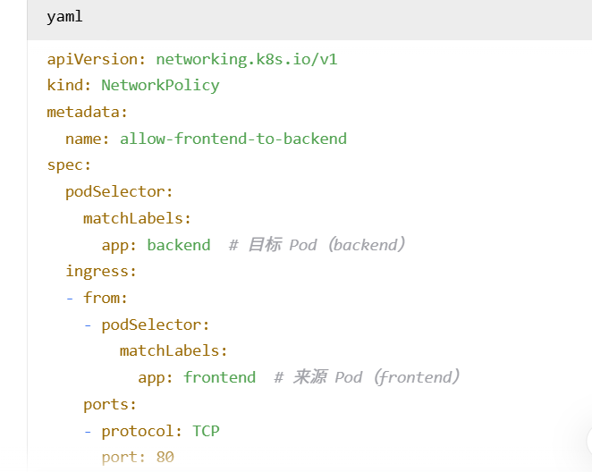

        - 每个 Node 节点上都会运行一个 **BGP Daemon（BGP client）**，最常见的是 **Bird 或 GoBGP**。
        - 这个 BGP Daemon 负责：
            1. 把本节点的 Pod 网段（比如 10.244.1.0/24）通过 BGP 协议宣告出去
            2. 学习其他节点宣告的 Pod 网段（比如 Node2 的 10.244.2.0/24）
            3. 更新本机路由表（Linux 内核的路由表）

                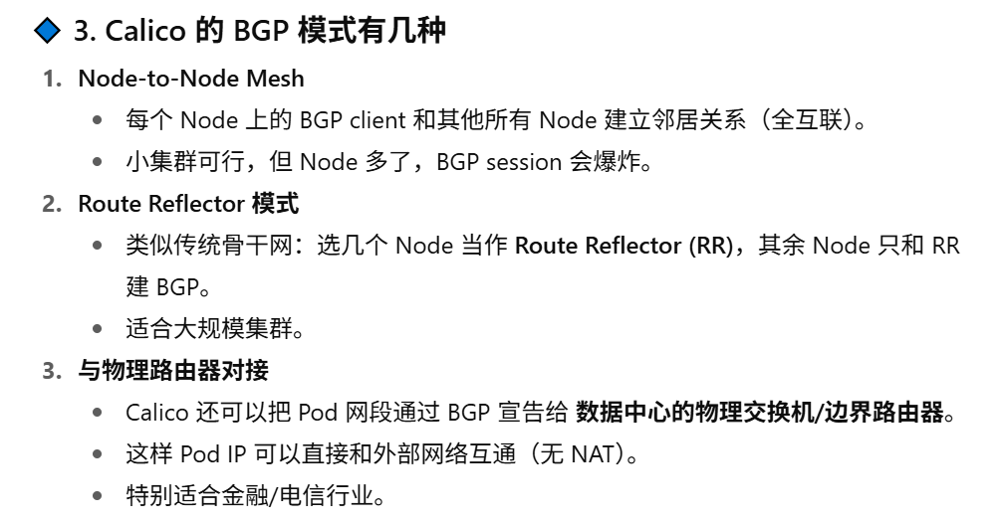

                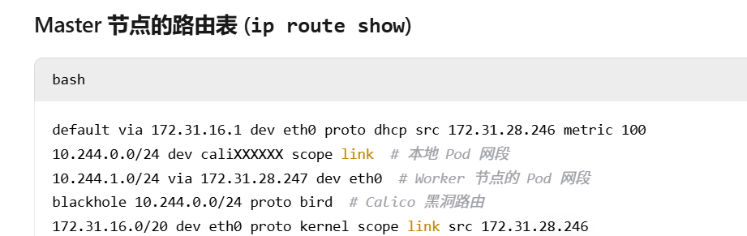

                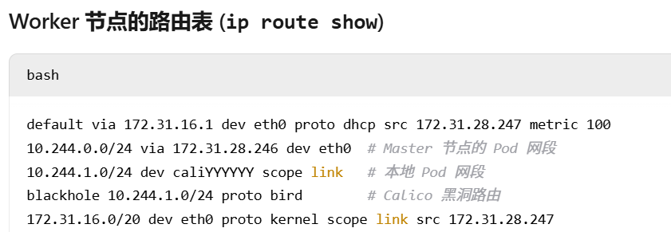

    - 应用场景：适用于对网络安全要求较高的企业级应用场景，如金融、医疗等行业的K8S集群。
- **Flannel(10.244.0.0/16)**：
    - 特点：特点：简单易用，是K8S中最常用的网络插件之一。它通过在各节点之间创建虚拟网络，实现Pod之间的通信。支持多种后端模式，如**VXLAN**、UDP等。
    - 应用场景：适合初学者或者对网络性能要求不是特别高的测试、开发环境。
    - **Flannel 通过 Overlay 网络（常用 VXLAN 或 UDP 封装）**，把 Pod 的**三层IP报文封装在宿主机的三层网络包里**，**在 Node 之间隧道转发**，实现 Pod 跨节点通信。

- **Cilium(10.0.0.0/8)**：
    - 特点：基于 eBPF（内核层编程），高性能、支持网络策略、Service Mesh、透明加密
    - 应用场景：金融、AI/高性能场景，新趋势。

- 回答：首先这两个都是 K8S 中常见的这个网络插件，那我个人就是搭的环境中我用的是这个 flannel，那么 flannel 它是一个比较简单方便的一个网络插件，常用于测试，学习环境，或者小企业对网络延迟没有那么高的场景。它主要是通过 VXLAN 和 UDP 封装实现的跨节点通信，现在主流用的是VXLAN，UDP性能更差。工作原理是将Pod 的三层 IP 报文当做成payload封装在 VXLAN 帧中，再套到宿主机的三层网络包里然后通过节点的物理网卡传输，然后在Node之间通过隧道转发，实现pod跨节点通信。Calico则不一样，它是直接在三层通信，默认是 BGP 路由模式（无封装），但也支持 VXLAN 模式。通常默认每个节点上都运行一个BGP Daemon，最常见的是Bird或者GOBGP，节点会通过这个BGP Daemon把本节点的pod网段通过 BGP 协议宣告出去，并且会学习其他节点的pod网段，最后更新到自己的内核路由表当中。然后就可以直接通过三层网络访问对方的其他节点 的IP 直接进行通信，除此之外，这个 Calico 它还支持根据标签对Pod之间的流量进行过滤和隔离，主要是配合network policy 去实现，就是写一些入站规则和出站规则去进一步提高网络安全性。

8. 简述Kubernetes Pod的常见调度方式?
    1. 默认调度：Kubernetes使用默认的调度器（kube-scheduler）来根据资源需求和节点的可用资源进行调度。调度器会评估节点的CPU、内存等可用资源。
    2. 亲和性和反亲和性：
    - **节点亲和性（Node Affinity）：根据节点的标签**将Pod调度到特定的节点。

        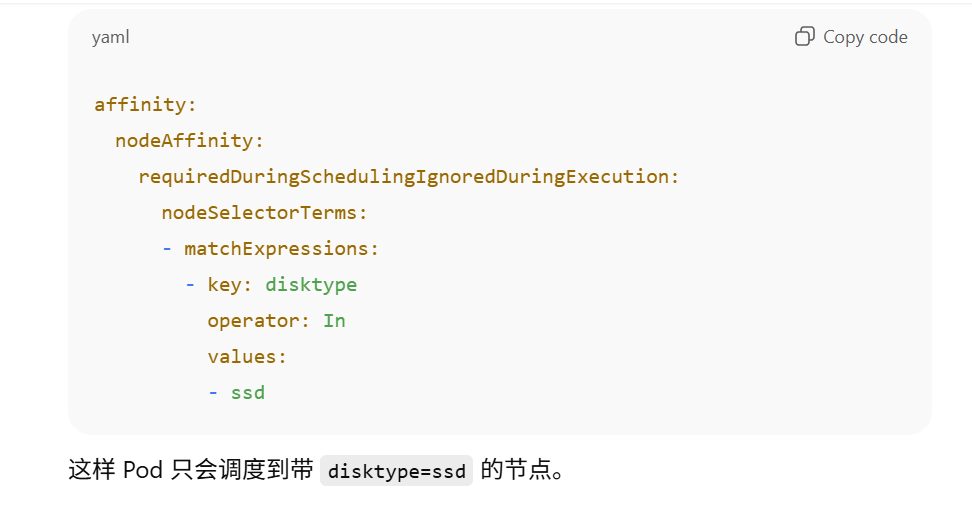

        查看节点的标签：`kubectl get nodes --show-labels`

        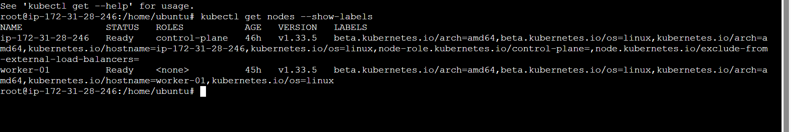

    - **Pod亲和性（Pod Affinity）**：将Pod调度到与特定Pod在同一节点上。

        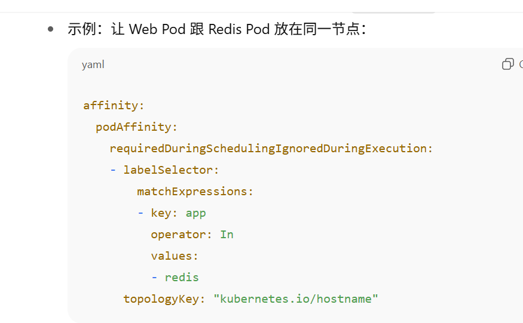

    - **Pod反亲和性（Pod Anti-Affinity）**：避免将Pod调度到与特定Pod在同一节点上。

        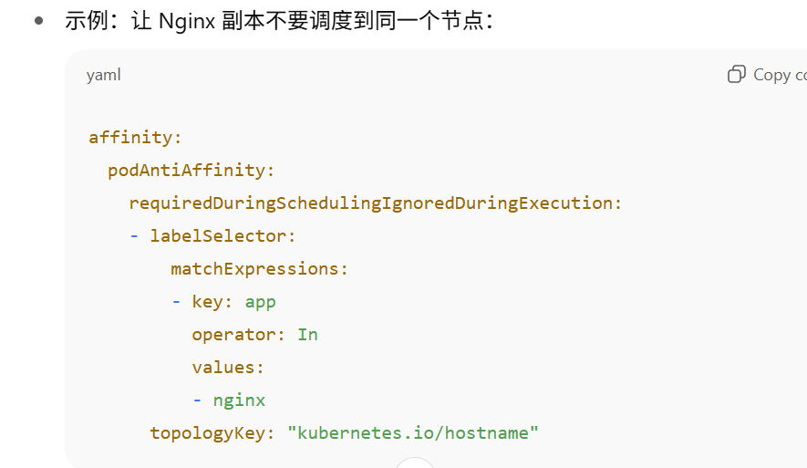

    3. **污点和容忍(taint和tolerant)**：节点可以设置污点，表示该节点不接受特定类型的Pod。Pod可以设置容忍，以便能够被调度到有污点的节点上。
    - 查看节点的taint：`kubectl describe node <node name> | grep Taints`

        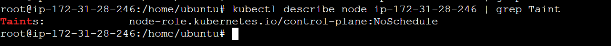

        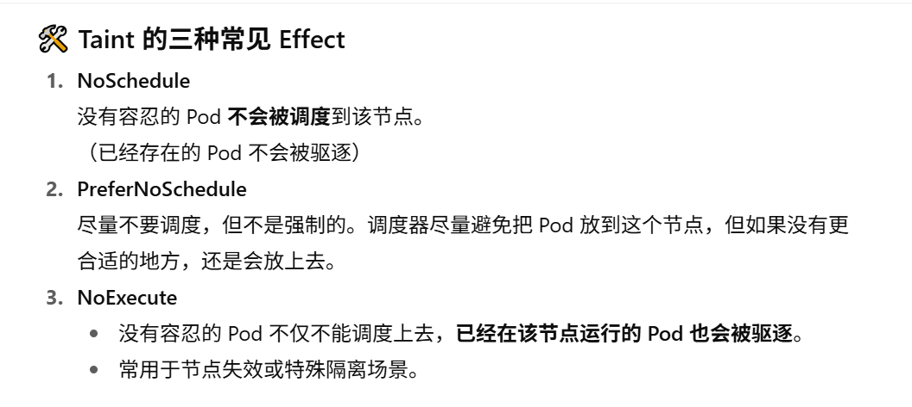

    - **要将pod调度到有taint的节点，需要写上tolerant**：

        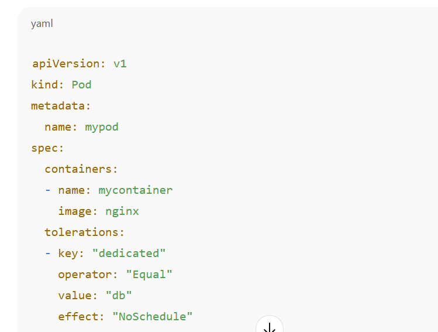

    4. **资源请求和限制**：Pod可以声明所需的资源（CPU、内存等），调度器会根据节点的可用资源做出调度决策。

    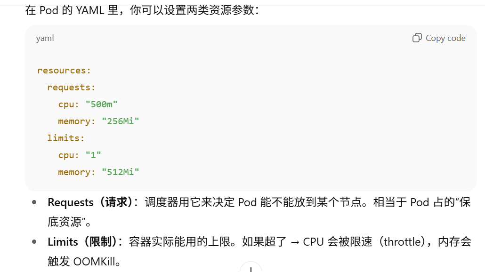

    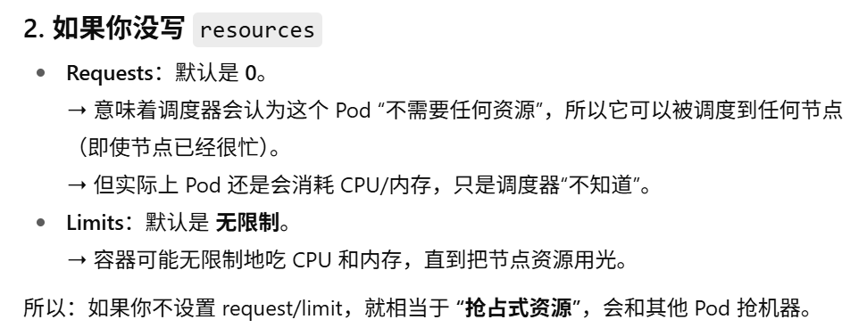

    5. **优先级和抢占**：Kubernetes支持Pod优先级，使得高优先级的Pod可以抢占低优先级的Pod以获取资源。

    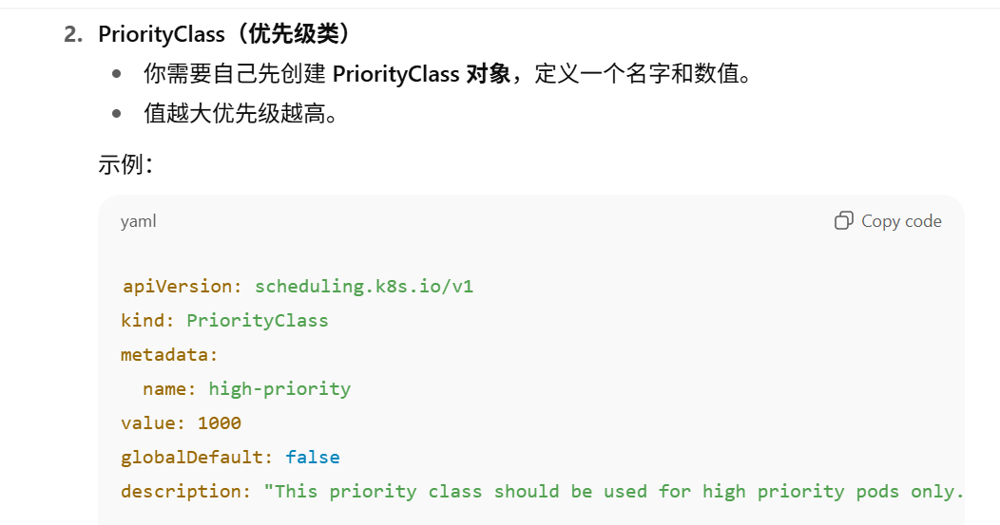

    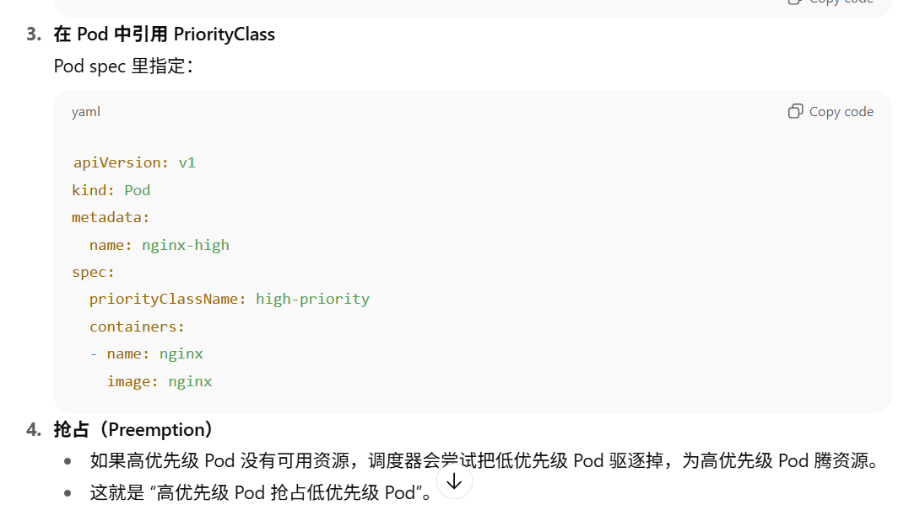

    6. **分布策略**：通过配置分布策略，可以控制Pod在集群中的分布情况，防止集中在某个节点上。

    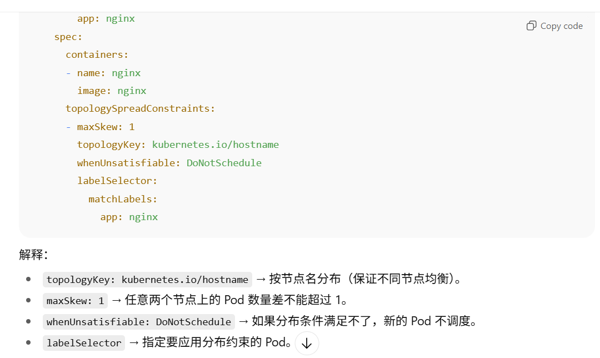

    7. 定制调度器：用户可以创建自定义调度器，处理特定的调度逻辑，以满足业务需求。
    8. 地点亲和性（Topological Spread Constraints）：控制Pod在集群不同拓扑（如不同地区、区域等）的分布，以提高可用性和容错性。
    
    - 回答：首先，K8S 默认调度会通过kube-scheduler 去进行节点筛选（Predicate排除有污点或资源不足的节点）’和‘节点打分（Priority比较符合的节点，选更优）’选出一个最优的节点。当然还有其中除了资源还有非常多其他因素，第一个是亲和性和反亲和性策略，其中有节点和pod亲和性策略，以及pod的反亲和性，都是在pod的配置中去关联对应的节点和pod的标签，实现将pod部署到定义的节点上，或者将pod和定义的pod部署在同一或者不同的拓扑域(同一node或者可用区)。还有就是污点taint和容忍toleration，那么就是如果你有某个节点，不希望他有其他pod的部署在上面，你可以给他设置一个 taint。那通常污点它分为三种类型，一种是 no schedule，然后prefer no schedule，最后是 no execute。那 no schedule 的意思就是当前这个节点不允许没有容忍的新pod部署到这个节点上，但是已经运行的pod不会受到影响，那再就是 prefer，no schedule， 字面意思就是尽量拒绝无容忍的新 Pod，若无其他合适 Node，仍允许部署。那最后就是 no execute，最严格，拒绝无容忍的新 Pod，且已运行的无容忍 Pod 会被驱逐。除此之外，还可以通过pod的resources字段主动配置CPU / 内存的请求值request和上限值limit。当然就是这里有一个比较常见的问题，若未配置 request/limit，默认 request=0，K8s 会认为 Pod “无需资源”，可能导致 Pod 被调度到资源已满的 Node，引发资源抢占和过载。那再就是优先级调度，通过创建 priority class资源，设置value，这个value越大，它的优先级越高，然后最后你在 Pod 配置信息中关联这个 priority class，这个 Pod 就有这个对应的这个优先级，当高优先级 Pod 无 Node 可调度时，K8s 会自动删除 “低优先级、资源占用最小” 的 Pod，释放资源供高优先级 Pod 使用（如支付 Pod 优先级高于日志 Pod，资源不足时先删日志 Pod）。