1. 如何查看端口是否被占用？
- `lsof -i :80` (可以更详细地显示进程信息)
- `ss -tunpa | grep 80` (-t表示TCP连接，-u表示UDP连接，-n表示显示数字格式的地址和端口，-p表示显示进程信息，-a表示显示所有状态的连接)

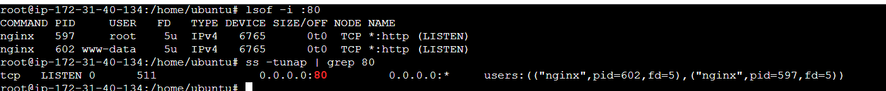

- 回答：可以通过lsof或者ss然后去查看指定的端口数，然后看是否有其他进程在占用这个端口。lsof 通常可以用选项-i，然后冒号加上对应的端口数，然后 SS 的话可以通过 grep 去看对应的这个端口的书，然后看是否有进程占用。lsof以列表形式显示每个​​进程​​的详细信息，ss将共享同一套接字的​​多个进程信息合并显示​​在一行里。通常ss会比lsof或者netstat更快(因为ss直接从 ​​Linux 内核的 netlink接口​​ 获取 socket 信息)，但是lsof更详细，能看到用户信息等。

2. 如何排查资源使用情况？
- `vmstat` (r很高(> CPU 核心数) → CPU 不够，si/so 大量交换(持续不为 0) → 内存不足，b 很高(长期大于 CPU 核心数的 20–30%)、wa 高(> 20%：磁盘 I/O 瓶颈明显) → 可能 I/O 瓶颈。)

    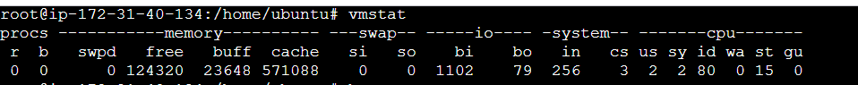

- `iostat` (看idle时间，看磁盘的平均单次I/O平均大小和I/O平均大小)

    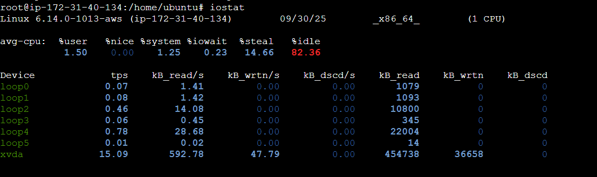

- `htop` (看实时系统cpu，内存及正在运行的进程的情况)

    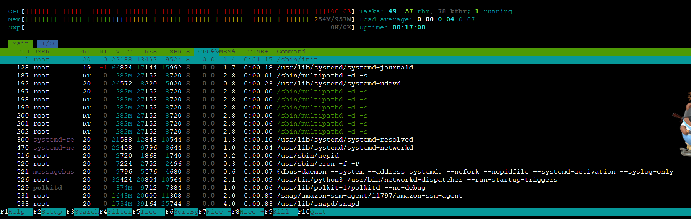

- `df -h`（看磁盘使用情况）

    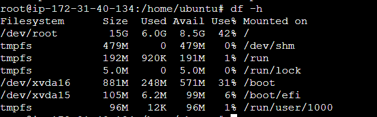

- `free`（看内存使用情况）

    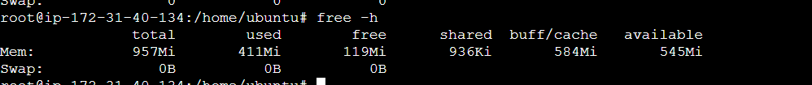

- 回答：从这几个维度去排查吧，比如说 CPU 方面的话，可以 `vmstat` 去看一个整体的 CPU 使用情况，可以通过`vmstat 1 5`收集一个时间段的数据，比如每一秒刷新收集五秒。然后也可以通过 htop或者top 去看，它上面也会显示整体的一个 CPU和内存的整体使用情况。那如果要看内存的话，常用就是用 free，HTOP/Top 也可以。刚刚提到的那 vmstat，通过看swap次数，buff和cache也能看到当前内存的使用情况。那除此之外，看磁盘 IO 的话，HTOP 也可以看一个整体的IO情况，然后通常还会用 iostat 去看具体某个磁盘的平均的 IOPS，单次写，读的大小等等。然后如果要某个进程的这个 CPU，memory 使用情况，可以用 HTOP以及用 PS 去看一个进程的 PID，user 等等的更多信息。

    **2.1** 若top命令后看到一个进程使用率为100%，如何分析问题，在什么情况下会出现这种情况
    - 看htop中该进程的cpu,内存(RES物理内存和VIRT虚拟内存)的使用情况
    - 通过iostat命令查看**磁盘的I/O使用情况**，使用 **iotop 命令查看具体的磁盘I/O占用进程**，判断该进程是否存在大量的磁盘读写操作。
    - 使用 netstat 或 ss 命令**查看网络连接情况**，使用 **iftop 命令查看网络流量情况**，判断该进程是否存在大量的网络数据传输。
    - 分析源代码，查看代码中是否存在死循环、递归调用过深等问题。
    - 查看**系统日志**/var/log/syslog 或 /var/log/messages，判断是否有相关的错误信息。
    - 常见问题：死循环，高并发处理，资源竞争，系统配置问题。

    - 回答：那通常我会先通过 top 的命令去看进程它的一个 PID，然后去 PS 中看到这个进程具体的一些信息，了解它具体是一个什么进程，然后我会进一步通过iostat去查看当前的这个磁盘 IO 的使用率，看是不是磁盘有大量的磁盘读写操作，导致CPU在等待IO， 或者是IO饱和了，导致CPU不断反复尝试。那再就是通过free和vmstat看看是不是有内存内存频繁 swap 导致 IO 上升进而 CPU 满。系统资源层面就大致是这些，然后去看syslog汇总是否有相关的报错，最后结合这些信息，case by case去理解是因为线程泄漏，高并发处理或者资源竞争的原因，如果都不是，那就去看代码层是不是有问题，包括代码是不是进入死循环，或者是不是代码在执行大量类似数学运算这种大量消耗cpu的操作等。


3. 如何查看日志？
- `journalctl -u kubelet` (用于查看systemd-journald服务收集的日志)

    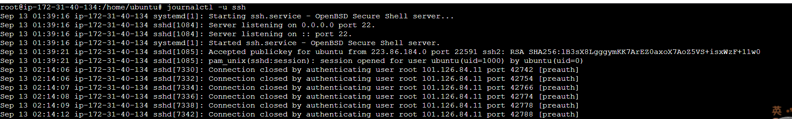

4. 什么是硬链接软连接？
- 硬链接是直接与文件数据关联，不能跨分区且不可以链接目录，不占用inode。(``ln sourcefile linkfile``)
- 软链接是对文件路径的引用，可以跨分区且可以链接目录，占用inode，删除源文件会导致软链接变成悬挂链接，无法访问目标文件(`ln -s sourcefile linkfile`)。

- 回答：首先硬链接和软连接都是 Linux 中的一个快捷访问某个文件的方式，那么它们两个最大的区别是硬链接与源文件共享同一个 inode，不会占用多的inode，但是每一个软链接都会占用一个 inode。其次就是硬链接它是指向和源文件相同的inode，但软链接的inode是指向源文件的路径，那这就会出现，如果说你将源文件删除后，硬链接它依然是可以正常访问，但软连接因为指向源文件的路径，那如果你把源文件删除了，那软连接，它就会变成一个悬挂链接，它就访问不到任何东西了。但是硬链接也会有一些缺点，包括它不能跨文件系统、跨磁盘去创建，主要是不同文件系统又独立的inode编号，比如两个系统可能有相同的inode会导致有冲突，也不能去创建一个目录的硬链接，因为有可能会破坏目录树结构导致无限循环。那软链接它就不具备这上面这些问题。那除此之外，他们在命令行创建的话，通常是用 LN，如果你要创建软链接，你就-s。


5. 进程和线程的区别？
- 定义：进程是程序在**操作系统中的一次执行过程**，是系统进行**资源分配和调度的基本单位**。**线程是进程中的一个执行单元**，是**CPU调度和分派的基本单位**。
- 资源占用：进程拥有自己**独立的内存空间、系统资源**（如文件描述符、信号处理等）。一个进程可以包含多个线程，这些线程**共享该进程的内存空间和系统资源**。
- 调度和执行：线程和进程的调度**都由操作系统内核负责**，但线程的调度开销通常比进程小，因为线程之间的切换不需要切换内存空间。
- 通信方式：进程之间的通信（IPC）通常需要使用**管道、消息队列、共享内存等机制**，而线程之间可以直接通过**共享变量进行通信**，因为它们共享同一进程的内存空间。
- 健壮性：进程之间的独立性使得一**个进程的崩溃不会影响到其他进程**，因此进程的健壮性较高。由于线程共享所在进程的内存空间，**一个线程的崩溃可能会导致整个进程的崩溃**，因此，线程的健壮性相对较低。

- 回答：首先进程是操作系统的一次执行过程，那它也是系统进行资源分配和调度的基本单位，线程则是进程中的一个执行单元，也是 CPU 的调度和分配的基本单位。然后在资源方面，每个进程有独立的内存空间和系统资源，那线程则是共享进程的内存空间和这个系统资源，那再到就是调度和执行，进程和线程都是通过系统内核去调度和执行，但是进程会比线程调度的成本更低，因为他不会涉及到切换内存。那再就是关于通信的话，进程和进程之间通信是通过像管道、消息队列或者是信号以及共享内存等机制。线程的话则是直接通过它的一个共享变量进行通信，因为他们相当于是共享现进程的一个内存。然后。最后就是健壮性，那进程，它通常健壮性会更强，因为它单个进程崩溃不会导致其他进程崩溃，但线程则健壮性比较差，因为单个线程的崩溃很可能会导个导致整个进程的崩溃。


    **5.1** 怎么杀死进程？

        

    - 回答：通常杀死进程，你就直接用kill通过信号的方式去杀死进程，默认是发送信号15就是友好终止，如果不行的话，那就加参数杠9强行删除，进程无机会执行清理操作，可能导致数据损坏或资源泄漏。

    **5.2** Linux如何查询端口并杀死进程？
        - 通过ss或者Isof查询到对应端口进程的PID，并执行kill或者kill -9杀死进程。
    - 回答：通常你可以用，像 **ss ,LSOF 或者 PS** 去查看对应进程的这个 PID，然后再结合 kill 命令去杀死这个进程。

    **5.3** 进程如何通信？
    - 管道（Pipe）/命名管道（FIFO）
        - 底层：基于pipe(),mkfifo()实现
        - 具体：ls | grep txt 或者 mkfifo /tmp/fifo && cat /tmp/fifo & echo hello > /tmp/fifo
    - 消息队列（Message Queue）
        - 底层：开发可以直接用msgsnd/msgrcv系统调用
        - 应用层：通常用常见中间件包括RabbitMQ, Kafka, ActiveMQ实现。
    - 共享内存（Shared Memory）
        - 数据库（MySQL、PostgreSQL）大量用共享内存来做 buffer pool。
    - 信号（Signal）
        - 底层：kill()实现。
        - 具体：kill -9 PID、Ctrl+C（SIGINT）就是最直观的表现。
    - 套接字（Socket）
        - 具体：网络编程的基础，TCP/IP、UDP 都是 socket 的应用。
    - 文件映射（Memory-Mapped Files）
        - 用于加速文件访问，例如 Linux 下的 mmap，可以让文件内容直接表现为内存数组。

6. 在linux中，输入一个命令后，会发生什么？
- **命令解析**：
    - 用户在终端输入命令后，终端程序比如bash，sh会读取用户的整行输入，并且进行**分行处理，区分命令本身，选项和参数**。
    - 终端会判断输入的命令是是**内置命令、外部命令还是别名**。
- **命令查找**
    - 内部命令：shell会直接调用内部的函数来执行该命令。
    - 外部命令：查找当前**环境变量中的PATH**指定的目录列表。
    - 别名：shell会将其替代成对应的实际命令。
- **环境准备**
    - **变量替换**：例如输入`echo $HOME`的时候，shell会将其中HOME替换成为用户主目录的实际路径。
    - **通配符拓展**：输入`ls *.txt`，shell会将*.txt扩展为当前目录下所有以.txt结尾的文件
    - **命令替换**：例如输入`echo(date)`，shell会先执行`date`，再替换掉`(date)`的位置，然后再执行echo。
-**进程创建与执行**
    - 对于外部命令，shell会调用**fork()**系统调用创建一个新的子进程，子进程创建成功后，会调用**exec()**系列系统调用，用要执行的命令对应的可执行文件替换当前子进程的映像。
- **输入输出处理**
    - 标准输入、输出和错误输出
    - 重定向
    - 管道
- **结果返回与状态码**
    - 命令执行结果
    - 退出状态码

7. linux中(), (()), {}, [], [[]]的区别： 

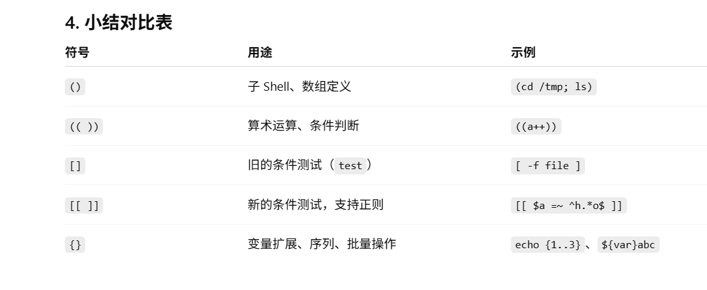

8. 再linux中，如何查找一个文件？
- find
- locate(推荐locate)

    **9.1** 如何查看文件或者目录大小？
    - `ls -l`
    - `du -sh 文件或目录名` (显示文件或目录的总大小，s表示总结，h表示以人类可读的格式显示)
    - `df -h` (显示文件系统的磁盘使用情况)
    - `stat 文件或目录名` (显示文件或目录的详细信息，包括大小、权限、所有者等)

        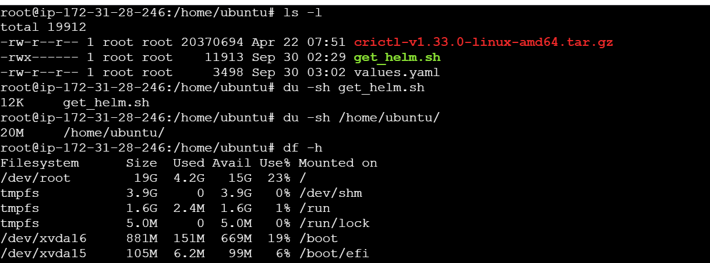

        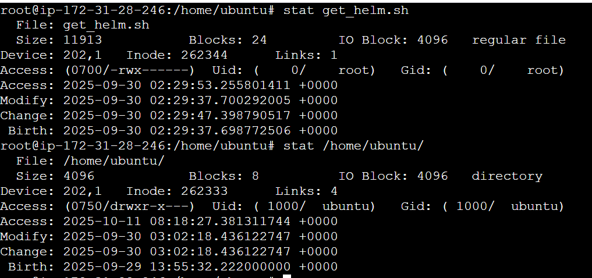

    **8.1** du和df的区别？
    - du（Disk Usage）：用于**显示文件和目录的磁盘使用情况**，可以递归地计算目录及其子目录所占用的磁盘空间。常用选项包括：
        - `-h`：以人类可读的格式显示大小（如KB、MB、GB）。
        - `-s`：仅显示总计。
        - `-a`：显示所有文件和目录的大小。
        - 示例：`du -sh /path/to/directory` 显示指定目录的总大小。
    - df（Disk Free）：用于**显示文件系统的磁盘空间使用情况**，包括每个挂载点的总空间、已用空间、可用空间和使用百分比。常用选项包括：
        - `-h`：以人类可读的格式显示大小。
        - `-T`：显示文件系统类型。
        - 示例：`df -h` 显示所有挂载点的磁盘使用情况。

9. 通常linux中，有哪些查看网络状态的命令？
- IP: ip命令是ifconfig的替代工具，功能更强大，可用于显示和配置网络接口、路由表等信息。
- ss: ss是netstat的替代工具，速度更快，能提供更详细的网络连接信息。
- ping：用于测试网络连通性，向目标主机发送ICMP回显请求数据包，并接收目标主机的响应。
- telnet：用于测试 TCP 端口连通性，常用于验证目标主机某个服务端口是否可访问。
- curl：用于从命令行发送 HTTP/HTTPS 请求，调试 Web 服务常用。
- traceroute：用于跟踪数据包从本地主机到目标主机所经过的路由路径
- tcpdump：用于捕获和分析网络数据包，常用于网络故障排查和安全分析。

10. linux中的通道是什么？
- 匿名通道：
`ls | grep xxx`
- 命名通道：

    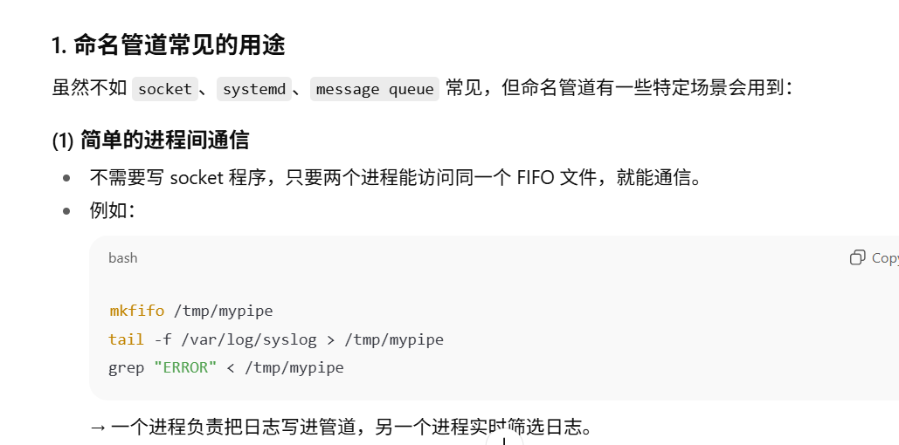

11. 了解文件系统类型吗？
- 文件系统类型：
    - Ext4：是Linux系统中广泛使用的日志文件系统，它是Ext3文件系统的后继版本。具有高可靠性、高性能和良好的扩展性，支持最大1EB的文件系统和最大16TB的单个文件，同时还支持延迟分配、多块分配等特性，能有效提升文件系统的性能。
    - XFS：是一种高性能的64位日志文件系统，特别适合处理大容量数据和大文件。它具有出色的并发性能和快速的文件系统修复能力，在大规模数据存储和高性能计算环境中应用广泛。
- 文件系统工作原理：
    - inode：每个文件和目录在文件系统中都有一个对应的inode（索引节点），inode包含了文件的元数据，如文件的权限、所有者、文件大小、创建时间、修改时间等，同时还包含了指向文件数据块的指针。
    - 数据块：文件的数据实际存储在数据块中，数据块是文件系统分配和管理磁盘空间的基本单位。
    - 目录项：目录也是一种特殊的文件，它包含了一系列的目录项，每个目录项记录了文件名和对应的inode号码，通过目录项可以将文件名和inode关联起来。
- 文件系统的挂载与卸载


12. Linux内核是什么？
- 定义：Linux 系统的核心是内核。内核控制着计算机系统上的所有硬件和软件，在必要时分配硬件，并根据需要执行软件：
    - 系统内存管理
    - 应用程序管理
    - 硬件设备管理
    - 文件系统管理

13. 在Linux日志文件中如何查找关键字
- grep：
    - `grep "关键词" 日志路径` (可以加-i不区分大小写，-n显示行号，-r目录下递归查询)
    - `xxx | grep "关键词"` (管道符前的命令输出结果中查找关键词)
- sed：
    - `sed 's/foo/bar/g' file.txt`，将文件中的foo替换为bar(加上-i直接对原文本进行修改)
    - `sed -n '10,20p' file.txt`，打印第10到20行
    - `sed '/pattern/d' file.txt`，删除包含pattern的行
- awk：
    - `awk '{print $1, $3}' file.log`,打印特定列
    - `awk '$3 > 100 {print $0}' file.log`,按条件过滤，输出第3列大于100的行
    - `awk -F',' '{print $2}' data.csv`，指定分隔符为逗号，打印第2列
    - `awk '/error/ {print $0}' file.log`，结合正则表达式，查找包含"error"的行

    **13.1** 在Linux上如何用命令查看日志文件里面“error”的个数，并且统计行数?
    - `grep -i "error" /var/log/syslog | wc -l` (grep -i不区分大小写，wc -l统计行数)
    - 优先，多文件需要统计总行数再用wc`grep -c "error" /var/log/syslog` (grep -c直接统计匹配行数)
    - `awk '/error/ {count++} END {print count}' /var/log/syslog` (awk按行扫描日志文件，遇到包含"error"的行就计数，最后输出总数)
14. 如何在两个服务器之间传送数据？
- scp：基于**SSH协议**的文件传输工具，适用于在两台Linux服务器之间安全地**复制文件和目录**。
    - 语法：`scp [选项] [源路径] [目标路径]`
    - 示例：`scp /path/to/local/file user@remote_host:/path/to/remote/directory`
- rsync： 基于**rsync协议**，支持**增量传输和断点续传**，适用于在两台服务器之间**同步文件和目录**。
    - 语法：`rsync [选项] [源路径] [目标路径]`
    - 示例：`rsync -avz /path/to/local/directory/ user@remote_host:/path/to/remote/directory/` (a表示归档模式，v表示详细输出，z表示压缩传输)
- ftp/sftp：基于**FTP协议**，适用于在两台服务器之间传输文件。**sftp是基于SSH的安全文件传输协议**，需要两台服务器都安装有FTP或SFTP服务。
    - ftp语法：`ftp [选项] [远程主机]`
    - sftp语法：`sftp [选项] [用户@远程主机]`
    - ftp示例：`ftp remote_host`，然后使用`ftp>`提示符下的通过**put** /home/user/test.txt上传文件，**get** test.txt下载文件。
    - sftp示例：`sftp user@remote_host`，然后使用`sftp>`提示符下的通过**put** /home/user/test.txt上传文件，**get** test.txt下载文件。

15. Linux中如何设置定时任务?
- 定义：使用cron服务来管理和执行定时任务。cron服务会定期检查crontab文件，并根据其中的时间表执行相应的命令或脚本。
- 编辑crontab文件：使用`crontab -e`命令打开当前用户的crontab文件进行编辑。
- crontab文件格式：每行表示一个定时任务，格式如下：
```* * * * * command_to_execute```
    - 五个星号分别表示分钟、小时、日期、月份和星期几，可以使用具体的数值、逗号分隔的列表、范围或步长来指定时间。
    - 例如，`0 2 * * * /path/to/script.sh`表示每天凌晨2点执行`/path/to/script.sh`脚本。
- 通过`crontab -l`查看当前用户的定时任务，通过`crontab -r`删除当前用户的定时任务。

16. shell脚本是什么？
- 定义：Shell脚本是一种用来**自动化执行一系列命令的文本文件**，通常以 **.sh** 为扩展名。它是由一系列的**shell命令组成**，可以包含变量、条件语句、循环等编程结构。最常见的 Shell 是 **Bash**，也有Zsh，Ksh等。
    **16.1** shell脚本第一行是什么？
    - 定义：在shell脚本的第一行通常会包含一个特殊的注释行，通常以#!/bin/bash开头，称为shebang（#!），用于指定脚本的解释器。

17. 在服务器上仅开启22端口和443端口，其他端口全部禁止访问，使用iptables如何实现。
- 仅允许22端口和443端口的入站流量(其中-A表示添加规则，-p表示协议，--dport表示目标端口，-j表示目标动作)：
```bash
# optional，避免冲突，可以先清空现有规则：
iptables -F             # 清空所有规则
iptables -X             # 删除所有自定义链
iptables -Z             # 清空所有计数器
# 开放22和443入站流量
iptables -A INPUT -p tcp --dport 22 -j ACCEPT
iptables -A INPUT -p tcp --dport 443 -j ACCEPT
# 拒绝其他所有入站，转发流量：
iptables -A INPUT -j DROP
iptables -A FORWARD -j DROP
# 允许所有出站流量：
iptables -A OUTPUT -j ACCEPT
# 允许本地回环接口流量：
iptables -A INPUT -i lo -j ACCEPT
# 允许已建立和相关的连接流量：
iptables -A INPUT -m state --state ESTABLISHED,RELATED -j ACCEPT
# 保存规则：
service iptables save
```

18. 内核态和用户态的区别？
- 定义：
    - 用户态（User Mode）：是**应用程序运行的模式**，用户态下的程序**无法直接访问硬件资源和内核数据结构**，必须通过系统调用接口请求内核服务。
    - 内核态（Kernel Mode）：是**操作系统内核运行的模式**，内核态下的代码可以**直接访问硬件资源和内核数据结构**，执行特权操作。
- 切换：
    - 用户态到内核态的切换：当用户态程序**需要执行系统调用**（如文件读写操作、网络通信、申请内存等）时，会通过触发系统调用，CPU切换到内核态，执行相应的内核代码。也可能因为出现异常（如非法内存访问）或硬件中断（如I/O设备请求）而切换到内核态。
    - 当发生切换时，CPU会**保存当前用户程序的上下文信息到内存栈**，包括程序计数器(PC)、寄存器状态等。然后切换到内核态，同时指令跳到内核响应的处理程序入口，**执行内核代码**。
    - 内核态到用户态的切换：内核完成系统调用后，会将之前保存的用户程序**上下文信息从内核栈中恢复到CPU的寄存器中**，并切换回用户态继续执行。

19. 解释linux中万物皆为文件是什么意思？
- <span style="color:red;">普通文件和目录</span>：包括**文本文件、二进制文件、配置文件**等，目录也是一种特殊的文件，它存储的是**文件和子目录的相关信息**，例如**文件名、文件属性以及指向文件数据存储位置的指针**等。
- <span style="color:red;">设备文件</span>：Linux将硬件设备抽象为文件，分为**字符设备文件**和**块设备文件**。字符设备文件（如**终端、串口**）允许按字节流方式访问，而块设备文件（**如硬盘、U盘**）允许按块方式访问数据。通过这些设备文件，用户空间的程序可以**像操作普通文件一样与硬件设备进行交互**。
- <span style="color:red;">管道和套接字</span>：**管道（Pipe）** 和**套接字（Socket）** 也是文件的一种形式，用于进程间通信。管道分为**无名和命名管道FIFO文件**，一个进程向管道写入数据，另一个进程从管道读取数据。而套接字则用于网络通信，通过socket()函数创建，会返回一个**文件描述符**，后续通过使用read()和write()函数对这个文件描述符操作实现不同主机上的进程进行数据交换。
- <span style="color:red;">符号链接</span>：符号链接（Symbolic Link）是一种特殊的文件类型，它包含了另一个文件或目录的路径信息。通过符号链接，用户可以创建对目标文件或目录的快捷方式，方便访问和管理。

20. 请简单描述VI编辑器的使用？
- 定义：有三种模式，分别是命令模式、插入模式和返回命令模式。
- 常见的用法：
    - 插入通常我会用i进入插入模式，编辑完成后按Esc键返回命令模式。
    - 保存和退出：在命令模式下，输入`:wq`保存并退出，输入`:q!`强制退出不保存。
    - 移动光标：通常我会用`20G`移动到第20行，`$`移动到行尾，`0`移动到行首。
    - 删除文本：在命令模式下，`dd`删除当前行，`x`删除当前光标所在的字符。向下删除就是`20dd`。
    - 查找文本：在命令模式下，输入`/关键词`进行向下查找，输入`?关键词`进行向上查找，按n键查找下一个，按N键查找上一个。
    - 复制和粘贴：在命令模式下，`yy`复制当前行，`p`在光标后粘贴，`P`在光标前粘贴。

21. 什么是inode？
- 定义：**inode（索引节点）**是文件系统中的一个**数据结构**，用于**存储文件的元数据（metadata）**，包括文件的**权限、所有者、文件大小、创建时间、修改时间等信息**，以及指向**文件数据块**的指针。


22. 在Linux系统中如何查看僵尸进程？
- 通过ps命令查看僵尸进程：
    - `ps aux | grep Z` (Z表示僵尸状态)
    - `ps -eo pid,ppid,stat,cmd | grep 'Z'` (显示PID、PPID、状态和命令)
- 通过htop命令查看僵尸进程：
    - 启动htop，按F4键，输入Z过滤僵尸进程。

    **22.1** 什么是僵尸进程？
    - 定义：僵尸进程（Zombie Process）是指**已经终止但其父进程尚未调用wait()或waitpid()函数来读取其退出状态的进程**。僵尸进程仍然保留在系统的进程表中，**占用一定的系统资源（如PID），但不再执行任何代码**。

