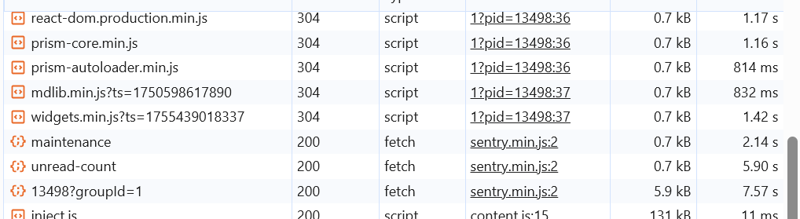

1. TCP三次握手？

    

    > 三次握手确保通信双方都能确认彼此的收发能力

2. TCP四次挥手？       

    

    
    
    >因为TCP 必须分成 确认对方已经知道你要关闭，以及 对方自己也准备关闭 这两个独立动作，导致需要 四次。

3. TCP和UDP区别？
    - 连接性(三次握手):面向连接 vs 无连接
    - 可靠性(重传，ack确认，seq保证数据不乱序)
        - TCP将数据分成多个段（Segment），并有自己的seq
    - 数据传输方式：面向字节流 vs 面向报文
    - 数据流控制(flow control，congestion control)
    - 开销(建立连接，重传等网络和资源开销)
    - 使用场景
    
    **3.1** TCP如何保证可靠传输：
        
    - 三次握手
    - seq number分段segment
    - 重传
    - checksum
    - flow control避免丢包
    - congestion control避免丢包

    **3.2** TCP拥塞控制是怎么样的？
    > 最好还是可以用cubic回答
    - 慢启动
    - 拥塞避免
    - 快速重传
    - 快速回复
    - 超时重传
    - 自适应调整

    **3.3** TCP粘包和拆包，以及定长协议，分隔符协议和消息头+消息体协议？
    - 粘包：接收端将多个segement组合成一个包
    - 拆包：若超出MSS，发送方将一个长的package拆成多个小包
    - 定长协议，分隔符协议和消息头+消息体协议：

        

4. http和https的区别？
    - 加密
    - 端口
    - 速度/性能
    - 证书

    **4.1**：http是什么？
    
    - HTTP（超文本传输协议，Hypertext Transfer Protocol）是一种用于在客户端（通常是浏览器）和服务器之间传输超文本数据的应用层协议。它是Web的基础，允许用户通过互联网访问和交换信息。
    - **请求-响应模型**：客户端发送一个HTTP请求，服务器接收并处理请求后返回一个HTTP响应。
    - **无状态性**：每个请求都是独立的，服务器不保留之前请求的状态，虽然可以通过其他手段（如Cookies、会话等）来实现状态管理。
    - **灵活性**: 支持多种数据格式，如HTML、XML、JSON、图像等。
    - **可扩展性**：允许开发者定义新的方法和头部字段。

    **4.2** https加密过程？

    

        > HTTPS采用了对称加密和非对称加密相结合的方式。在建立连接阶段，使用非对称加密（如RSA）来安全地交换会话密钥；在数据传输阶段，使用对称加密（如AES）来加密实际传输的数据。

    **4.3** 对称加密和非对称加密的区别？

    

    **4.4** HTTP状态码：
    - 1xx：信息性状态码
    - 2xx：成功状态码
    - 3xx：重定向状态码
    - 4xx：客户端错误状态码
    - 5xx：服务器错误状态码

    **4.5** HTTP请求通常有什么组成部分:

    

    **4.6** Get和Post的区别？

    - 参数传递方式(Get通常请求参数会附加在URL后面)
    - 安全性(直接放在URL后面，不太安全)
    - 缓存(get会被缓存，post通常不会)
    - 幂等性(get幂等，post不是)

    **4.7** 简述websocket的原理和应用场景？
    - 定义：WebSocket 是一种 **全双工通信协议**，在一个单一的 TCP 连接上，允许 **客户端和服务器双向实时通信**。
    - 和传统http的区别：传统 HTTP 是“请求-响应”模式，客户端必须发起请求；WebSocket 一旦建立连接，**双方都可以主动发送消息**。
    - 工作原理：浏览器先发一个 HTTP 请求（带 **Upgrade: websocket 头**），请求升级协议；服务器同意后，**连接从 HTTP 切换为 WebSocket**。
    - 建立后：双方通过这个 TCP 连接，随时可以互相发送数据帧，传输的数据可以是文本或二进制。
    - 使用场景：在线聊天系统(QQ，微信) ，在线游戏：玩家位置、血量、动作等要实时同步 → WebSocket 保证毫秒级更新。股票行情/直播弹幕：服务器需要实时推送数据给客户端，而不是等客户端轮询请求。

    **4.8** http 2的新特性？
    - **二进制分帧：** HTTP 2.0将所有传输的信息分割为更小的消息和帧，并采用**二进制格式对它们进行编码**，每个帧都有特定的类型和标识。在HTTP 1.x中，数据**以纯文本的形式传输**。
    - **多路复用**：这是HTTP 2.0的核心特性之一。在HTTP 1.x中，**每个请求都需要建立一个单独的TCP连接**，这会导致连接的开销较大，尤其是在高并发的情况下。而**HTTP 2.0允许在一个TCP连接上同时进行多个请求和响应的传输**，不同的请求和响应可以交错进行，互不干扰。
    - **头部压缩：** HTTP请求和响应的头部通常包含了大量的元数据，如Cookie、User - Agent等。在HTTP 1.x中，**每次请求都会重复发送这些头部信息**，造成了大量的带宽浪费。HTTP 2.0采用了**HPACK算法对头部进行压缩**。该算法会在客户端和服务器端维护一个头部字段表，对于重**复出现的头部字段，只需要发送一个索引值**。
    - **服务器推送**：在传统的HTTP 1.x中，客户端需要**明确请求每个资源，服务器才会返回相应的数据**。HTTP 2.0中，服务器可以根据客户端的请求，**预测客户端可能需要的其他资源**，并主动将这些资源推送到客户端。例如，当客户端请求一个HTML页面时，服务器可以同时推送该页面引用的CSS文件和JavaScript文件。

    **4.9** http缓存的理解？
    - **强缓存：**
        - 浏览器直接从本地缓存中读取资源，无需向服务器发送请求。通过响应头中的 Expires 和 Cache-Control 字段来控制。
        - Expires：它的值是一个**具体的时间点**，表示资源的过期时间。当再次请求该资源时，若当前时间**未超过 Expires**指定的时间，则使用**本地缓存**。
        - Cache-Control：常见的值有 **max-age**（指定资源在多少秒内有效）、**no-cache**（表示需要先与服务器验证资源是否有更新，再决定是否使用缓存）、**no-store**（表示不使用任何缓存）等。
    - **协商缓存:**
        - 当强缓存失效时，浏览器会向服务器发送请求，验证资源是否有更新。通过响应头中的 ETag 和 Last-Modified 字段来控制。
        - Last-Modified:浏览器再次请求该资源时，会在请求头中添加 **If-Modified-Since 字段，值为上次响应头中的 Last-Modified 值**。服务器收到请求后，会比较资源的当前最后修改时间和 If-Modified-Since 的值，**若相同则返回 304 状态码，否则返回 200 状态码和新的资源**。
        - ETag:是资源的唯一标识符，通常是根据**资源内容生成的哈希值**。浏览器再次请求该资源时，会在请求头中添加 If-None-Match 字段，值为**上次响应头中的 ETag 值**。服务器收到请求后，会比较资源的当前 ETag 值和 If-None-Match 的值，**若相同则返回 304 状态码，否则返回 200 状态码和新的资源。**ETag 比 Last-Modified 更精确，因为即使资源的最后修改时间未变，但内容可能已经改变。

        

        
        
        

5. DNS解析的过程？

    

6. cookie和session是什么？
- 定义：Cookie 和 Session 是用于管理用户状态和存储信息的两种技术，常用于Web开发中。
- cookie：Cookie 是**由客户端保存**用户浏览器中的小块数据，通常用于保存用户的偏好设置、登录信息和跟踪用户行为等。
- session：Session **是在服务器上保存**的用户状态信息，通常用于在**用户与服务器的交互过程中**保存用户的登录状态和其他信息。

    **6.1** cookie和session的区别？
    - 存储位置
    - 数据量
    - 安全性
    - 生命周期
    - 用途

        

        

7. 请解释epoll的原理和作用?
- 定义：epoll 是 Linux 内核提供的一种**I/O 多路复用机制**。
- 作用：高效地同时监听 **成千上万个文件描述符FD** (socket、pipe、文件等) 的可读/可写事件。
- 对比：传统的 select / poll 也能做多路复用，但效率差，每次调用都要把**所有 fd 传给内核**，fd 数量越多，性能越差，单个select只有1024个fd上限；Epoll 没有**最大 fd 数量限制**；内核里维护事件表，**不需要重复传 fd**；支持 **事件驱动（回调机制）**，效率更高。
- 关键系统调用：
    - epoll_create

        

    - epoll_ctl

        

    - epoll_wait

        

- 工作模式：
    - **水平触发(LT)**
    - **边缘触发(ET)**

        

8. 什么是ARP协议？
- 定义：ARP（Address Resolution Protocol，地址解析协议）是一种用于在**局域网中通过IP地址查找对应的MAC地址的协议**。它在以太网等局域网技术中广泛应用。
- 工作原理：
    - 请求广播： 当一台主机需要将数据包发送到同一局域网中的另一台主机时，它需要知道目标主机的MAC地址。如果主机只知道目标主机的IP地址，它会向**网络广播一个ARP请求，内容包括目标IP地址**。
    - ARP响应： 所有接收该请求的主机都会检查这个请求中的目标IP地址。**如果某台主机的IP地址与请求中的目标IP地址相匹配，它会发送一个ARP响应，回复其MAC地址**。
    - 缓存： 请求主机会接收到ARP响应，获取到目标主机的MAC地址，**并将这个信息缓存起来，以便后续快速访问，避免重复发送ARP请求**。
    - 数据包发送： 获取到MAC地址后，请求主机就可以将数据包发送到目标主机的MAC地址上。
- 安全性：ARP协议本身并没有安全机制，容易受到**ARP欺骗（ARP Spoofing）等攻击**。这种攻击使得攻击者能够将其MAC地址与合法主机的IP地址相关联，从而截获或篡改网络流量。因此，在一些安全要求较高的网络环境中，可能会使用其他安全协议来增强ARP的安全性。

9. 常见的网络协议：
- 传输文件：
    - FTP（File Transfer Protocol，文件传输协议）：用于在网络上进行文件的上传和下载。它基于**客户端 - 服务器模式**，允许用户通过命令行或图形界面工具连接到远程服务器，管理和传输文件。例如，**网站管理员通过 FTP 将网站的网页文件、图片等上传到服务器**。
    - TFTP（Trivial File Transfer Protocol，简单文件传输协议）：是一种简化版的文件传输协议，它**不需要用户进行身份验证**，实现起来较为简单，占用资源少。常用于在**网络设备（如路由器、交换机）之间传输配置文件**，或者在无盘工作站启动时从服务器获取引导文件。

- 电子邮件：
    - SMTP（Simple Mail Transfer Protocol，简单邮件传输协议）：主要用于发送电子邮件。当用户在邮件客户端撰写好邮件并点击发送时，**邮件客户端会通过 SMTP 协议将邮件发送到发件人的邮件服务器，然后发件人的邮件服务器再通过 SMTP 协议将邮件转发到收件人的邮件服务器**。
    - POP3（Post Office Protocol - Version 3，邮局协议第 3 版）：用于接收电子邮件。邮件服务器接收到邮件后会存储在邮箱中，**用户的邮件客户端使用 POP3 协议从邮件服务器下载邮件到本地**。下载后，邮件通常会从服务器上删除。
    - IMAP（Internet Message Access Protocol，互联网消息访问协议）：也是用于接收电子邮件的协议，但**与 POP3 不同，IMAP 允许用户在本地客户端对服务器上的邮件进行管理，如分类、标记等操作，而邮件仍然保留在服务器上。**

        

        

- 用于万维网：
    - http（Hypertext Transfer Protocol，超文本传输协议）：是用于传输超文本的协议，是万维网数据通信的基础。它是一种**无状态的协议**，客户端（如浏览器）**向服务器发送请求，服务器返回相应的资源（如 HTML 页面、图片等）**。例如，当我们在浏览器中输入网址并回车，浏览器就会通过 HTTP 协议向对应的服务器请求网页资源。
    - https（Hypertext Transfer Protocol Secure，超文本传输安全协议）：是在 HTTP 的基础上加入了 **SSL/TLS 协议进行加密和身份验证**，保证了数据在传输过程中的安全性和完整性。现在大多数网站都采用 HTTPS 协议，特别是涉及用户隐私信息（如登录、支付等）的网站。

- 用于域名解析：
    - DNS（Domain Name System，域名系统）：将人类可读的域名（如 www.example.com）转换为计算机能够识别的 IP 地址。当我们在浏览器中输入域名时，**浏览器会先向 DNS 服务器发送请求**，获取该域名对应的 IP 地址，然后再通过该 IP 地址与对应的服务器进行通信。

- 用于远程登录：
    - Telnet：允许用户通过网络远程登录到其他计算机上，并在远程计算机上执行命令。不过，**Telnet 协议在传输数据时是明文的**，存在安全风险，现在使用得越来越少。
    - SSH（Secure Shell，安全外壳协议）：同样用于远程登录和执行命令，但它**通过加密和身份验证机制保证了通信的安全性**。SSH 广泛应用于系统管理员远程管理服务器，以及开发人员在不同服务器之间进行代码部署等操作。