1. TCP三次握手？

    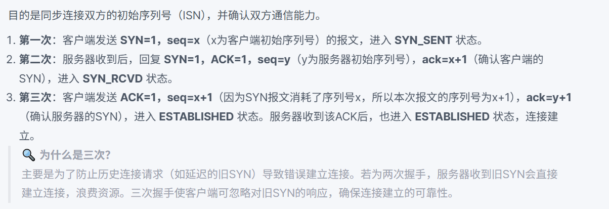

    > 三次握手确保通信双方都能确认彼此的收发能力

2. TCP四次挥手？       

    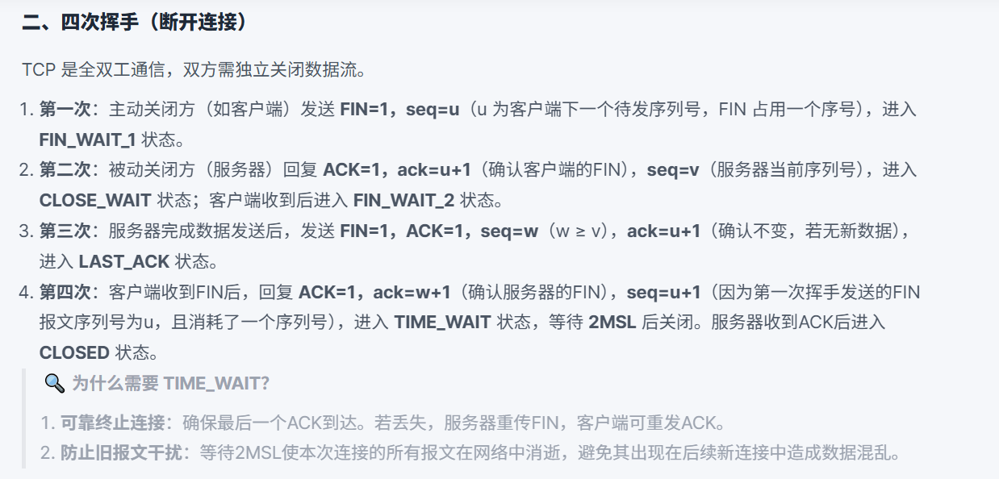

    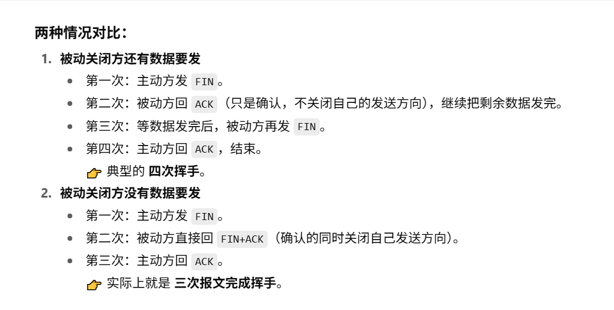
    
    >因为TCP 必须分成 确认对方已经知道你要关闭，以及 对方自己也准备关闭 这两个独立动作，导致需要 四次。

3. TCP和UDP区别？
    - 连接性(三次握手):面向连接 vs 无连接
    - 可靠性(重传，ack确认，seq保证数据不乱序)
        - TCP将数据分成多个段（Segment），并有自己的seq
    - 数据传输方式：面向字节流 vs 面向报文
    - 数据流控制(flow control，congestion control)
    - 开销(建立连接，重传等网络和资源开销)
    - 使用场景
    
    **3.1** TCP如何保证可靠传输：
        
    - 三次握手
    - seq number分段segment
    - 重传
    - checksum
    - flow control避免丢包
    - congestion control避免丢包

    **3.2** TCP拥塞控制是怎么样的？
    > 最好还是可以用cubic回答
    - 慢启动
    - 拥塞避免
    - 快速重传
    - 快速回复
    - 超时重传
    - 自适应调整

    **3.3** TCP粘包和拆包，以及定长协议，分隔符协议和消息头+消息体协议？
    - 粘包：接收端将多个segement组合成一个包
    - 拆包：若超出MSS，发送方将一个长的package拆成多个小包
    - 定长协议，分隔符协议和消息头+消息体协议：

        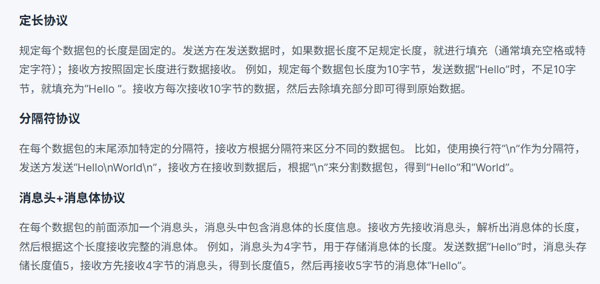

    **3.4** UDP如何实现可靠传输？
    - UDP（用户数据报协议）本身是一个无连接的协议，不提供可靠传输功能。
    - 但可以通过应用层去实现给每个数据记录序列号，超时重传，通过校验和检测丢包等。

4. http和https的区别？
    - 加密
    - 端口
    - 速度/性能
    - 证书

    **4.1**：http是什么？
    
    - HTTP（超文本传输协议，Hypertext Transfer Protocol）是一种用于在客户端（通常是浏览器）和服务器之间传输超文本数据的应用层协议。它是Web的基础，允许用户通过互联网访问和交换信息。
    - **请求-响应模型**：客户端发送一个HTTP请求，服务器接收并处理请求后返回一个HTTP响应。
    - **无状态性**：每个请求都是独立的，服务器不保留之前请求的状态，虽然可以通过其他手段（如Cookies、会话等）来实现状态管理。
    - **灵活性**: 支持多种数据格式，如HTML、XML、JSON、图像等。
    - **可扩展性**：允许开发者定义新的方法和头部字段。

    **4.2** https加密过程？

    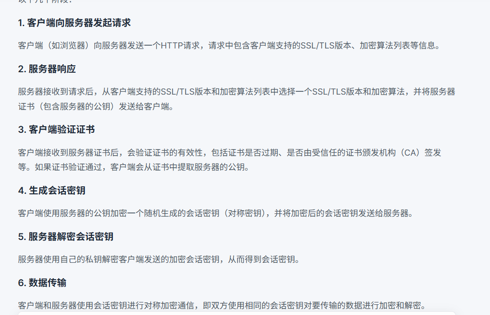

        > HTTPS采用了对称加密和非对称加密相结合的方式。在建立连接阶段，使用非对称加密（如RSA）来安全地交换会话密钥；在数据传输阶段，使用对称加密（如AES）来加密实际传输的数据。

    **4.3** 对称加密和非对称加密的区别？

    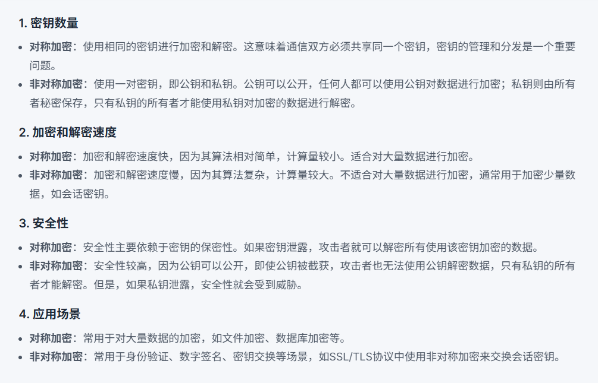

    **4.4** HTTP状态码：
    - 1xx：信息性状态码
    - 2xx：成功状态码
    - 3xx：重定向状态码
    - 4xx：客户端错误状态码
    - 5xx：服务器错误状态码

    **4.5** HTTP请求通常有什么组成部分:

    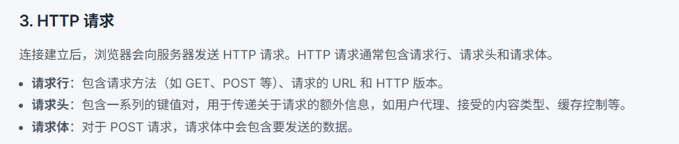

    **4.6** Get和Post的区别？

    - 参数传递方式(Get通常请求参数会附加在URL后面)
    - 安全性(直接放在URL后面，不太安全)
    - 缓存(get会被缓存，post通常不会)
    - 幂等性(get幂等，post不是)

    **4.7** 简述websocket的原理和应用场景？
    - 定义：WebSocket 是一种 **全双工通信协议**，在一个单一的 TCP 连接上，允许 **客户端和服务器双向实时通信**。
    - 和传统http的区别：传统 HTTP 是“请求-响应”模式，客户端必须发起请求；WebSocket 一旦建立连接，**双方都可以主动发送消息**。
    - 工作原理：浏览器先发一个 HTTP 请求（带 **Upgrade: websocket 头**），请求升级协议；服务器同意后，**连接从 HTTP 切换为 WebSocket**。
    - 建立后：双方通过这个 TCP 连接，随时可以互相发送数据帧，传输的数据可以是文本或二进制。
    - 使用场景：在线聊天系统(QQ，微信) ，在线游戏：玩家位置、血量、动作等要实时同步 → WebSocket 保证毫秒级更新。股票行情/直播弹幕：服务器需要实时推送数据给客户端，而不是等客户端轮询请求。

    **WebSocket心跳检测和断线重连机制的实现**:
    - 心跳检测机制：**定期(例如设定每30秒)向服务器发送一个小数据包**（心跳包），以此来确认客户端和服务器之间的连接是否正常。
    - 断线重连机制：在**连接异常关闭或检测到心跳超时时**，尝试重新建立连接。
    - 边缘情况：网络抖动，服务器负载过高，防火墙和代理，服务器维护。

        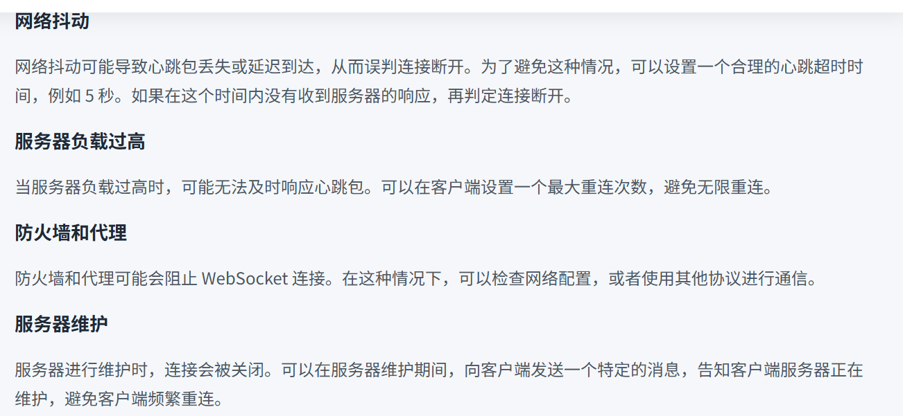

    **4.8** http 2和http 3的新特性？
    - **二进制分帧：** HTTP 2.0将所有传输的信息分割为更小的消息和帧，并采用**二进制格式对它们进行编码**，每个帧都有特定的类型和标识。在HTTP 1.x中，数据**以纯文本的形式传输**。
    - **多路复用**：这是HTTP 2.0的核心特性之一。在HTTP 1.x中，**每个请求都需要建立一个单独的TCP连接**，这会导致连接的开销较大，尤其是在高并发的情况下。而**HTTP 2.0允许在一个TCP连接上同时进行多个请求和响应的传输**，不同的请求和响应可以交错进行，互不干扰。
    - **头部压缩：** HTTP请求和响应的头部通常包含了大量的元数据，如Cookie、User - Agent等。在HTTP 1.x中，**每次请求都会重复发送这些头部信息**，造成了大量的带宽浪费。HTTP 2.0采用了**HPACK算法对头部进行压缩**。该算法会在客户端和服务器端维护一个头部字段表，对于重**复出现的头部字段，只需要发送一个索引值**。
    - **服务器推送**：在传统的HTTP 1.x中，客户端需要**明确请求每个资源，服务器才会返回相应的数据**。HTTP 2.0中，服务器可以根据客户端的请求，**预测客户端可能需要的其他资源**，并主动将这些资源推送到客户端。例如，当客户端请求一个HTML页面时，服务器可以同时推送该页面引用的CSS文件和JavaScript文件。
    - http3：基于 **QUIC 协议**，QUIC 协议在 UDP 之上构建，解决了 TCP 层的队头阻塞问题，即使某个数据包丢失，也不会影响其他流的传输。
    
    **4.9** http缓存的理解？
    - **强缓存：**
        - 浏览器直接从本地缓存中读取资源，无需向服务器发送请求。通过响应头中的 Expires 和 Cache-Control 字段来控制。
        - Expires：它的值是一个**具体的时间点**，表示资源的过期时间。当再次请求该资源时，若当前时间**未超过 Expires**指定的时间，则使用**本地缓存**。
        - Cache-Control：常见的值有 **max-age**（指定资源在多少秒内有效）、**no-cache**（表示需要先与服务器验证资源是否有更新，再决定是否使用缓存）、**no-store**（表示不使用任何缓存）等。

            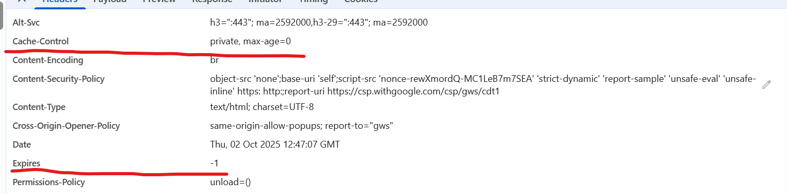

    - **协商缓存:**
        - 当强缓存失效时，浏览器会向服务器发送请求，验证资源是否有更新。通过响应头中的 ETag 和 Last-Modified 字段来控制。
        - Last-Modified:浏览器再次请求该资源时，会在请求头中添加 **If-Modified-Since 字段，值为上次响应头中的 Last-Modified 值**。服务器收到请求后，会比较资源的当前最后修改时间和 If-Modified-Since 的值，**若相同则返回 304 状态码，否则返回 200 状态码和新的资源**。
        - ETag:是资源的唯一标识符，通常是根据**资源内容生成的哈希值**。浏览器再次请求该资源时，会在请求头中添加 If-None-Match 字段，值为**上次响应头中的 ETag 值**。服务器收到请求后，会比较资源的当前 ETag 值和 If-None-Match 的值，**若相同则返回 304 状态码，否则返回 200 状态码和新的资源。**ETag 比 Last-Modified 更精确，因为即使资源的最后修改时间未变，但内容可能已经改变。

        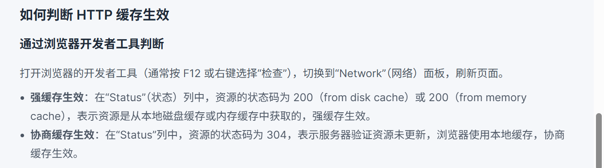

        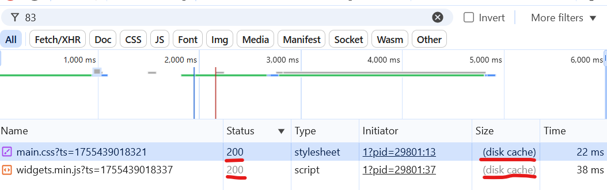
        

    **4.9** 请列举HTTP头部字段并说明其作用
    - 请求头部字段
        - user agent:客户端的**浏览器的名称、版本号、操作系统等信息**, 服务器可以根据这些信息为不同的客户端提供不同的页面内容或服务,比如针对移动浏览器和桌面浏览器返回不同布局的网页。

            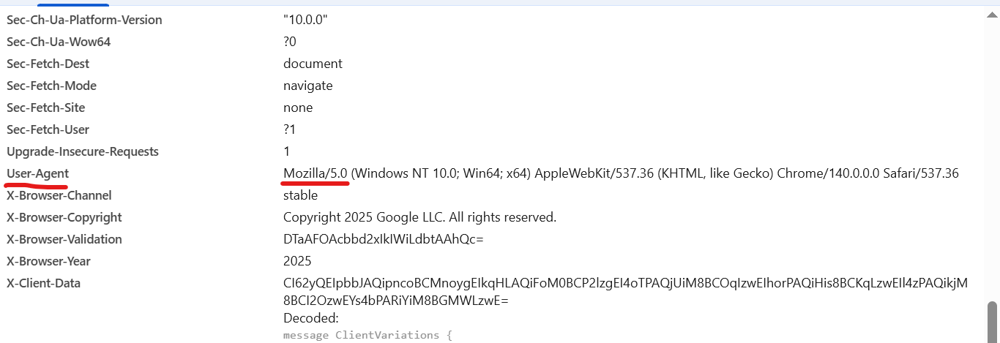

        - Accept：告知服务器**客户端能够接受的响应内容类型**比如：Accept: text/html,application/xhtml+xml 表示客户端可以接受HTML和XHTML格式的响应。
            - Accept-language：表明**客户端期望的语言**，服务器可以根据这个字段返回对应语言的页面。如 Accept - Language: zh - CN,zh;q = 0.9 表示客户端优先接受中文（中国大陆）的内容。
            - Accept-encoding：作用：告诉服务器**客户端支持的内容编码方式，常见的有 gzip、deflate 等**。服务器可以根据这个字段对响应内容进行压缩，以减少数据传输量，提高传输效率。
        - cookie: 用于在**客户端和服务器之间传递会话信息。**服务器通过 Set - Cookie 响应头将一些数据发送给客户端，客户端在后续的请求中会通过 Cookie 头部将这些数据再发送回服务器，从而实现会话跟踪等功能。

            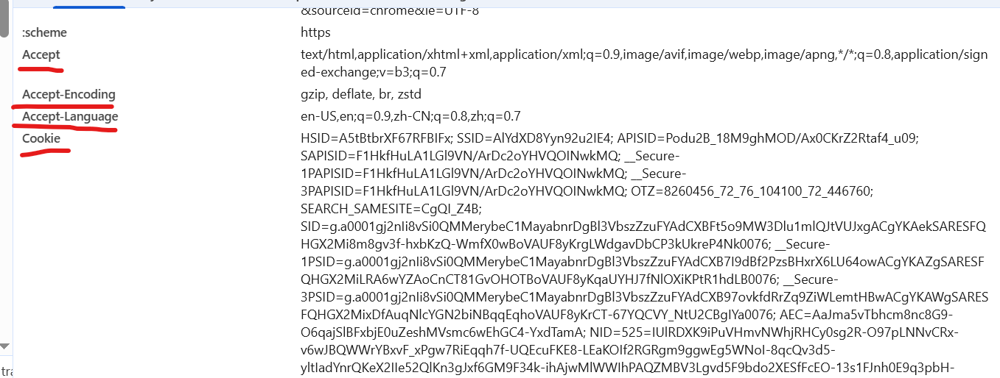

        - Authorization：用于向服务器**提供用户的身份验证信息**，常见的认证方式有基本认证（Basic）和令牌认证（Bearer）等。例如，Authorization: Basic base64(username:password) 用于基本认证。

    - 响应头部字段
        - Content-Type：指示响应内容的MIME类型，**告诉客户端如何解析响应数据**。例如，Content - Type: text/html; charset=UTF - 8 表示响应内容是HTML格式，并且使用UTF - 8字符编码。
        - Content-Length：指定响应**内容的字节长度**。客户端可以根据这个字段来判断响应数据是否接收完整。
        - Set-Cookie：服务器使用该字段向客户端**发送Cookie信息**，**客户端会将这些Cookie保存起来**，并在后续的请求中携带。可以设置Cookie的名称、值、过期时间、路径等属性。
        - Location：在**HTTP重定向时使用**，用于指定**重定向的目标URL**。当服务器返回3xx状态码时，会通过 Location 字段告诉客户端应该访问的新地址。
        - Cache-Control：用于**控制缓存策略**，指定**响应内容是否可以被缓存**，以及**缓存的时间等**。例如，Cache - Control: max - age = 3600 表示响应内容可以被缓存1小时。
        - ETag：是一个**资源的唯一标识符**，服务器为**每个资源生成一个ETag值**。客户端在后续请求时可以通过 If - None - Match 头部携带之前获取的ETag值，服务器会比较这个值，如果资源没有变化，就返回304状态码，告诉客户端使用本地缓存。

            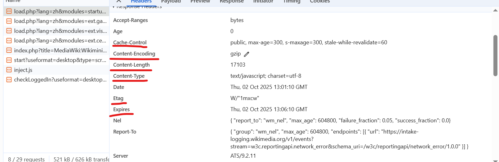

            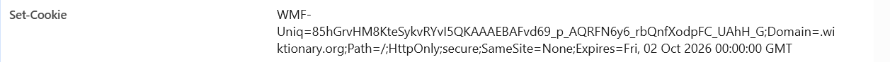

            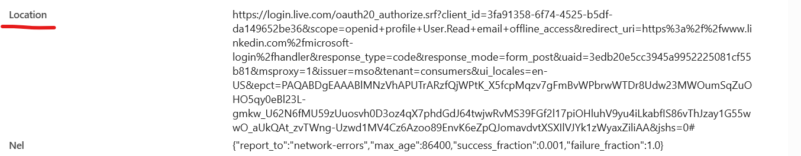

        - 通用头部字段：
            - date：表示**HTTP消息生成的日期和时间**，格式为 RFC 1123 标准。可以用于调试、缓存验证等。
            - connection：控制**客户端和服务器之间的连接方式**，常见的值有 keep - alive 和 close。keep - alive 表示在一次请求完成后保持连接，以便后续请求可以复用该连接；close 表示请求完成后关闭连接。
            - server：**标识处理请求的服务器软件名称和版本号**，例如 Server: Apache/2.4.41 (Ubuntu)。

                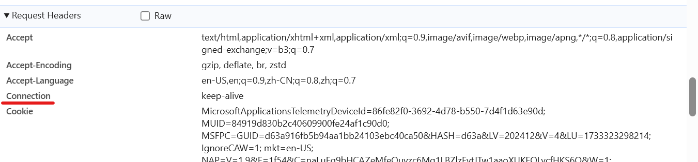

                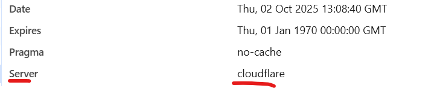

5. DNS解析的过程？

    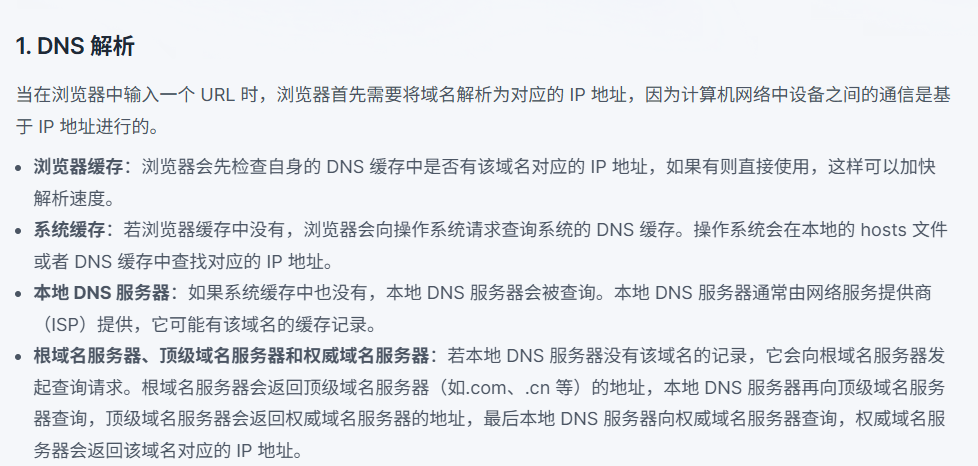

6. cookie和session是什么？
- 定义：Cookie 和 Session 是用于**管理用户状态和存储信息**的两种技术，常用于Web开发中。
- cookie：Cookie 是**由客户端保存**用户浏览器中的**小块数据**，通常用于保存用户的偏好设置、登录信息和跟踪用户行为等。
- session：Session **是在服务器上保存**的用户状态信息，通常用于在**用户与服务器的交互过程中**保存用户的登录状态和其他信息。

    **6.1** cookie和session的区别？
    - 存储位置
    - 数据量
    - 安全性
    - 生命周期
    - 用途

        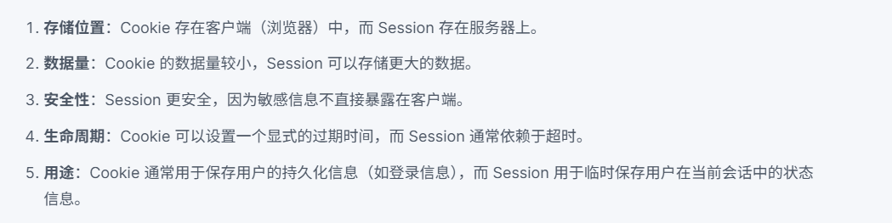

        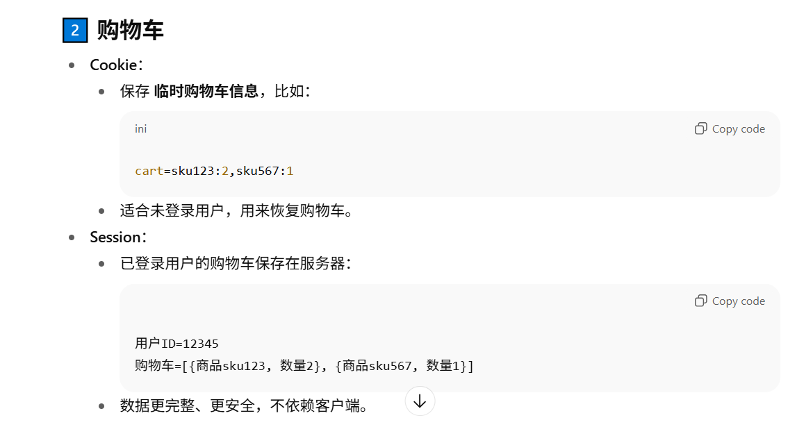

7. 请解释epoll的原理和作用?
- 定义：epoll 是 Linux 内核提供的一种**I/O 多路复用机制**。
- 作用：高效地同时监听 **成千上万个文件描述符FD** (socket、pipe、文件等) 的可读/可写事件。
- 对比：传统的 select / poll 也能做多路复用，但效率差，每次调用都要把**所有 fd 传给内核**，fd 数量越多，性能越差，单个select只有1024个fd上限；Epoll 没有**最大 fd 数量限制**；内核里维护事件表，**不需要重复传 fd**；支持 **事件驱动（回调机制）**，效率更高。
- 关键系统调用：
    - epoll_create

        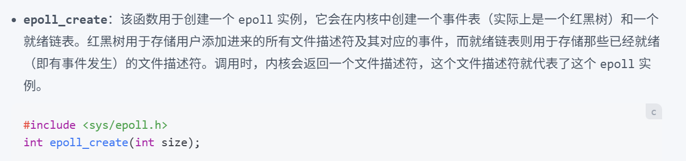

    - epoll_ctl

        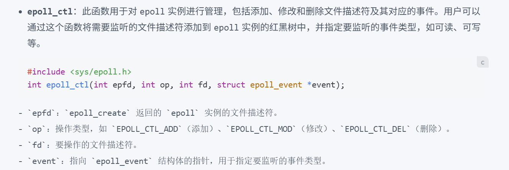

    - epoll_wait

        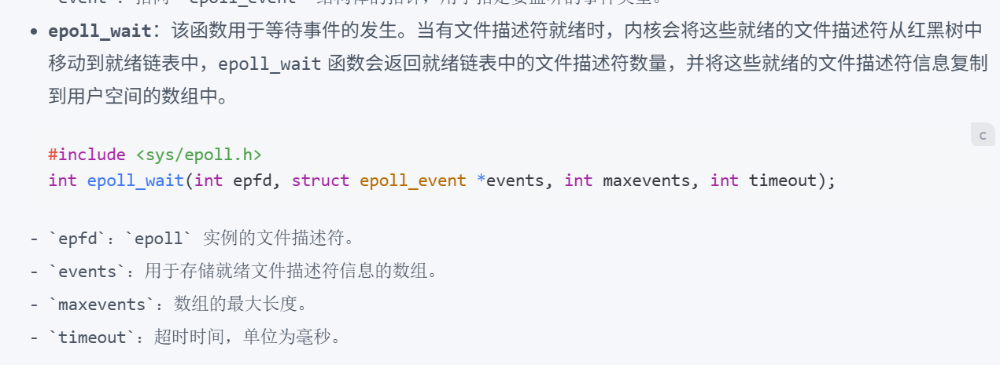

- 工作模式：
    - **水平触发(LT)**
    - **边缘触发(ET)**

        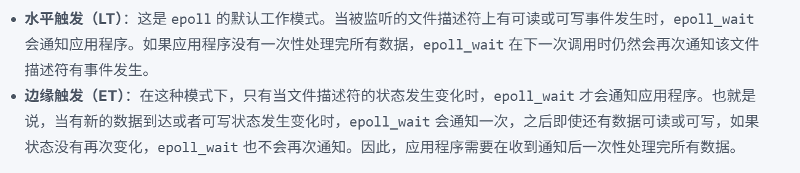

8. 什么是ARP协议？
- 定义：ARP（Address Resolution Protocol，地址解析协议）是一种用于在**局域网中通过IP地址查找对应的MAC地址的协议**。它在以太网等局域网技术中广泛应用。
- 工作原理：
    - 请求广播： 当一台主机需要将数据包发送到同一局域网中的另一台主机时，它需要知道目标主机的MAC地址。如果主机只知道目标主机的IP地址，它会向**网络广播一个ARP请求，内容包括目标IP地址**。
    - ARP响应： 所有接收该请求的主机都会检查这个请求中的目标IP地址。**如果某台主机的IP地址与请求中的目标IP地址相匹配，它会发送一个ARP响应，回复其MAC地址**。
    - 缓存： 请求主机会接收到ARP响应，获取到目标主机的MAC地址，**并将这个信息缓存起来，以便后续快速访问，避免重复发送ARP请求**。
    - 数据包发送： 获取到MAC地址后，请求主机就可以将数据包发送到目标主机的MAC地址上。
- 安全性：ARP协议本身并没有安全机制，容易受到**ARP欺骗（ARP Spoofing）等攻击**。这种攻击使得攻击者能够将其MAC地址与合法主机的IP地址相关联，从而截获或篡改网络流量。因此，在一些安全要求较高的网络环境中，可能会使用其他安全协议来增强ARP的安全性。

9. 常见的网络协议：
- 传输文件：
    - FTP（File Transfer Protocol，文件传输协议）：用于在网络上进行文件的上传和下载。它基于**客户端 - 服务器模式**，允许用户通过命令行或图形界面工具连接到远程服务器，管理和传输文件。例如，**网站管理员通过 FTP 将网站的网页文件、图片等上传到服务器**。
    - TFTP（Trivial File Transfer Protocol，简单文件传输协议）：是一种简化版的文件传输协议，它**不需要用户进行身份验证**，实现起来较为简单，占用资源少。常用于在**网络设备（如路由器、交换机）之间传输配置文件**，或者在无盘工作站启动时从服务器获取引导文件。

- 电子邮件：
    - SMTP（Simple Mail Transfer Protocol，简单邮件传输协议）：主要用于发送电子邮件。当用户在邮件客户端撰写好邮件并点击发送时，**邮件客户端会通过 SMTP 协议将邮件发送到发件人的邮件服务器，然后发件人的邮件服务器再通过 SMTP 协议将邮件转发到收件人的邮件服务器**。
    - POP3（Post Office Protocol - Version 3，邮局协议第 3 版）：用于接收电子邮件。邮件服务器接收到邮件后会存储在邮箱中，**用户的邮件客户端使用 POP3 协议从邮件服务器下载邮件到本地**。下载后，邮件通常会从服务器上删除。
    - IMAP（Internet Message Access Protocol，互联网消息访问协议）：也是用于接收电子邮件的协议，但**与 POP3 不同，IMAP 允许用户在本地客户端对服务器上的邮件进行管理，如分类、标记等操作，而邮件仍然保留在服务器上。**

        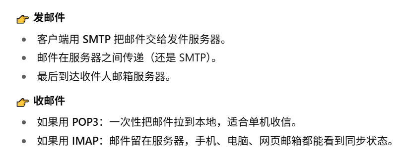

        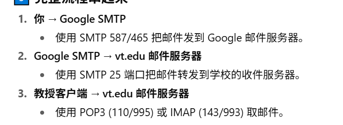

- 用于万维网：
    - http（Hypertext Transfer Protocol，超文本传输协议）：是用于传输超文本的协议，是万维网数据通信的基础。它是一种**无状态的协议**，客户端（如浏览器）**向服务器发送请求，服务器返回相应的资源（如 HTML 页面、图片等）**。例如，当我们在浏览器中输入网址并回车，浏览器就会通过 HTTP 协议向对应的服务器请求网页资源。
    - https（Hypertext Transfer Protocol Secure，超文本传输安全协议）：是在 HTTP 的基础上加入了 **SSL/TLS 协议进行加密和身份验证**，保证了数据在传输过程中的安全性和完整性。现在大多数网站都采用 HTTPS 协议，特别是涉及用户隐私信息（如登录、支付等）的网站。

- 用于域名解析：
    - DNS（Domain Name System，域名系统）：将人类可读的域名（如 www.example.com）转换为计算机能够识别的 IP 地址。当我们在浏览器中输入域名时，**浏览器会先向 DNS 服务器发送请求**，获取该域名对应的 IP 地址，然后再通过该 IP 地址与对应的服务器进行通信。

- 用于远程登录：
    - Telnet：允许用户通过网络远程登录到其他计算机上，并在远程计算机上执行命令。不过，**Telnet 协议在传输数据时是明文的**，存在安全风险，现在使用得越来越少。
    - SSH（Secure Shell，安全外壳协议）：同样用于远程登录和执行命令，但它**通过加密和身份验证机制保证了通信的安全性**。SSH 广泛应用于系统管理员远程管理服务器，以及开发人员在不同服务器之间进行代码部署等操作。

10. 介绍QUIC协议？
- 定义:QUIC（Quick UDP Internet Connections）是一种基于 UDP 设计的传输层网络协议，由 Google 开发，旨在提供比 TCP 更快、更可靠的网络连接
- 快速建立连接：
    - 减少握手延迟：QUIC 可以在首次连接时通过 0 - RTT 或 1 - RTT 完成握手。0 - RTT **意味着客户端可以在第一次与服务器通信时就发送应用数据**，无需等待握手完成，大大减少了连接建立的时间。
    - 会话恢复：QUIC 会为**每个连接分配一个唯一的连接 ID**，即使客户端的 IP 地址或端口发生变化，只要连接 ID 不变，就可以快速恢复之前的会话，避免重新进行握手。
- 多路复用：
    - 避免队头阻塞：在 TCP 中，同一连接上的多个数据流是按顺序传输的，如果一个数据包丢失，后续的数据包都需要等待该数据包重传，这就是队头阻塞问题。而 QUIC 支持多路复用，不同的数据流可以在同一个连接上独立传输，**一个数据流的丢包不会影响其他数据流的传输，提高了传输效率**。
- 可靠传输：
    - 数据包编号和确认机制：QUIC 为**每个数据包分配一个唯一的编号**，并使用类似 TCP 的确认机制来确保数据包的可靠传输。如果数据包丢失，**接收方会发送 NACK（Negative Acknowledgment）通知发送方重传**。
    - 前向纠错(FEC)：QUIC 还支持前向纠错技术，发送方可以在发送数据的同时发送一些冗余信息，接收方可以利用这些冗余信息在不等待重传的情况下恢复丢失的数据包，进一步提高了传输的可靠性和效率。
- 拥塞控制：QUIC 实现了**多种拥塞控制算法**，并且可以在运行时**动态切换**。这使得 QUIC 能够更好地适应不同的网络环境和应用场景，提高网络利用率。
- 安全性：QUIC 集成了 TLS 1.3 加密协议，所有数据在传输过程中都进行加密，保证了数据的机密性和完整性。与 TCP + TLS 的组合相比，**QUIC 减少了加密握手的延迟，提高了安全性和性能。**

    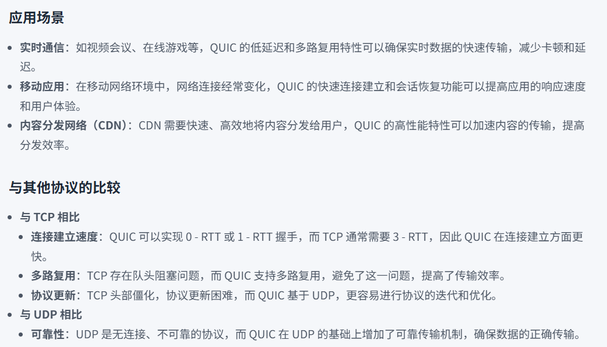

11. 即时通讯的实现：短轮询、长轮询、SSE 和 WebSocket 间的区别？
- **短轮询（Short Polling）**：
    - 客户端定期向服务器发送请求，询问是否有新数据。客户端每隔一定时间（例如每2秒）发送**一个HTTP请求到服务器**，如果有新消息则返回数据，否则返回空。
- **长轮询（Long Polling）**：
    - 客户端发送请求，**一直保持连接**，直到服务器有新数据或请求超时。客户端发送HTTP请求，服务器在有新数据时立即回复客户端，如果没有，**则保持连接，直到有新数据或者超时后才回复**。
- SSE（Server-Sent Events）：一种**单向的服务器推送技术**，服务器可以主动向客户端推送数据。**客户端通过一个特定的HTTP连接向服务器请求数据**，服务器通过这个连接持续发送事件。
- WebSocket：一种全双工的通信协议，允许客户端和服务器之间进行实时的数据交换。