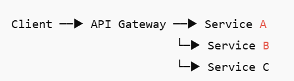
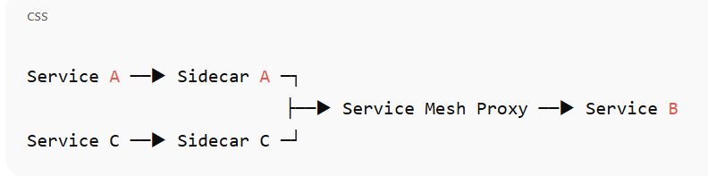
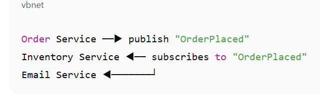
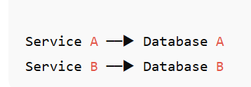

1. 使用过那些高可用负载均衡，lvs如何配置动静分离？
2. nginx用过哪些模块，做过什么业务？
3. k8s集群如何配置？
4. k8s的构建是怎样的？有哪些组件？etcd如何部署？
5. proxy通常部署在哪些节点？node的组件有哪些？
6. 网络用什么组件？deployment的作用？
7. AKS和VM的区别？

    **答案**：

    如你要部署一个订单系统：

    - 用 VM： 你可能部署**三个 VM**，一个跑 Web，一个跑 API，一个跑数据库。需要手动管理端口、更新和监控。

    - 用 AKS： 你会把 Web、API、数据库分别打包成容器，通过 **YAML 编排部署，Pod 自动伸缩**，升级无缝滚动。

8. 微服务架构是什么？

- 单一职责：一个服务只做一件事

- 自治部署：服务之间不互相依赖部署

- 去中心化管理：每个服务拥有自己的配置、数据存储、代码仓库

- 可观测性：全面监控、日志、追踪能力

- 容错设计：熔断、重试、限流等机制

常见包括**API Gateway 架构**，所有客户端请求先经过一个统一入口（API 网关），再转发给后端各个微服务，典型的包括Azure API Management, NGINX等：

或者**Service Mesh 架构**，使用“**sidecar代理**”自动管理服务间通信（流量控制、加密、重试等），核心组件是数据面和控制面：

**Event-Driven 架构（EDA）:**

服务之间通过消息队列或事件总线进行异步通信，解耦依赖关系。

**Serverless 微服务架构**:

使用 Azure Functions、AWS Lambda 等无服务器平台来部署每个微服务，自动弹性扩展。

**分布式数据库架构**:

每个微服务拥有自己的数据库（Database per service），避免共享数据库。

