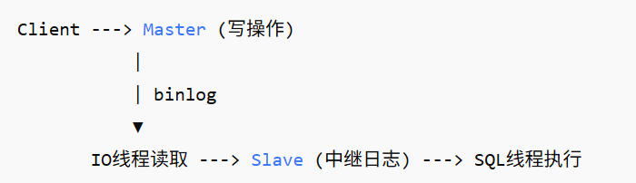

- 如果我想看A表中比B表中的某一项数值增值最高的的top10，怎么查？(注意A表可能有新增实例)
```sql
SELECT
    t7.vm_id,
    t7.cost AS cost_day7,
    COALESCE(t6.cost, 0) AS cost_day6,
    (t7.cost - COALESCE(t6.cost, 0)) AS cost_increase
FROM billing_20250707 t7
LEFT JOIN billing_20250706 t6
    ON t7.vm_id = t6.vm_id
ORDER BY cost_increase DESC
LIMIT 10;
```
或者：
```sql
SELECT
  CASE 
    WHEN t6.cost IS NULL THEN 0
    ELSE t6.cost
  END AS cost_day6
FROM billing_20250707 t7
LEFT JOIN billing_20250706 t6 ON t7.vm_id = t6.vm_id;
```

1. mysql数据库分库分表，多表连接的命令是什么？
    
    **答案**：
    - 同一实例不同库：**SELECT ... FROM db1.t1 a JOIN db2.t2 b ON ...;**（直接用 **库.表**）。
    - 不同实例/真正“分库分表”（水平拆分）：需要中间件（**ShardingSphere、MyCAT** 等）或在应用层做聚合，MySQL 原生 SQL 不能跨实例 JOIN。
2. 往一个数据库下的一张表下面差一个数据，命令是什么？

    **答案**：

    例子：
    ```sql
    INSERT INTO db1.users (id, name, salary, created_at)
    VALUES (123, 'Alice', 12000, NOW());
    ```
3. 从一个库下面查另外一个库下面的数据？

    **答案**：

    **同一实例**：SELECT * FROM other_db.table WHERE ...;

    **跨实例**：用 Federated 引擎（较少用）、中间件、或在应用层/ETL 侧拉取后再查。
4. MySQL索引数据结构是什么？为什么使用B+树？什么是索引覆盖？

    **答案**：
    - **结构**：InnoDB 主/二级索引使用 B+Tree；（Memory 引擎支持 Hash 索引）。
    - **为什么 B+Tree**：层高低（I/O 少）、区间扫描友好、叶子节点链表顺序遍历快；二级索引叶子保存主键值（回表）。
    - **覆盖索引**：查询所需列都能从索引本身拿到，不需要回表（EXPLAIN 里常见 Using index）。例如：
5. 编写一个sql语句，从员工表和工资表中基于ID关联，选择薪资最高的三名员工？

    **答案**：
    ```sql
    -- 假设表结构：employees(id, name, dept, ...) ; salaries(emp_id, amount, effective_date, ...)
    SELECT e.id, e.name, s.amount
    FROM employees e
    JOIN salaries  s ON s.emp_id = e.id
    -- 如果 salaries 有多期薪资，选当前/最新一条：
    -- JOIN (SELECT emp_id, MAX(effective_date) AS md FROM salaries GROUP BY emp_id) x
    --   ON x.emp_id = s.emp_id AND s.effective_date = x.md
    ORDER BY s.amount DESC
    LIMIT 3;
    ```
6. mysql数据库连接的不同模式和方法？

    **答案**：
    传输方式：**TCP（host:port）**、**UNIX Socket（本机、最快）**、**Windows 的 命名管道/共享内存。**

    安全：**支持 TLS/SSL**；

    认证插件：caching_sha2_password（默认，8.0+）、mysql_native_password（兼容），也可用 LDAP/OAuth 代理接入。

    客户端：**mysql CLI**、JDBC/ODBC、各语言驱动。
7. update函数的相关步骤?

    **答案**：
    **解析**→**优化/选索引**→**加锁**（行锁/间隙锁）→**按索引定位行**→**检查约束/触发器**→**写 Undo**（回滚段）与 **Redo**（确保崩溃恢复）→**修改页**→**记录 binlog**（ROW/MIXED/STATEMENT）→**事务提交**（flush redo、binlog 顺序一致，支持 sync_binlog 与 innodb_flush_log_at_trx_commit 调优）。
8. left join,right join, union分别是什么

    **答案**：
    - LEFT JOIN：保留左表全部行，右表无匹配则为 NULL。
    - RIGHT JOIN：对称于 LEFT。
    - UNION：纵向合并结果集并去重；UNION ALL 不去重。
9. 哈希算法是什么，怎么用？

    **答案**：
    将任意输入映射为定长摘要（如 SHA-256，低碰撞、不可逆）。
10. 查询的时候如何优化查询效率？

    **答案**：
    - 用 EXPLAIN 看执行计划（type、rows、key、extra）。
    - 避免 SELECT *、合理分页（延迟关联/ID 游标）、批量写入、用缓存（Redis）、读写分离。
    - 表设计：合适范式/反范式权衡，避免过大行，冷热数据拆分。
    - 参数：innodb_buffer_pool_size、join_buffer_size、tmp_table_size 等。
11. SQL 服务器的文件类型和存储位置?

    **答案**：
12. MySQL的主从同步有哪些？

    **答案**：
MySQL 的主从同步（也叫 主从复制，Replication）是 MySQL 架构中用于高可用、读写分离、灾备容灾 的关键机制，核心就是主库负责处理写操作，从库负责只读操作，并且从主库同步数据:



13. PG SQL的主从同步？

    **答案**：
    - 物理复制：流复制（WAL Streaming），异步/同步；
    - 热备（Hot Standby）可读；级联复制；
    - 逻辑复制：基于 publication/subscription 的表级复制（跨版本/跨平台更灵活）；
    - 复制槽（physical/logical slots）保证 WAL 保留；故障转移常用 repmgr、Patroni、pg_auto_failover。