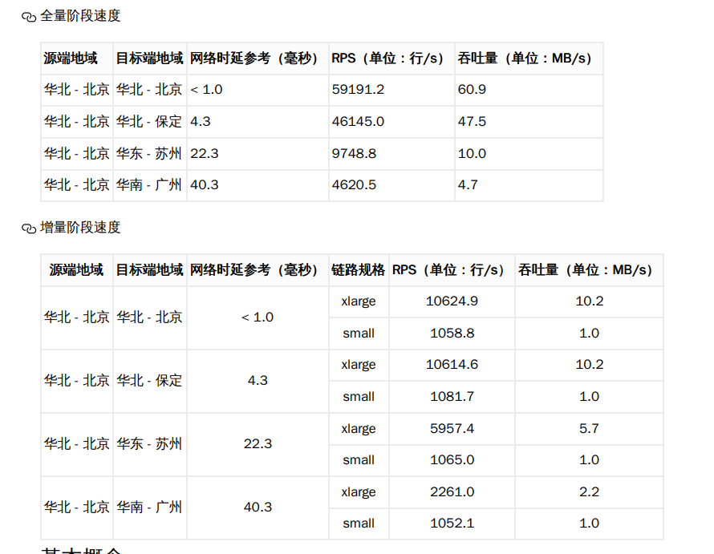

## 具体迁移workflow(CMC)
### 1. 云服务器迁移计划示例

####  场景说明
你希望将源端（如阿里云 ECS、其他第三方云或本地服务器）上的服务器迁移到百度智能云。该迁移计划帮助你从资源扫描、配置推荐、实例创建到迁移关联全流程管理。

---

####   迁移步骤

##### 1. 创建迁移计划
- 登录「云迁移中心（CMC）」控制台。
- 在左侧导航栏选择 **迁移计划**，点击“创建迁移计划”。
- 资源类型选择 **云服务器**，点击“确定”进入下一步。
- 填写迁移计划名称、选择目标地域和待迁移的实例，点击“确定”提交。

>  **注意**：如果你的实例属于容器集群节点，不建议加入“云服务器迁移计划”；建议直接在 CCE 中创建新节点。

##### 2. 执行迁移计划
- 进入迁移计划详情页（点击“执行计划”或进入“迁移任务详情”）。
- 按照界面引导逐步执行迁移。

###### 2.1 创建资源
- 系统将基于源实例自动 **推荐配置与价格**（如映像类型、规格、网络）。
- 可直接采用推荐配置，或继续调整。

###### 2.2 修改推荐配置（可选）
- 如有特殊需求，可通过“修改目标配置”调整计算规格、云盘或网络设置。
- 如果已经手动创建了目标实例，可选择“使用已有资源”来关联迁移计划。

###### 2.3 创建实例
- 在源端镜像迁移完成后，你可以点击“创建实例”按钮，跳转至 BCC 创建页。
- 使用已生成的 **自定义镜像** 并关联好 VPC、子网、安全组等资源进行实例创建。
- 实例创建成功后，将自动关联到对应的源端实例。若创建多台实例，仅一台会被关联。

###### 2.4 删除（移出实例）
- 如果发现迁移计划中包含不需要迁移的实例，可在详情页执行“删除”操作。
- 删除操作不会删除实际资源，仅移除此实例在迁移计划中的关联。

---

####  总结
“云服务器迁移计划”的核心在于：  
**自动生成源实例的配置推荐 → 可选调整配置 → 通过自定义镜像和资源关联创建目标实例 → 保留实例映射关系和迁移计划管理能力。**

### 2. K8s迁移：
---
#### 场景说明    
假设你有一个阿里云 K8s 集群：
- 50 个节点（ECS 虚拟机）
- 运行一个电商系统（前端 Nginx、后端 SpringBoot、MySQL StatefulSet）
- 镜像存在阿里云 ACR
- 数据存在阿里云盘 + OSS

---

#### 迁移步骤：
1. 在百度云 CCE 创建一个 50 节点的新集群。
2. 把业务镜像从阿里云 ACR 推送到百度云 CR。
3. 用 kubectl get -o yaml 导出 Deployment/Service/ConfigMap/Secret。
4. 在百度云集群中 kubectl apply 部署这些 YAML。
5. MySQL StatefulSet → 在百度云挂载新的云盘（BOS/CFS），再导入数据（mysqldump 或 DTS）。
6. 测试确认无误后，切换域名 DNS，把流量从阿里云切到百度云。

    

### 3. VNet迁移：
---
#### 场景说明    
假设你在阿里云有一个 VPC：
- VPC 名字：vpc-prod
- CIDR：192.168.0.0/16
- 子网：
    - subnet-a：192.168.1.0/24
    - subnet-b：192.168.2.0/24
---
#### 迁移步骤（通过 CMC VPC 迁移计划实现）

1. 扫描源端 VPC 信息
    - 在百度 CMC 控制台发起“资源扫描”，系统会调用阿里云 API，获取 VPC 的 CIDR、子网配置。
    - 扫描结果：192.168.0.0/16 的 VPC + 两个子网。
2. 创建迁移计划
    - 在 CMC 选择“私有网络 VPC” → 创建迁移计划。
    - 把扫描到的 vpc-prod 及子网加入到迁移计划中。
3. 配置目标资源
    - 在百度云 VPC 中新建一个 VPC，CIDR 保持和阿里云一致：192.168.0.0/16。
    - 在 VPC 下新建两个子网：192.168.1.0/24、192.168.2.0/24，对应阿里云的子网。
    - 如果百度云里你已经有同样网段的 VPC，也可以选择“关联现有资源”。
4. 执行迁移
    - 点击“完成迁移”，CMC 会在百度云里创建出和阿里云一致的 VPC + 子网结构。
    - 后续当你迁 ECS → BCC 时，系统会自动把它放入这个新建的 VPC/子网中。
5. 验证
    - 在百度云控制台检查，确认 VPC 的 CIDR、子网划分和源端一致。
    - 后续你可以在这个 VPC 中继续挂载 BCC、RDS、CCE 等资源，确保网络结构和源端相同。

### 4. NSG迁移:
---
#### 场景说明

假设你在阿里云有一个安全组：

- 名字：`sg-webapp`
- 入方向规则：  
    - 允许 **TCP 80 (HTTP)** 来源 `0.0.0.0/0`  
    - 允许 **TCP 443 (HTTPS)** 来源 `0.0.0.0/0`  
- 出方向规则：  
    - 允许所有协议 / 所有端口，目的地 `0.0.0.0/0`  

---

你希望将这个安全组迁移到百度云，以便后续把 BCC 实例或 CCE 节点加入后还能使用同样的访问控制策略。

---
#### 迁移步骤

1. **扫描源端安全组**  
    - 在百度 CMC 控制台发起资源扫描任务。  
    - 系统会调用阿里云 API，拉取安全组的规则清单（包括 ingress/egress）。  

2. **创建迁移计划**  
    - 在 CMC 中选择“企业安全组”资源类型，点击“创建迁移计划”。  
    - 将扫描到的 `sg-webapp` 添加到迁移计划中。  

3. **配置目标资源**  
    - 选择“创建新资源”。  
    - 在百度云上新建一个安全组，保持与源端规则一致：  
        - 名称：`sg-webapp-migrated`  
        - 入方向：  
            - TCP 80 来源 `0.0.0.0/0`  
            - TCP 443 来源 `0.0.0.0/0`  
        - 出方向：  
            - 所有协议/端口，目的地 `0.0.0.0/0`  

4. **执行迁移**  
    - 点击“完成迁移”。  
    - 系统会在百度云 VPC 中自动创建该安全组并应用相同规则。  

5. **验证与关联**  
    - 在百度云控制台检查安全组规则，确认与阿里云一致。  
    - 将新安全组挂载到目标 BCC 实例或 CCE 节点，确保业务访问策略不变。  

### 5. NAT网关迁移：
---
#### 场景说明

你希望将源端（如阿里云或本地云）上的 NAT 网关迁移到百度智能云，并希望自动配置 SNAT/DNAT 规则以保持业务连通性。同时需要确保 VPC 与 EIP 已先迁移完成。

---

#### 迁移步骤

1. **资源扫描准备**  
    - 在百度 CMC 控制台发起资源扫描任务。  
    - 确保已迁移或计划迁移的 VPC 和弹性公网 IP（EIP）已准备好，否则 NAT 网关迁移会失败。

2. **创建迁移计划**  
    - 在 CMC 控制台点击“迁移计划”，选择资源类型为 **NAT网关**。  
    - 填写迁移计划名称，选择要迁移的源端 NAT 网关资源。

3. **配置目标资源**  
    - 进入迁移计划，点击 **配置目标资源**。  
    - 配置目标 NAT 网关基本信息：  
        - 名称  
        - 目标地域  
        - 归属网络（所在 VPC）  
        - 计费方式  
        - 性能容量  
        - 使用的公网 IP（EIP）

4. **提交创建**  
    - 确认信息无误后点击 **提交订单**，百度云将自动创建目标 NAT 网关。

5. **配置 SNAT 规则**  
    - 返回迁移计划界面，点击 **继续迁移**。  
    - 进入 SNAT 规则配置页面，手动配置必要的 SNAT 规则，**确保每条规则完成后点击“提交”**。

6. **配置 DNAT 规则**  
    - 同样地，进入 DNAT 规则配置页面，完成 DNAT 规则，并逐条点击“提交”。

7. **完成迁移**  
    - 当 SNAT 和 DNAT 规则配置完成后，点击 **“迁移完成”**，迁移流程结束。
---
#### 小提醒
- 在迁移 NAT 网关前必须先完成 **VPC 与 EIP 的迁移**，否则迁移会报错。
- SNAT/DNAT 规则需逐条提交，确保配置生效。

### 6. 弹性公网 IP (EIP) 迁移示例
---
#### 场景说明

你已经通过 CMC 完成了对阿里云（或其他平台）弹性公网 IP 的资源扫描。  
接下来希望将这些 EIP 迁移到百度云，并可选择将它们加入共享带宽，以维持公网访问或负载均衡配置。

---

#### 操作说明
- 迁移计划列表页只显示尚未迁移的 EIP。  
- 若要将迁移的 EIP 加入共享带宽，则**本次选择的所有 EIP 必须加入同一个共享带宽**。

---

#### 迁移步骤

1. **创建迁移计划**  
   - 登录 [云迁移中心 CMC 控制台]。  
   - 在左侧导航栏选择 **迁移计划**，点击 **创建迁移计划**。  
   - 资源类型选择为 **弹性公网 IP**。  
   - 为迁移计划填写名称，并选择要迁移的 EIP 资源。

2. **执行迁移步骤**  
   - 进入迁移计划详情页面，点击 **迁移**。  
   - 选择是否要为 EIP 创建 **共享带宽**：  
     - **需要共享带宽**：在右侧配置共享带宽的名称、计费方式、网络线路、带宽大小及资源数量。系统会在创建共享带宽后，自动创建并将 EIP 加入，无需再单独操作。  
     - **不需要共享带宽**：点击“跳过”，进入下一步；在右侧直接配置 EIP 的名称、计费方式、网络线路、公网带宽和数量。
   - 注：若要迁移 “单线类型” EIP，请先联系商务申请权限。

3. **关联资源**  
   - 创建完成后，将新的 EIP 资源绑定到目标云上所需业务实例，如 BCC、CCE 节点等，迁移即完成。

---

####  总结
弹性公网 IP 的迁移工作实质是：  
**在百度云上重新创建 EIP，并按需加入共享带宽。**  
这保证了迁移后的公网接入结构中，EIP 与源环境功能保持一致，无需手动重建。

###  7. 负载均衡迁移计划示例

#### 背景说明
- 本迁移适用于将源端（如阿里云）的负载均衡实例（ALB、NLB、CLB）迁移到百度云的 BLB（应用型负载均衡）。
- 注意：不同厂商负载均衡在特性和形态上存在差异，迁移前需结合业务部署情况进行适配。

#### 主要差异说明：
- 阿里云支持一个服务器组中绑定多个端口，百度云的目标组仅支持绑定统一端口，请务必在迁移前统一服务端口（如统一为 80）。
- 阿里云 ALB/NLB 的服务器组可独立存在，百度的 BLB 目标组必须归属于负载均衡实例下，含屡多个组的情况要拆分。
- 阿里云 ALB/NLB 可使用域名作为入口，百度云 BLB 暂不支持域名，入口为 IP 地址形式。
- 阿里云 CLB 的健康检查配置在监听器上，百度 BLB 的健康检查配置在后端服务器组上。

确保 VPC、子网、安全组、EIP、后端服务器等网络资源已迁移或已新建完成。

---

#### 迁移步骤

##### 1. 创建迁移计划
- 登录 云迁移中心 (CMC) 控制台。
- 导航至“资源清单”，勾选希望迁移的负载均衡实例。
- 点击「创建迁移计划」，输入计划名称并确认创建。

##### 2. 执行迁移
在迁移计划列表页，点击迁移计划名称进入详情页面，并按流程依次完成以下步骤：

###### 2.1 迁移负载均衡实例
- 对比源端实例配置。
- 点击确定后跳转至 BLB 控制台，创建新的负载均衡实例。
- 创建完成后，返回 CMC 页面并刷新状态。

###### 2.2 迁移目标服务器组
- 在目标组列表中，按“去创建”为每个源端服务器组创建一个对应目标组。
- 完成后点击“下一步”继续。

###### 2.3 迁移监听器
- 按“去创建”为迁移计划中的每个监听器创建目标监听器。
- 创建流程与目标组类似，完成后继续下一步。

###### 2.4 检查配置并完成迁移
- 校验目标 BLB 实例、目标服务器组、监听器配置是否正确。
- 迁移完成后，可返回列表页继续迁移其他实例。

---

#### 映射与关联说明
- 对于已迁移或已创建的 VPC、子网、安全组、EIP、后端服务器等资源，系统将尝试自动定位和关联；若识别错误或想手动调整，可在 BLB 控制台中修改。
- 某些参数可能由于云产品间差异无法自动迁移，需要在创建时手动补充。

---

#### 关联已有 BLB 实例作为目标
如已在百度云配置好 BLB，可关联现有实例：
1. 进入迁移计划详情页。
2. 选择“关联目标资源”，找到对应 BLB 实例并提交。
3. 确认后视为迁移完成；若仍需配置子资源，请在 BLB 实例列表中进行。

---

#### 总结
负载均衡迁移计划的核心是：
**在百度云上按源端配置自动创建 BLB + 后端服务器组 + 监听器，并建立映射关系，确保业务结构映射准确且迁移路径清晰。**

###  8. 日志服务迁移计划示例

#### 场景说明
在 CMC 控制台的“迁移方案 → 迁移计划”模块中，选择 **日志服务** 作为资源类型，即可创建日志服务的迁移计划。适用于将源端（如阿里云或其他平台）的日志服务资源迁移至百度智能云。

---

####  迁移步骤

##### 1. 前期准备
- 在源端授权 CMC 获取认证信息，进行在线扫描或离线采集方式获取资源信息。  
- 扫描完成后，进入“资源清单 → 日志服务”标签页查看已扫描到的日志集资源。  
:contentReference[oaicite:0]{index=0}

##### 2. 创建迁移计划配置
- 进入“迁移方案 → 迁移计划”页面，选择资源类型为 **日志服务**。  
- 填写迁移计划名称，选择一个或多个待迁移的日志服务资源（仅限未绑定迁移计划或迁移失败的资源）。  
- 点击“确定”完成迁移计划的创建。  

##### 3. 执行迁移计划流程
###### 3.1 确认日志集资源
- 日志集资源会被分类为：
  - **部分匹配**：源端配置部分不兼容或需降级处理，可查看详情并选择迁移或取消；支持批量操作。
  - **完全匹配**：兼容迁移。
- 可查看每个资源的源码与目标配置映射详情。  

###### 3.2 确定采集任务
- 同步日志集关联的采集任务配置，分类为：
  - **完全匹配**：支持迁移；
  - **部分匹配**：需调整后迁移；
  - **完全不匹配**：无法迁移（如自定义插件）。
- 支持一键迁移、批量迁移或手动选择操作。  

###### 3.3 确定索引配置
- 迁移日志集关联的索引配置，分类为：
  - **部分匹配**：需手动调整；
  - **完全匹配**：兼容迁移。
- 可选择是否迁移某个索引配置，但目前不支持修改索引配置。  

###### 3.4 一键创建迁移任务
- 确认待迁移资源、采集任务与索引配置无误后，点击“一键创建迁移任务”。  
- 创建完成后，可在“迁移实施 → 迁移任务管理 → 日志服务”标签页查看任务状态与结果。  

---

#### 总结
日志服务迁移计划的核心在于：  
**通过扫描源端日志服务资源和关联配置，选择兼容项并在百度云上生成对应资源，整合成可执行的迁移任务，确保日志服务结构和功能在迁移后仍能保持一致。**