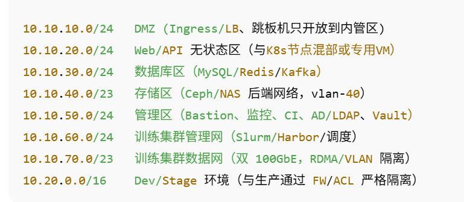
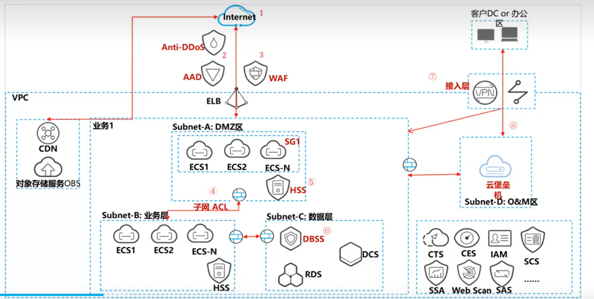

## AI初创公司厂商上云需求
#### 当前环境：
- 网络划分：

    

- 资产盘算:

    - 计算:
        - GPU 服务器：50 台（训练用，8×A100 80GB/台，NVLink，双 100GbE）
        - CPU 服务器：30 台（推理 & 业务/中间件）

    - 存储：
        - 对象/块存储集群：24 台存储节点（Ceph：S3 兼容 + RBD）

        - 文件存储 NAS：4 台（NFS，热数据、高并发小文件）

    - 网络设备:
        - 边界防火墙 ×2（HA）
        - 核心交换机 ×2（MLAG/堆叠）
        - 汇聚/接入交换机 ×若干
        - VPN/专线 CPE ×2（双活/主备）

    - 管理与安全：
        - 跳板机（Bastion）×2
        - 监控/日志（Prometheus+Loki/ELK）×2
        - Git/CI（GitLab+Runner）×2
        - 密钥库（HashiCorp Vault）× 1
#### 业务驱动力和上云目标：
- 弹性不足，成本压力，存储瓶颈，交付慢，迁移要求：大量有状态服务，如何迁移不中断？GPU驱动，框架兼容问题
#### 当前架构：
- 迁移范围：
    - 第一阶段：核心推理服务（CPU 节点）+ 数据库/缓存 → 上云，先保证客户 API 全国可用。
    - 第二阶段：GPU 训练环境逐步迁到百度云，保留少量本地 GPU 做实验。   
    - 第三阶段：全量迁移，IDC 逐步关停。
- 集成复杂度：
- 兼容性：
- 安全合规和约束条件：视频和图像数据涉及零售/安防，必须遵守 数据本地合规，不能将数据转存到境外，必须用百度云的 国内节点，允许 30 分钟内的割接窗口，数据库必须支持 增量迁移，不能丢数据，传输链路必须 加密（VPN/专线），不能明文走公网，上云后必须有 VPC 隔离、WAF、防火墙、安全组策略。
- 预算成本：整体 TCO 不超过现在 IDC 成本的 70%， 可以用 抢占式 GPU / 混合云训练 降低成本，希望用 冷热分层（热数据 CFS/冷数据 BOS 归档），优先考虑 VPN/专线混合，但专线带宽不能太贵。

#### 准备阶段：
- 云上landing zone：
    - 安全性(网络安全，数据安全，主机安全，应用安全)：
        - **潜在隐患**：数据泄漏，身份、凭证和访问管理不足，不安全的接口和应用程序编程接口，系统漏洞，账户劫持，恶意内部人员，高级持续性威胁，数据丢失，滥用和恶意使用云服务，DoS，共享的技术漏洞
        - 上云的关键**安全需求**：
            - **业务连续不中断**：防网络攻击，防黑客入侵，法律遵从、合规
            - **远程全程可管控**：配置安全策略，风险识别和处置，操作可审计、追溯
            - **数据保密不扩散**：防内部窃取，内部非授权员工不可见，云服务商不可见
        - **具体服务**：
            - **网络安全**：
                - Anti-DDoS
                - DDoS高防
                - VPC/安全组
                - 端云协同保护
            - **主机安全**：
                - 主机WAF
                - 主机入侵检测
                - 主机漏洞管理
            - **应用安全**：
                - Web应用防火墙
                - Web扫描
                - 云WAF
                - 编码扫描
                - 网页防爬虫
            - **数据安全**：
                - 数据库安全，审计，防火墙，脱敏
                - 专属加密服务
                - 密钥管理
                - 密钥对登陆
        
        云上系统安全架构设计建议：
    
        

        - EPC划分：
        子网DMZ:10.0.10.0/24 业务:10.10.20.0/24, 数据库用RDS代替，确保RDS网络与业务互通，存储区用百度BOS代替，入口用百度BLB代替。

        - 流量划分：
        BLB绑定一个EIP，监听80/443端口对应后端业务区网页的80/443端口。
        - ALC划分：
            - 在所有子网中定义一个deny all inbound rule，优先级高于默认路由
            - 在业务子网中加一个优先级高于deny all的rule，允许DMZ通过8443/8080访问，同时在DMZ也需要建立一个inbound rule允许业务8443/8080访问，确保数据能回来。

    - 可用性(单AZ可用性，跨AZ容灾，跨AZ双活，异地容灾部署(两地三中心))：
    - 可拓展性(水平扩展或垂直扩展)：
    - 性能(性能方案，性能检查，性能监听和性能权衡)：
    - 成本(成本设计，成本优化，合理使用宽带以及预估宽带使用率)：