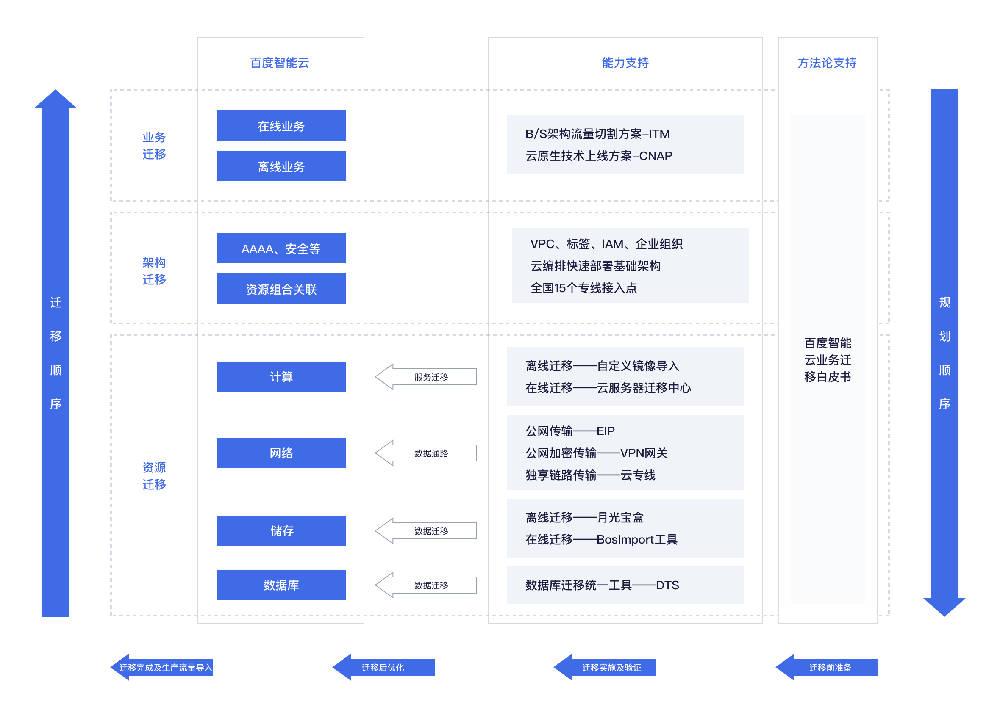

## 迁移流程：
1. 考虑不同行业包括**金融，零售，能源，互联网，人工智能，工业制造**等
2. 应用场景包含：
    - 传统**IDC**上云
    - **跨云**平台迁移
    - **跨账号或跨地域**迁移
3. 迁移完整流程：
    - **迁移前准备**：
        - **业务**驱动原因
        - 集成复杂性
        - **技术兼容**程度
        - 安全性
        - 配置和计划成本
    - **迁移实施及验证**：
        - **Landing**云上架构设计
        - 实时同步数据
        - 调整和压力测试
    - **迁移后优化**：
        - **性能**：
            - 性能瓶颈
            - 资源配置
            - 系统架构调整
        - **成本**：
            - 清理冗余资源
            - 保证资源利用和业务压力匹配
    - 迁移完成及**生成流量导入**：
        - 流量导入可以采用**变更A记录或者Cname的简单DNS策略**。
        - 这一过程更多的是数据补齐的过程，含网络对接、**服务割接**等。

4. 百度具体迁移流程：
    - 资源迁移：
        - **计算**：
            - 离线迁移——自定义镜像导入：
                - 源服务器**安装组件**，组件**制作当前机器镜像**（RAW,QCOW2,VHD,VMDK），[上传至BOS](BOS迁移方式.md)——镜像导入——生成目标镜像——**创建目标服务器**
            - 在线迁移——[云服务迁移中心 (CMC)](CMC不同组件具体迁移过程.md)

                - 下载迁移工具，生成目标镜像——创建目标服务器BCC(BaiDu Cloud Compute)
                
        - **网络**:
            - 公网传输——**EIP**
            - 公网加密——**VPN网关**
            - 独享链路——**云专线**
        - **储存**：
            - **离线迁移**——月光宝盒
            - **在线迁移**——Boslmport工具
        - **数据库**：
            - **DTS迁移工具**
                - **结构**迁移：读取源库表结构定义语法，重新组装成目标库的语法格式。
                - **全量**迁移：全量读取源表内容并写到对应的目标表。
                - **增量**迁移：目标库增量日志解析和回放，实现数据在线迁移。

                

                - **数据校验**：
                    - 数据校验支持在不停服的情况下进行校验。
                    - 数据校验算法采用基于表的 Chunk 进行比对，具备高性能。
                    - 数据校验任务支持对源端和目标端全量数据的行级数据进行字段校验。
                    - 任务运行过程中如果有数据不一致的数据，DTS 会在一定时间后对异常数据再次校验，确保该异常不是增量延迟导致的

                    